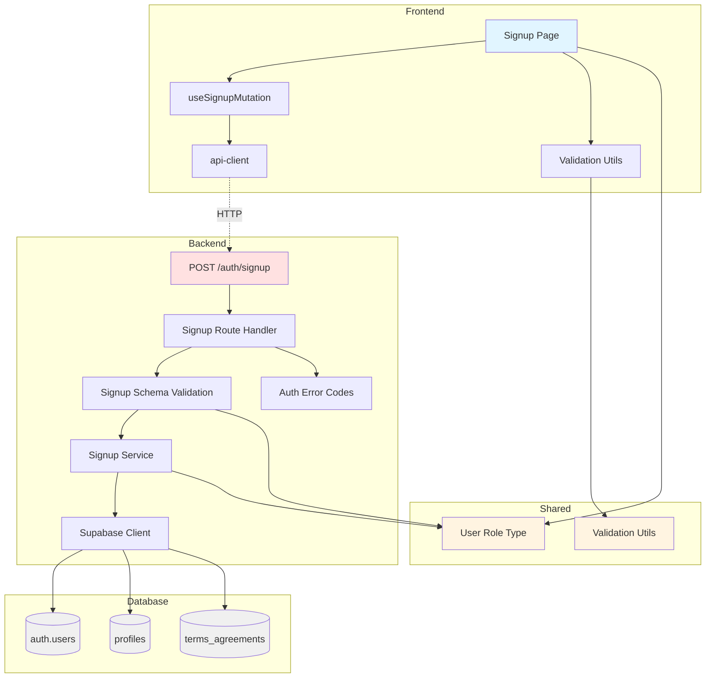

# UC-001 Implementation Plan: 역할 선택 & 온보딩

## 개요

### Backend Modules

| 모듈 | 위치 | 설명 |
|------|------|------|
| Signup Route | `src/features/auth/backend/route.ts` | 회원가입 API 엔드포인트 (`POST /auth/signup`) |
| Signup Service | `src/features/auth/backend/service.ts` | 회원가입 비즈니스 로직 (트랜잭션 처리) |
| Signup Schema | `src/features/auth/backend/schema.ts` | 회원가입 요청/응답 zod 스키마 |
| Auth Error | `src/features/auth/backend/error.ts` | 인증 관련 에러 코드 정의 |

### Frontend Modules

| 모듈 | 위치 | 설명 |
|------|------|------|
| Signup Page | `src/app/signup/page.tsx` | 회원가입 페이지 (수정) |
| Signup Hook | `src/features/auth/hooks/useSignupMutation.ts` | 회원가입 React Query 훅 |
| Signup DTO | `src/features/auth/lib/dto.ts` | 백엔드 스키마 재노출 |

### Shared Modules

| 모듈 | 위치 | 설명 |
|------|------|------|
| Validation Utils | `src/lib/validation/auth.ts` | 이메일, 비밀번호, 휴대폰번호 유효성 검사 유틸 |
| User Role Type | `src/types/user.ts` | User role 타입 정의 (shared) |

---

## Diagram



---

## Implementation Plan

### 1. Shared Modules

#### 1.1 User Role Type (`src/types/user.ts`)

**목적**: 사용자 역할 타입 정의

**구현**:
```typescript
export const UserRole = {
  LEARNER: 'learner',
  INSTRUCTOR: 'instructor',
} as const;

export type UserRole = typeof UserRole[keyof typeof UserRole];
```

---

#### 1.2 Validation Utils (`src/lib/validation/auth.ts`)

**목적**: 클라이언트/서버 공통 유효성 검사 유틸

**구현**:
```typescript
import { z } from 'zod';

export const emailSchema = z.string().email({ message: '올바른 이메일 주소를 입력하세요' });

export const passwordSchema = z.string().min(8, { message: '비밀번호는 8자 이상이어야 합니다' });

export const phoneSchema = z.string().regex(
  /^01[0-9]-?\d{3,4}-?\d{4}$/,
  { message: '올바른 휴대폰번호를 입력하세요' }
);

export const nameSchema = z.string().min(1, { message: '이름을 입력하세요' }).max(100);
```

**Unit Tests**:
```typescript
// src/lib/validation/auth.test.ts
describe('emailSchema', () => {
  it('should validate correct email', () => {
    expect(emailSchema.safeParse('test@example.com').success).toBe(true);
  });

  it('should reject invalid email', () => {
    expect(emailSchema.safeParse('invalid-email').success).toBe(false);
  });
});

describe('passwordSchema', () => {
  it('should validate password with 8+ characters', () => {
    expect(passwordSchema.safeParse('password123').success).toBe(true);
  });

  it('should reject password with less than 8 characters', () => {
    expect(passwordSchema.safeParse('pass').success).toBe(false);
  });
});

describe('phoneSchema', () => {
  it('should validate correct phone number', () => {
    expect(phoneSchema.safeParse('010-1234-5678').success).toBe(true);
    expect(phoneSchema.safeParse('01012345678').success).toBe(true);
  });

  it('should reject invalid phone number', () => {
    expect(phoneSchema.safeParse('123-456-7890').success).toBe(false);
  });
});
```

---

### 2. Backend Modules

#### 2.1 Auth Error Codes (`src/features/auth/backend/error.ts`)

**목적**: 인증 관련 에러 코드 정의

**구현**:
```typescript
export const authErrorCodes = {
  emailAlreadyExists: 'EMAIL_ALREADY_EXISTS',
  invalidCredentials: 'INVALID_CREDENTIALS',
  invalidRequest: 'INVALID_REQUEST',
  signupFailed: 'SIGNUP_FAILED',
  profileCreationFailed: 'PROFILE_CREATION_FAILED',
  termsAgreementFailed: 'TERMS_AGREEMENT_FAILED',
  validationError: 'VALIDATION_ERROR',
} as const;

type AuthErrorValue = (typeof authErrorCodes)[keyof typeof authErrorCodes];

export type AuthServiceError = AuthErrorValue;
```

---

#### 2.2 Signup Schema (`src/features/auth/backend/schema.ts`)

**목적**: 회원가입 요청/응답 스키마

**구현**:
```typescript
import { z } from 'zod';
import { emailSchema, passwordSchema, phoneSchema, nameSchema } from '@/lib/validation/auth';
import { UserRole } from '@/types/user';

export const SignupRequestSchema = z.object({
  email: emailSchema,
  password: passwordSchema,
  role: z.enum([UserRole.LEARNER, UserRole.INSTRUCTOR]),
  name: nameSchema,
  phone: phoneSchema,
  agreedToTerms: z.literal(true, {
    errorMap: () => ({ message: '약관에 동의해야 합니다' })
  }),
});

export type SignupRequest = z.infer<typeof SignupRequestSchema>;

export const SignupResponseSchema = z.object({
  user: z.object({
    id: z.string().uuid(),
    email: z.string().email(),
    role: z.enum([UserRole.LEARNER, UserRole.INSTRUCTOR]),
    name: z.string(),
  }),
  token: z.string(),
});

export type SignupResponse = z.infer<typeof SignupResponseSchema>;

export const ProfileTableRowSchema = z.object({
  id: z.string().uuid(),
  role: z.enum([UserRole.LEARNER, UserRole.INSTRUCTOR]),
  name: z.string(),
  phone: z.string(),
  created_at: z.string(),
  updated_at: z.string(),
});

export type ProfileRow = z.infer<typeof ProfileTableRowSchema>;
```

---

#### 2.3 Signup Service (`src/features/auth/backend/service.ts`)

**목적**: 회원가입 비즈니스 로직 (트랜잭션)

**구현**:
```typescript
import type { SupabaseClient } from '@supabase/supabase-js';
import { failure, success, type HandlerResult } from '@/backend/http/response';
import type { SignupRequest, SignupResponse } from './schema';
import { authErrorCodes, type AuthServiceError } from './error';

export const signup = async (
  client: SupabaseClient,
  request: SignupRequest,
): Promise<HandlerResult<SignupResponse, AuthServiceError, unknown>> => {
  // 1. 이메일 중복 체크
  const { data: existingUser } = await client.auth.admin.listUsers();
  const emailExists = existingUser?.users.some(u => u.email === request.email);

  if (emailExists) {
    return failure(409, authErrorCodes.emailAlreadyExists, '이미 사용중인 이메일입니다');
  }

  // 2. Supabase Auth 계정 생성
  const { data: authData, error: authError } = await client.auth.admin.createUser({
    email: request.email,
    password: request.password,
    email_confirm: true,
  });

  if (authError || !authData.user) {
    return failure(500, authErrorCodes.signupFailed, authError?.message ?? '회원가입에 실패했습니다');
  }

  const userId = authData.user.id;

  // 3. profiles 테이블에 추가
  const { error: profileError } = await client
    .from('profiles')
    .insert({
      id: userId,
      role: request.role,
      name: request.name,
      phone: request.phone,
    });

  if (profileError) {
    // 롤백: Auth 계정 삭제
    await client.auth.admin.deleteUser(userId);
    return failure(500, authErrorCodes.profileCreationFailed, '프로필 생성에 실패했습니다');
  }

  // 4. terms_agreements 테이블에 추가
  const { error: termsError } = await client
    .from('terms_agreements')
    .insert({
      user_id: userId,
    });

  if (termsError) {
    // 롤백: Auth 계정 및 프로필 삭제
    await client.from('profiles').delete().eq('id', userId);
    await client.auth.admin.deleteUser(userId);
    return failure(500, authErrorCodes.termsAgreementFailed, '약관 동의 저장에 실패했습니다');
  }

  // 5. JWT 토큰 생성 (세션 생성)
  const { data: sessionData, error: sessionError } = await client.auth.admin.createSession({
    userId,
  });

  if (sessionError || !sessionData.session) {
    return failure(500, authErrorCodes.signupFailed, '세션 생성에 실패했습니다');
  }

  return success({
    user: {
      id: userId,
      email: request.email,
      role: request.role,
      name: request.name,
    },
    token: sessionData.session.access_token,
  }, 201);
};
```

**Unit Tests**:
```typescript
// src/features/auth/backend/service.test.ts
describe('signup', () => {
  let mockSupabaseClient: jest.Mocked<SupabaseClient>;

  beforeEach(() => {
    mockSupabaseClient = createMockSupabaseClient();
  });

  it('should successfully create user with all data', async () => {
    const request: SignupRequest = {
      email: 'test@example.com',
      password: 'password123',
      role: 'learner',
      name: '홍길동',
      phone: '010-1234-5678',
      agreedToTerms: true,
    };

    mockSupabaseClient.auth.admin.listUsers.mockResolvedValue({ data: { users: [] } });
    mockSupabaseClient.auth.admin.createUser.mockResolvedValue({
      data: { user: { id: 'user-id', email: 'test@example.com' } },
    });
    mockSupabaseClient.from('profiles').insert.mockResolvedValue({ error: null });
    mockSupabaseClient.from('terms_agreements').insert.mockResolvedValue({ error: null });
    mockSupabaseClient.auth.admin.createSession.mockResolvedValue({
      data: { session: { access_token: 'token-123' } },
    });

    const result = await signup(mockSupabaseClient, request);

    expect(result.ok).toBe(true);
    expect(result.status).toBe(201);
  });

  it('should return error when email already exists', async () => {
    mockSupabaseClient.auth.admin.listUsers.mockResolvedValue({
      data: { users: [{ email: 'test@example.com' }] },
    });

    const result = await signup(mockSupabaseClient, {
      email: 'test@example.com',
      password: 'password123',
      role: 'learner',
      name: '홍길동',
      phone: '010-1234-5678',
      agreedToTerms: true,
    });

    expect(result.ok).toBe(false);
    expect(result.error.code).toBe(authErrorCodes.emailAlreadyExists);
  });

  it('should rollback when profile creation fails', async () => {
    mockSupabaseClient.auth.admin.listUsers.mockResolvedValue({ data: { users: [] } });
    mockSupabaseClient.auth.admin.createUser.mockResolvedValue({
      data: { user: { id: 'user-id' } },
    });
    mockSupabaseClient.from('profiles').insert.mockResolvedValue({
      error: { message: 'DB error' },
    });

    const result = await signup(mockSupabaseClient, validRequest);

    expect(result.ok).toBe(false);
    expect(mockSupabaseClient.auth.admin.deleteUser).toHaveBeenCalledWith('user-id');
  });
});
```

---

#### 2.4 Signup Route (`src/features/auth/backend/route.ts`)

**목적**: 회원가입 API 엔드포인트

**구현**:
```typescript
import type { Hono } from 'hono';
import { failure, respond } from '@/backend/http/response';
import { getLogger, getSupabase, type AppEnv } from '@/backend/hono/context';
import { SignupRequestSchema } from './schema';
import { signup } from './service';
import { authErrorCodes } from './error';

export const registerAuthRoutes = (app: Hono<AppEnv>) => {
  app.post('/auth/signup', async (c) => {
    const body = await c.req.json();
    const parsedBody = SignupRequestSchema.safeParse(body);

    if (!parsedBody.success) {
      return respond(
        c,
        failure(
          400,
          authErrorCodes.invalidRequest,
          '요청 데이터가 유효하지 않습니다',
          parsedBody.error.format(),
        ),
      );
    }

    const supabase = getSupabase(c);
    const logger = getLogger(c);

    const result = await signup(supabase, parsedBody.data);

    if (!result.ok) {
      logger.error('Signup failed', result.error);
    }

    return respond(c, result);
  });
};
```

---

### 3. Frontend Modules

#### 3.1 Signup DTO (`src/features/auth/lib/dto.ts`)

**목적**: 백엔드 스키마 재노출

**구현**:
```typescript
export {
  SignupRequestSchema,
  SignupResponseSchema,
  type SignupRequest,
  type SignupResponse,
} from '@/features/auth/backend/schema';
```

---

#### 3.2 Signup Hook (`src/features/auth/hooks/useSignupMutation.ts`)

**목적**: 회원가입 React Query Mutation 훅

**구현**:
```typescript
'use client';

import { useMutation } from '@tanstack/react-query';
import { apiClient, extractApiErrorMessage } from '@/lib/remote/api-client';
import { SignupRequestSchema, SignupResponseSchema, type SignupRequest } from '../lib/dto';

const postSignup = async (request: SignupRequest) => {
  try {
    const validated = SignupRequestSchema.parse(request);
    const { data } = await apiClient.post('/api/auth/signup', validated);
    return SignupResponseSchema.parse(data);
  } catch (error) {
    const message = extractApiErrorMessage(error, '회원가입에 실패했습니다');
    throw new Error(message);
  }
};

export const useSignupMutation = () =>
  useMutation({
    mutationFn: postSignup,
  });
```

---

#### 3.3 Signup Page (`src/app/signup/page.tsx`)

**수정 사항**:
- 역할 선택 UI 추가
- 이름, 휴대폰번호 입력 필드 추가
- 약관 동의 체크박스 추가
- `useSignupMutation` 훅 사용
- 클라이언트 유효성 검사 추가
- 역할별 리다이렉트 로직 추가

**QA Sheet**:

| 테스트 케이스 | 입력 | 기대 결과 |
|--------------|------|----------|
| 정상 가입 (Learner) | 유효한 이메일, 비밀번호, 이름, 휴대폰, 약관 동의, role=learner | 회원가입 성공, 코스 카탈로그로 리다이렉트 |
| 정상 가입 (Instructor) | 유효한 이메일, 비밀번호, 이름, 휴대폰, 약관 동의, role=instructor | 회원가입 성공, 대시보드로 리다이렉트 |
| 이메일 중복 | 이미 존재하는 이메일 | "이미 사용중인 이메일입니다" 에러 메시지 표시 |
| 비밀번호 8자 미만 | password="abc123" | "비밀번호는 8자 이상이어야 합니다" 에러 메시지 표시 |
| 휴대폰번호 형식 오류 | phone="123-456-7890" | "올바른 휴대폰번호를 입력하세요" 에러 메시지 표시 |
| 약관 미동의 | agreedToTerms=false | 가입 버튼 비활성화 |
| 역할 미선택 | role=null | 가입 버튼 비활성화 |
| 이름 미입력 | name="" | 가입 버튼 비활성화 |
| 네트워크 오류 | API 500 에러 | "회원가입 처리 중 오류가 발생했습니다" 에러 메시지 표시 |
| 로딩 중 중복 제출 | 제출 버튼 연속 클릭 | 첫 번째 요청만 처리, 버튼 비활성화 |

---

### 4. Integration

#### 4.1 Hono App 등록 (`src/backend/hono/app.ts`)

**수정**:
```typescript
import { registerAuthRoutes } from '@/features/auth/backend/route';

export const createHonoApp = () => {
  // ...
  registerAuthRoutes(app);
  // ...
};
```

---

### 5. Database Migration

**위치**: `supabase/migrations/20250101000000_initial_schema.sql`

이미 생성되어 있으므로 추가 작업 불필요.

---

## 구현 순서

1. **Shared Modules** (병렬 작업 가능)
   - User Role Type
   - Validation Utils + Unit Tests

2. **Backend Modules** (순차 작업)
   - Auth Error Codes
   - Signup Schema
   - Signup Service + Unit Tests
   - Signup Route
   - Hono App 등록

3. **Frontend Modules** (순차 작업)
   - Signup DTO
   - Signup Hook
   - Signup Page 수정 + QA

4. **Integration Test** (E2E)
   - 전체 플로우 검증

---

## Dependencies

### 신규 설치 필요
없음 (기존 라이브러리 사용)

### Shadcn UI 컴포넌트 추가
```bash
npx shadcn@latest add checkbox
npx shadcn@latest add radio-group
npx shadcn@latest add select
```
