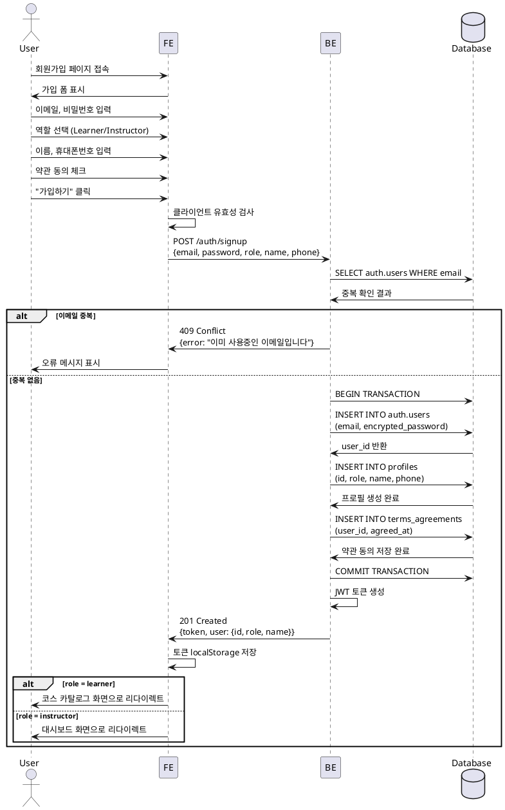

# UC-001: 역할 선택 & 온보딩

## Primary Actor
신규 사용자

## Precondition
- 사용자가 LMS 서비스에 접속
- 계정이 없는 상태

## Trigger
회원가입 페이지 진입 및 가입 정보 입력 완료

## Main Scenario

1. 사용자가 이메일, 비밀번호 입력
2. 사용자가 역할(Learner/Instructor) 선택
3. 사용자가 이름, 휴대폰번호 입력
4. 사용자가 약관 동의 체크
5. 사용자가 "가입하기" 버튼 클릭
6. BE가 이메일 중복 검사 수행
7. BE가 Supabase Auth로 계정 생성
8. BE가 `profiles` 테이블에 역할, 이름, 휴대폰번호 저장
9. BE가 `terms_agreements` 테이블에 약관 동의 이력 저장
10. BE가 인증 토큰 발급
11. FE가 토큰 저장 및 역할별 초기 화면으로 리다이렉트
    - Learner → 코스 카탈로그
    - Instructor → 대시보드

## Edge Cases

| 상황 | 처리 |
|------|------|
| 이메일 중복 | "이미 사용중인 이메일입니다" 메시지 표시 |
| 비밀번호 정책 미달 | "비밀번호는 8자 이상이어야 합니다" 메시지 표시 |
| 휴대폰번호 형식 오류 | "올바른 휴대폰번호를 입력하세요" 메시지 표시 |
| 약관 미동의 | 가입 버튼 비활성화 또는 "약관에 동의해주세요" 메시지 표시 |
| 네트워크 오류 | "네트워크 오류가 발생했습니다. 다시 시도해주세요" 메시지 표시 |
| DB 저장 실패 | 트랜잭션 롤백, "가입 처리 중 오류가 발생했습니다" 메시지 표시 |

## Business Rules

1. **역할 필수 선택**: 모든 사용자는 가입 시 Learner 또는 Instructor 중 하나를 선택해야 함
2. **약관 동의 필수**: 약관에 동의하지 않으면 가입 불가
3. **이메일 중복 불가**: 동일한 이메일로 중복 가입 불가
4. **프로필 필수 입력**: 이름, 휴대폰번호는 필수 입력 사항
5. **원자적 처리**: Auth 계정 생성, 프로필 생성, 약관 동의 저장은 원자적으로 처리되어야 함 (하나라도 실패 시 전체 롤백)
6. **역할별 리다이렉트**: 가입 완료 후 역할에 따라 적절한 초기 화면으로 이동

## Sequence Diagram

