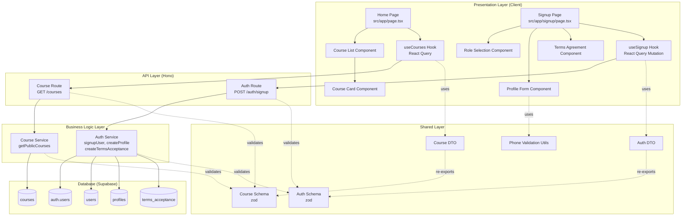

# Implementation Plan: 홈/카탈로그 & 역할 선택 & 온보딩

## 개요

### Backend Modules

| 모듈 | 위치 | 설명 |
|------|------|------|
| Auth Service | `src/features/auth/backend/service.ts` | 회원가입, 프로필 생성, 약관 동의 처리 |
| Auth Route | `src/features/auth/backend/route.ts` | POST /auth/signup 엔드포인트 |
| Auth Schema | `src/features/auth/backend/schema.ts` | 회원가입 요청/응답 스키마 (zod) |
| Auth Error | `src/features/auth/backend/error.ts` | 인증 관련 에러 코드 정의 |
| Course Service | `src/features/course/backend/service.ts` | 공개 코스 목록 조회 |
| Course Route | `src/features/course/backend/route.ts` | GET /courses (공개 코스 목록) |
| Course Schema | `src/features/course/backend/schema.ts` | 코스 조회 요청/응답 스키마 |
| Course Error | `src/features/course/backend/error.ts` | 코스 관련 에러 코드 정의 |

### Frontend Modules

| 모듈 | 위치 | 설명 |
|------|------|------|
| Home Page | `src/app/page.tsx` | 공개 코스 카탈로그 (기존 파일 수정) |
| Signup Page | `src/app/signup/page.tsx` | 회원가입 & 온보딩 (기존 파일 수정) |
| Role Selection Component | `src/features/auth/components/role-selection.tsx` | Learner/Instructor 역할 선택 UI |
| Profile Form Component | `src/features/auth/components/profile-form.tsx` | 이름, 휴대폰번호 입력 폼 |
| Terms Agreement Component | `src/features/auth/components/terms-agreement.tsx` | 약관 동의 체크박스 |
| Course List Component | `src/features/course/components/course-list.tsx` | 코스 카드 목록 표시 |
| Course Card Component | `src/features/course/components/course-card.tsx` | 개별 코스 카드 UI |
| Use Signup Hook | `src/features/auth/hooks/useSignup.ts` | 회원가입 React Query Mutation |
| Use Courses Hook | `src/features/course/hooks/useCourses.ts` | 공개 코스 목록 React Query |

### Shared/Utility Modules

| 모듈 | 위치 | 설명 |
|------|------|------|
| Validation Utils | `src/lib/validation/phone.ts` | 휴대폰번호 형식 검증 유틸리티 |
| Auth DTO | `src/features/auth/lib/dto.ts` | Backend schema 재노출 |
| Course DTO | `src/features/course/lib/dto.ts` | Backend schema 재노출 |

---

## Diagram



---

## Implementation Plan

### 1. Shared Layer

#### 1.1 Phone Validation Utility
**파일**: `src/lib/validation/phone.ts`

**구현 내용**:
```typescript
// 한국 휴대폰번호 검증 (10~11자리 숫자)
export const isValidPhoneNumber = (phone: string): boolean
export const normalizePhoneNumber = (phone: string): string
```

**Unit Test**:
- ✅ 유효한 휴대폰번호 (01012345678) → true
- ✅ 유효한 휴대폰번호 (0101234567) → true
- ✅ 9자리 숫자 → false
- ✅ 12자리 숫자 → false
- ✅ 문자 포함 → false
- ✅ 하이픈 포함 정규화 (010-1234-5678 → 01012345678)

---

### 2. Backend Layer

#### 2.1 Auth Schema
**파일**: `src/features/auth/backend/schema.ts`

**구현 내용**:
```typescript
export const SignupRequestSchema = z.object({
  email: z.string().email(),
  password: z.string().min(8),
  role: z.enum(['learner', 'instructor']),
  name: z.string().min(1),
  phone: z.string().regex(/^\d{10,11}$/),
  termsAccepted: z.boolean().refine(v => v === true)
})

export const SignupResponseSchema = z.object({
  userId: z.string().uuid(),
  email: z.string().email(),
  role: z.enum(['learner', 'instructor'])
})
```

**Unit Test**:
- ✅ 유효한 요청 → 통과
- ✅ 이메일 형식 오류 → 검증 실패
- ✅ 비밀번호 7자 이하 → 검증 실패
- ✅ 휴대폰번호 9자리 → 검증 실패
- ✅ 약관 미동의 → 검증 실패

---

#### 2.2 Auth Error Codes
**파일**: `src/features/auth/backend/error.ts`

**구현 내용**:
```typescript
export const authErrorCodes = {
  signupFailed: 'SIGNUP_FAILED',
  emailAlreadyExists: 'EMAIL_ALREADY_EXISTS',
  invalidInput: 'INVALID_INPUT',
  profileCreationFailed: 'PROFILE_CREATION_FAILED',
  termsAcceptanceFailed: 'TERMS_ACCEPTANCE_FAILED',
} as const

export type AuthServiceError = typeof authErrorCodes[keyof typeof authErrorCodes]
```

---

#### 2.3 Auth Service
**파일**: `src/features/auth/backend/service.ts`

**구현 내용**:
```typescript
export const signupUser = async (
  supabase: SupabaseClient,
  request: SignupRequest
): Promise<HandlerResult<SignupResponse, AuthServiceError, unknown>>
```

**로직**:
1. Supabase Auth에 계정 생성 (email, password)
2. `users` 테이블에 role 저장
3. `profiles` 테이블에 name, phone 저장
4. `terms_acceptance` 테이블에 동의 이력 저장
5. 트랜잭션 실패 시 전체 롤백 (Supabase RPC 활용 가능)

**Unit Test**:
- ✅ 정상 회원가입 → success 반환
- ✅ 이메일 중복 → EMAIL_ALREADY_EXISTS
- ✅ users 테이블 저장 실패 → PROFILE_CREATION_FAILED
- ✅ profiles 테이블 저장 실패 → PROFILE_CREATION_FAILED
- ✅ terms_acceptance 저장 실패 → TERMS_ACCEPTANCE_FAILED

---

#### 2.4 Auth Route
**파일**: `src/features/auth/backend/route.ts`

**구현 내용**:
```typescript
export const registerAuthRoutes = (app: Hono<AppEnv>) => {
  app.post('/auth/signup', async (c) => {
    // 1. 요청 body 검증 (SignupRequestSchema)
    // 2. signupUser 서비스 호출
    // 3. respond 헬퍼로 응답 반환
  })
}
```

**Integration Test** (수동):
- POST /auth/signup → 201 Created
- 중복 이메일 → 400 Bad Request

---

#### 2.5 Course Schema
**파일**: `src/features/course/backend/schema.ts`

**구현 내용**:
```typescript
export const PublicCourseSchema = z.object({
  id: z.string().uuid(),
  title: z.string(),
  description: z.string().nullable(),
  category: z.string(),
  difficulty: z.string(),
  instructorName: z.string(),
})

export const PublicCoursesResponseSchema = z.array(PublicCourseSchema)
```

---

#### 2.6 Course Error Codes
**파일**: `src/features/course/backend/error.ts`

**구현 내용**:
```typescript
export const courseErrorCodes = {
  fetchError: 'FETCH_ERROR',
} as const

export type CourseServiceError = typeof courseErrorCodes[keyof typeof courseErrorCodes]
```

---

#### 2.7 Course Service
**파일**: `src/features/course/backend/service.ts`

**구현 내용**:
```typescript
export const getPublicCourses = async (
  supabase: SupabaseClient
): Promise<HandlerResult<PublicCourse[], CourseServiceError, unknown>>
```

**로직**:
1. courses 테이블에서 status='published' 조회
2. instructor_id로 profiles 테이블 조인하여 instructorName 조회
3. 결과를 PublicCourseSchema로 검증 후 반환

**Unit Test**:
- ✅ published 코스만 반환
- ✅ draft, archived 코스는 제외
- ✅ DB 에러 → FETCH_ERROR

---

#### 2.8 Course Route
**파일**: `src/features/course/backend/route.ts`

**구현 내용**:
```typescript
export const registerCourseRoutes = (app: Hono<AppEnv>) => {
  app.get('/courses', async (c) => {
    // 1. getPublicCourses 서비스 호출
    // 2. respond 헬퍼로 응답 반환
  })
}
```

---

#### 2.9 Hono App 등록
**파일**: `src/backend/hono/app.ts`

**수정 내용**:
```typescript
import { registerAuthRoutes } from '@/features/auth/backend/route'
import { registerCourseRoutes } from '@/features/course/backend/route'

// registerExampleRoutes(app) 이후 추가
registerAuthRoutes(app)
registerCourseRoutes(app)
```

---

### 3. Frontend Layer

#### 3.1 Auth DTO
**파일**: `src/features/auth/lib/dto.ts`

**구현 내용**:
```typescript
export { SignupRequestSchema, SignupResponseSchema } from '../backend/schema'
export type { SignupRequest, SignupResponse } from '../backend/schema'
```

---

#### 3.2 Course DTO
**파일**: `src/features/course/lib/dto.ts`

**구현 내용**:
```typescript
export { PublicCourseSchema, PublicCoursesResponseSchema } from '../backend/schema'
export type { PublicCourse } from '../backend/schema'
```

---

#### 3.3 useSignup Hook
**파일**: `src/features/auth/hooks/useSignup.ts`

**구현 내용**:
```typescript
import { useMutation } from '@tanstack/react-query'
import { apiClient } from '@/lib/remote/api-client'
import { SignupRequestSchema, SignupResponseSchema } from '../lib/dto'

export const useSignup = () => {
  return useMutation({
    mutationFn: async (request: SignupRequest) => {
      const response = await apiClient.post('/auth/signup', request)
      return SignupResponseSchema.parse(response.data)
    }
  })
}
```

**QA Sheet** (Presentation Layer):
- ✅ 회원가입 성공 시 적절한 리다이렉션
- ✅ 이메일 중복 시 에러 메시지 표시
- ✅ 필수 입력값 누락 시 필드별 에러 표시
- ✅ 약관 미동의 시 제출 불가
- ✅ 네트워크 오류 시 사용자 친화적 에러 표시

---

#### 3.4 useCourses Hook
**파일**: `src/features/course/hooks/useCourses.ts`

**구현 내용**:
```typescript
import { useQuery } from '@tanstack/react-query'
import { apiClient } from '@/lib/remote/api-client'
import { PublicCoursesResponseSchema } from '../lib/dto'

export const useCourses = () => {
  return useQuery({
    queryKey: ['courses', 'public'],
    queryFn: async () => {
      const response = await apiClient.get('/courses')
      return PublicCoursesResponseSchema.parse(response.data)
    }
  })
}
```

**QA Sheet**:
- ✅ 공개 코스 목록이 올바르게 표시됨
- ✅ 로딩 중 스피너 표시
- ✅ 에러 시 재시도 가능한 UI 표시

---

#### 3.5 Role Selection Component
**파일**: `src/features/auth/components/role-selection.tsx`

**구현 내용**:
- Learner / Instructor 라디오 버튼
- 선택 시 onChange 이벤트로 상위 컴포넌트에 전달

**QA Sheet**:
- ✅ 기본 선택값 없음
- ✅ 하나만 선택 가능
- ✅ 선택 변경 시 즉시 반영

---

#### 3.6 Profile Form Component
**파일**: `src/features/auth/components/profile-form.tsx`

**구현 내용**:
- 이름 입력 필드 (required)
- 휴대폰번호 입력 필드 (required, 숫자만 허용)
- onChange 이벤트로 상위 컴포넌트에 전달
- 클라이언트 측 검증 (휴대폰번호 형식)

**QA Sheet**:
- ✅ 이름 1자 이상 입력 필수
- ✅ 휴대폰번호 10~11자리 숫자만 허용
- ✅ 형식 오류 시 실시간 피드백

---

#### 3.7 Terms Agreement Component
**파일**: `src/features/auth/components/terms-agreement.tsx`

**구현 내용**:
- 약관 내용 표시 (간략 버전 또는 링크)
- 동의 체크박스
- onChange 이벤트로 상위 컴포넌트에 전달

**QA Sheet**:
- ✅ 체크하지 않으면 제출 불가
- ✅ 약관 내용 확인 가능

---

#### 3.8 Course Card Component
**파일**: `src/features/course/components/course-card.tsx`

**구현 내용**:
- 코스 제목, 설명, 카테고리, 난이도, 강사명 표시
- 클릭 시 로그인 상태에 따라 처리
  - 비로그인 → 로그인 페이지 리다이렉트
  - 로그인 → 코스 상세 페이지 이동

**QA Sheet**:
- ✅ 정보가 명확히 표시됨
- ✅ 비로그인 상태에서 클릭 시 로그인 유도

---

#### 3.9 Course List Component
**파일**: `src/features/course/components/course-list.tsx`

**구현 내용**:
- useCourses 훅 사용
- 로딩/에러/데이터 상태별 UI 분기
- CourseCard 컴포넌트 매핑

**QA Sheet**:
- ✅ 로딩 중 스켈레톤 또는 스피너 표시
- ✅ 에러 시 에러 메시지 및 재시도 버튼
- ✅ 데이터 없을 시 안내 문구

---

#### 3.10 Home Page (수정)
**파일**: `src/app/page.tsx`

**수정 내용**:
- 기존 예제 UI 제거
- CourseList 컴포넌트 추가
- 로그인/회원가입 버튼 유지
- 비로그인 사용자도 접근 가능하도록 설정

**QA Sheet**:
- ✅ 비로그인 상태에서 공개 코스 목록 확인 가능
- ✅ 로그인/회원가입 버튼 노출
- ✅ 코스 클릭 시 로그인 페이지로 리다이렉트

---

#### 3.11 Signup Page (수정)
**파일**: `src/app/signup/page.tsx`

**수정 내용**:
- 기존 이메일/비밀번호 폼 유지
- RoleSelection 컴포넌트 추가
- ProfileForm 컴포넌트 추가
- TermsAgreement 컴포넌트 추가
- useSignup 훅으로 회원가입 처리
- 성공 시 역할별 리다이렉션
  - Learner → /courses
  - Instructor → /dashboard

**QA Sheet**:
- ✅ 모든 필수 입력값 입력 시 제출 가능
- ✅ 약관 미동의 시 제출 불가
- ✅ 회원가입 성공 시 역할별 올바른 리다이렉션
- ✅ 에러 발생 시 사용자 친화적 메시지 표시
- ✅ 이메일 중복 시 명확한 안내

---

### 4. Database Migration

#### 4.1 Migration 확인
**파일**: `supabase/migrations/0002_create_lms_schema.sql`

**확인 사항**:
- `users`, `profiles`, `terms_acceptance`, `courses` 테이블 생성 여부
- 필요한 인덱스 및 제약조건 확인

---

### 5. Integration Checklist

- [ ] 백엔드 라우트 등록 확인 (`src/backend/hono/app.ts`)
- [ ] 환경 변수 설정 확인 (`.env.local`)
- [ ] Supabase migration 적용 확인
- [ ] 로컬 개발 서버 실행 (`npm run dev`)
- [ ] 회원가입 플로우 E2E 테스트
- [ ] 홈 페이지 공개 코스 목록 확인
- [ ] 비로그인 상태 접근 제어 확인
- [ ] 역할별 리다이렉션 확인

---

## Summary

이 구현 계획은 **홈/카탈로그 & 역할 선택 & 온보딩** 기능을 최소 스펙으로 모듈화하여 설계했습니다.

### 핵심 원칙
1. **기존 코드베이스 구조 준수**: CLAUDE.md의 디렉터리 구조 및 컨벤션을 엄격히 따름
2. **모듈 분리**: 백엔드(service/route/schema/error), 프론트엔드(components/hooks), 공유(lib) 계층 명확히 구분
3. **재사용성**: 공통 로직(phone validation, DTO)을 shared 레이어로 분리
4. **검증 중심**: zod 스키마 기반 요청/응답 검증, Unit Test 포함
5. **사용자 경험**: Presentation Layer에서 QA Sheet 기반 사용성 테스트 수행

이 계획을 기반으로 순차적으로 구현하면 유스케이스 요구사항을 충족할 수 있습니다.
