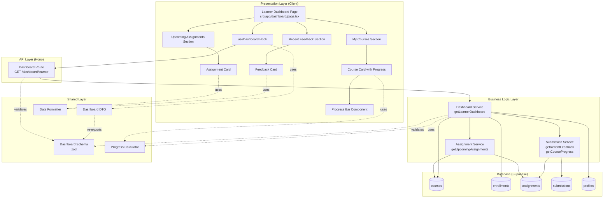

# Implementation Plan: Learner 대시보드

## 개요

### Backend Modules

| 모듈 | 위치 | 설명 |
|------|------|------|
| Dashboard Service | `src/features/dashboard/backend/service.ts` | 대시보드 데이터 조회 비즈니스 로직 |
| Dashboard Route | `src/features/dashboard/backend/route.ts` | GET /dashboard/learner |
| Dashboard Schema | `src/features/dashboard/backend/schema.ts` | 대시보드 응답 스키마 |
| Dashboard Error | `src/features/dashboard/backend/error.ts` | 대시보드 에러 코드 |
| Assignment Service | `src/features/assignment/backend/service.ts` | 과제 조회 비즈니스 로직 (신규) |
| Assignment Schema | `src/features/assignment/backend/schema.ts` | 과제 관련 스키마 (신규) |
| Submission Service | `src/features/submission/backend/service.ts` | 제출물 조회 비즈니스 로직 (신규) |
| Submission Schema | `src/features/submission/backend/schema.ts` | 제출물 관련 스키마 (신규) |

### Frontend Modules

| 모듈 | 위치 | 설명 |
|------|------|------|
| Learner Dashboard Page | `src/app/(protected)/dashboard/page.tsx` | Learner 대시보드 페이지 (수정) |
| My Courses Section | `src/features/dashboard/components/my-courses-section.tsx` | 내 코스 목록 섹션 |
| Upcoming Assignments Section | `src/features/dashboard/components/upcoming-assignments-section.tsx` | 마감 임박 과제 섹션 |
| Recent Feedback Section | `src/features/dashboard/components/recent-feedback-section.tsx` | 최근 피드백 섹션 |
| Course Card with Progress | `src/features/dashboard/components/course-card-with-progress.tsx` | 진행률 포함 코스 카드 |
| Assignment Card | `src/features/dashboard/components/assignment-card.tsx` | 과제 카드 |
| Feedback Card | `src/features/dashboard/components/feedback-card.tsx` | 피드백 카드 |
| Progress Bar | `src/features/dashboard/components/progress-bar.tsx` | 진행률 바 컴포넌트 |
| useDashboard Hook | `src/features/dashboard/hooks/use-dashboard.ts` | 대시보드 데이터 조회 Query |

### Shared/Utility Modules

| 모듈 | 위치 | 설명 |
|------|------|------|
| Dashboard DTO | `src/features/dashboard/dto.ts` | Backend schema 재노출 |
| Date Formatter Util | `src/lib/format/date.ts` | 상대 시간 포맷팅 (기존 확장) |
| Progress Calculator Util | `src/lib/utils/progress.ts` | 진행률 계산 로직 (신규) |

---

## Diagram



---

## Implementation Plan

### 1. Backend Layer

#### 1.1 Assignment Schema
**파일**: `src/features/assignment/backend/schema.ts`

**구현 내용**:
```typescript
export const AssignmentSchema = z.object({
  id: z.string().uuid(),
  courseId: z.string().uuid(),
  title: z.string(),
  dueDate: z.string(),
  status: z.enum(['draft', 'published', 'closed']),
})

export const UpcomingAssignmentSchema = AssignmentSchema.extend({
  courseName: z.string(),
  dueInHours: z.number(),
  submissionStatus: z.enum(['not_submitted', 'resubmission_required']),
})

export type Assignment = z.infer<typeof AssignmentSchema>
export type UpcomingAssignment = z.infer<typeof UpcomingAssignmentSchema>
```

**Unit Test**:
- ✅ 유효한 Assignment → 통과
- ✅ 잘못된 status → 검증 실패

---

#### 1.2 Submission Schema
**파일**: `src/features/submission/backend/schema.ts`

**구현 내용**:
```typescript
export const SubmissionSchema = z.object({
  id: z.string().uuid(),
  assignmentId: z.string().uuid(),
  learnerId: z.string().uuid(),
  status: z.enum(['submitted', 'graded', 'resubmission_required']),
  score: z.number().nullable(),
  feedback: z.string().nullable(),
  submittedAt: z.string(),
  gradedAt: z.string().nullable(),
})

export const FeedbackItemSchema = z.object({
  assignmentTitle: z.string(),
  courseName: z.string(),
  score: z.number().nullable(),
  feedback: z.string(),
  gradedAt: z.string(),
  isResubmissionRequired: z.boolean(),
})

export type Submission = z.infer<typeof SubmissionSchema>
export type FeedbackItem = z.infer<typeof FeedbackItemSchema>
```

**Unit Test**:
- ✅ 유효한 Submission → 통과
- ✅ score가 null인 경우 → 통과

---

#### 1.3 Dashboard Schema
**파일**: `src/features/dashboard/backend/schema.ts`

**구현 내용**:
```typescript
export const EnrolledCourseSchema = z.object({
  courseId: z.string().uuid(),
  title: z.string(),
  category: z.string(),
  difficulty: z.string(),
  instructorName: z.string(),
  enrolledAt: z.string(),
  progress: z.number().min(0).max(100),
  totalAssignments: z.number(),
  completedAssignments: z.number(),
})

export const LearnerDashboardResponseSchema = z.object({
  enrolledCourses: z.array(EnrolledCourseSchema),
  upcomingAssignments: z.array(UpcomingAssignmentSchema),
  recentFeedback: z.array(FeedbackItemSchema),
})

export type EnrolledCourse = z.infer<typeof EnrolledCourseSchema>
export type LearnerDashboardResponse = z.infer<typeof LearnerDashboardResponseSchema>
```

---

#### 1.4 Dashboard Error Codes
**파일**: `src/features/dashboard/backend/error.ts`

**구현 내용**:
```typescript
export const dashboardErrorCodes = {
  fetchError: 'DASHBOARD_FETCH_ERROR',
  invalidRole: 'INVALID_ROLE',
  notEnrolled: 'NO_ENROLLMENTS',
} as const

export type DashboardServiceError =
  (typeof dashboardErrorCodes)[keyof typeof dashboardErrorCodes]
```

---

#### 1.5 Assignment Service
**파일**: `src/features/assignment/backend/service.ts`

**구현 내용**:
```typescript
export const getUpcomingAssignments = async (
  client: SupabaseClient,
  learnerId: string
): Promise<HandlerResult<UpcomingAssignment[], AssignmentServiceError, unknown>>
```

**로직**:
1. learnerId로 enrollments 조회 → 수강 중인 courseId 리스트
2. 해당 코스들의 assignments 조회:
   - status = 'published'
   - due_date >= NOW() AND due_date <= NOW() + INTERVAL '7 days'
3. 각 assignment에 대해 submission 존재 여부 확인:
   - 제출 없음 → `not_submitted`
   - status = 'resubmission_required' → `resubmission_required`
   - 그 외 → 제외
4. due_date ASC 정렬
5. course 정보 JOIN하여 courseName 추가
6. dueInHours 계산: `(due_date - NOW()) / 3600`

**Unit Test**:
- ✅ 7일 이내 마감 과제 → 포함
- ✅ 8일 후 마감 과제 → 제외
- ✅ 이미 제출한 과제 → 제외
- ✅ 재제출 요청 과제 → 포함
- ✅ closed 상태 과제 → 제외

---

#### 1.6 Submission Service
**파일**: `src/features/submission/backend/service.ts`

**구현 내용**:
```typescript
export const getRecentFeedback = async (
  client: SupabaseClient,
  learnerId: string
): Promise<HandlerResult<FeedbackItem[], SubmissionServiceError, unknown>>

export const getCourseProgress = async (
  client: SupabaseClient,
  learnerId: string,
  courseId: string
): Promise<HandlerResult<{ total: number; completed: number }, SubmissionServiceError, unknown>>
```

**로직**:

**getRecentFeedback**:
1. learnerId로 submissions 조회:
   - status IN ('graded', 'resubmission_required')
   - feedback IS NOT NULL
2. graded_at DESC 정렬, LIMIT 5
3. assignment 정보 JOIN (title)
4. course 정보 JOIN (name)
5. FeedbackItem 형태로 매핑

**getCourseProgress**:
1. courseId의 published assignments 개수 조회 → total
2. learnerId의 해당 코스 submissions 조회:
   - status IN ('submitted', 'graded')
   - 중복 제거 (assignmentId 기준) → completed
3. { total, completed } 반환

**Unit Test**:
- ✅ 피드백 5개 이상 → 최신 5개만 반환
- ✅ 피드백 없음 → 빈 배열
- ✅ 과제 없는 코스 → total: 0, completed: 0
- ✅ 진행률 계산 → 정확한 숫자

---

#### 1.7 Dashboard Service
**파일**: `src/features/dashboard/backend/service.ts`

**구현 내용**:
```typescript
export const getLearnerDashboard = async (
  client: SupabaseClient,
  learnerId: string
): Promise<HandlerResult<LearnerDashboardResponse, DashboardServiceError, unknown>>
```

**로직**:
1. **역할 확인**: users 테이블에서 learnerId의 role이 'learner'인지 확인
   - 아니면 INVALID_ROLE 에러
2. **enrolledCourses 조회**:
   - enrollments 테이블에서 learnerId로 조회
   - courses 테이블 JOIN (title, category, difficulty, instructor_id)
   - profiles 테이블 JOIN (instructorName)
   - 각 코스별로 `getCourseProgress` 호출하여 진행률 계산
   - EnrolledCourse 배열 생성
3. **upcomingAssignments 조회**:
   - `getUpcomingAssignments` 호출
4. **recentFeedback 조회**:
   - `getRecentFeedback` 호출
5. LearnerDashboardResponse 반환

**Unit Test**:
- ✅ Learner 역할 → 정상 응답
- ✅ Instructor 역할 → INVALID_ROLE
- ✅ 수강 중인 코스 없음 → enrolledCourses 빈 배열
- ✅ 데이터 조합 → 올바른 구조 반환

---

#### 1.8 Dashboard Route
**파일**: `src/features/dashboard/backend/route.ts`

**구현 내용**:
```typescript
export const registerDashboardRoutes = (app: Hono<AppEnv>) => {
  app.get('/dashboard/learner', async (c) => {
    const supabase = getSupabase(c)
    const logger = getLogger(c)

    const { data: { user } } = await supabase.auth.getUser()

    if (!user) {
      return respond(c, failure(401, 'UNAUTHORIZED', 'You must be logged in.'))
    }

    const result = await getLearnerDashboard(supabase, user.id)

    if (!result.ok) {
      const errorResult = result as ErrorResult<DashboardServiceError, unknown>
      logger.error('Failed to fetch dashboard', errorResult.error.message)
      return respond(c, result)
    }

    return respond(c, result)
  })
}
```

---

#### 1.9 Hono App 등록
**파일**: `src/backend/hono/app.ts`

**수정 내용**:
```typescript
import { registerDashboardRoutes } from '@/features/dashboard/backend/route'

registerDashboardRoutes(app)
```

---

### 2. Shared/Utility Layer

#### 2.1 Progress Calculator Util
**파일**: `src/lib/utils/progress.ts`

**구현 내용**:
```typescript
export const calculateProgress = (completed: number, total: number): number => {
  if (total === 0) return 0
  return Math.round((completed / total) * 100)
}

export const getProgressColor = (progress: number): string => {
  if (progress >= 80) return 'text-green-600'
  if (progress >= 50) return 'text-yellow-600'
  return 'text-red-600'
}
```

**Unit Test**:
- ✅ 0/0 → 0%
- ✅ 5/10 → 50%
- ✅ 10/10 → 100%
- ✅ 색상 함수 → 올바른 클래스 반환

---

#### 2.2 Date Formatter Util (확장)
**파일**: `src/lib/format/date.ts`

**구현 내용**:
```typescript
import { formatDistanceToNow, formatDistanceToNowStrict } from 'date-fns'
import { ko } from 'date-fns/locale'

export const formatRelativeTime = (dateString: string): string => {
  return formatDistanceToNow(new Date(dateString), {
    addSuffix: true,
    locale: ko
  })
}

export const formatDueTime = (dueDate: string): string => {
  const distance = formatDistanceToNowStrict(new Date(dueDate), {
    locale: ko
  })
  return `${distance} 후`
}
```

**Unit Test**:
- ✅ 1시간 전 → "1시간 전"
- ✅ 2일 후 → "2일 후"

---

### 3. Frontend Layer

#### 3.1 Dashboard DTO
**파일**: `src/features/dashboard/dto.ts`

**구현 내용**:
```typescript
export {
  LearnerDashboardResponseSchema,
  EnrolledCourseSchema,
} from './backend/schema'
export type {
  LearnerDashboardResponse,
  EnrolledCourse,
} from './backend/schema'
export type { UpcomingAssignment } from '@/features/assignment/backend/schema'
export type { FeedbackItem } from '@/features/submission/backend/schema'
```

---

#### 3.2 useDashboard Hook
**파일**: `src/features/dashboard/hooks/use-dashboard.ts`

**구현 내용**:
```typescript
import { useQuery } from '@tanstack/react-query'
import { apiClient } from '@/lib/remote/api-client'
import type { LearnerDashboardResponse } from '../dto'

export const useDashboard = () => {
  return useQuery<LearnerDashboardResponse, Error>({
    queryKey: ['dashboard', 'learner'],
    queryFn: async () => {
      const response = await apiClient.get('/dashboard/learner')
      return response.data.data
    },
  })
}
```

**QA Sheet**:
- ✅ 로그인 상태 → 데이터 로드
- ✅ 비로그인 → 401 에러
- ✅ Instructor 역할 → INVALID_ROLE 에러

---

#### 3.3 Progress Bar Component
**파일**: `src/features/dashboard/components/progress-bar.tsx`

**구현 내용**:
```typescript
interface ProgressBarProps {
  progress: number
  total: number
  completed: number
}

export const ProgressBar = ({ progress, total, completed }: ProgressBarProps) => {
  return (
    <div className="space-y-1">
      <div className="flex justify-between text-sm">
        <span>{completed}/{total} 완료</span>
        <span className={getProgressColor(progress)}>{progress}%</span>
      </div>
      <div className="h-2 bg-gray-200 rounded-full overflow-hidden">
        <div
          className="h-full bg-blue-600 transition-all"
          style={{ width: `${progress}%` }}
        />
      </div>
    </div>
  )
}
```

**QA Sheet**:
- ✅ 진행률 0% → 바 비어있음
- ✅ 진행률 50% → 바 절반
- ✅ 진행률 100% → 바 가득참
- ✅ 색상 변화 → 진행률에 따라 변경

---

#### 3.4 Course Card with Progress
**파일**: `src/features/dashboard/components/course-card-with-progress.tsx`

**구현 내용**:
```typescript
interface CourseCardWithProgressProps {
  course: EnrolledCourse
}

export const CourseCardWithProgress = ({ course }: CourseCardWithProgressProps) => {
  return (
    <Card>
      <CardHeader>
        <CardTitle>{course.title}</CardTitle>
        <p className="text-sm text-muted-foreground">
          {course.instructorName} · {course.category} · {course.difficulty}
        </p>
      </CardHeader>
      <CardContent>
        <ProgressBar
          progress={course.progress}
          total={course.totalAssignments}
          completed={course.completedAssignments}
        />
        <p className="mt-2 text-xs text-muted-foreground">
          수강신청일: {formatRelativeTime(course.enrolledAt)}
        </p>
      </CardContent>
    </Card>
  )
}
```

**QA Sheet**:
- ✅ 코스 정보 표시
- ✅ 진행률 바 표시
- ✅ 수강신청일 상대 시간 표시

---

#### 3.5 Assignment Card
**파일**: `src/features/dashboard/components/assignment-card.tsx`

**구현 내용**:
```typescript
interface AssignmentCardProps {
  assignment: UpcomingAssignment
}

export const AssignmentCard = ({ assignment }: AssignmentCardProps) => {
  const isDueSoon = assignment.dueInHours <= 24

  return (
    <Card className={isDueSoon ? 'border-red-500' : ''}>
      <CardHeader>
        <CardTitle className="text-base">{assignment.title}</CardTitle>
        <p className="text-sm text-muted-foreground">{assignment.courseName}</p>
      </CardHeader>
      <CardContent>
        <div className="flex justify-between items-center">
          <span className={`text-sm ${isDueSoon ? 'text-red-600 font-semibold' : ''}`}>
            {formatDueTime(assignment.dueDate)}
          </span>
          <Badge variant={assignment.submissionStatus === 'resubmission_required' ? 'destructive' : 'outline'}>
            {assignment.submissionStatus === 'resubmission_required' ? '재제출 필요' : '미제출'}
          </Badge>
        </div>
      </CardContent>
    </Card>
  )
}
```

**QA Sheet**:
- ✅ 24시간 이내 마감 → 빨간색 강조
- ✅ 재제출 필요 → destructive badge
- ✅ 상대 시간 표시

---

#### 3.6 Feedback Card
**파일**: `src/features/dashboard/components/feedback-card.tsx`

**구현 내용**:
```typescript
interface FeedbackCardProps {
  feedback: FeedbackItem
}

export const FeedbackCard = ({ feedback }: FeedbackCardProps) => {
  return (
    <Card>
      <CardHeader>
        <CardTitle className="text-base">{feedback.assignmentTitle}</CardTitle>
        <p className="text-sm text-muted-foreground">{feedback.courseName}</p>
      </CardHeader>
      <CardContent className="space-y-2">
        {feedback.score !== null && (
          <p className="text-sm font-semibold">점수: {feedback.score}</p>
        )}
        <p className="text-sm text-muted-foreground line-clamp-3">
          {feedback.feedback}
        </p>
        <div className="flex justify-between items-center pt-2">
          <span className="text-xs text-muted-foreground">
            {formatRelativeTime(feedback.gradedAt)}
          </span>
          {feedback.isResubmissionRequired && (
            <Badge variant="destructive">재제출 필요</Badge>
          )}
        </div>
      </CardContent>
    </Card>
  )
}
```

**QA Sheet**:
- ✅ 피드백 내용 3줄 제한
- ✅ 점수 표시 (있는 경우)
- ✅ 재제출 필요 표시
- ✅ 상대 시간 표시

---

#### 3.7 My Courses Section
**파일**: `src/features/dashboard/components/my-courses-section.tsx`

**구현 내용**:
```typescript
interface MyCoursesSection Props {
  courses: EnrolledCourse[]
}

export const MyCoursesSection = ({ courses }: MyCoursesSection Props) => {
  if (courses.length === 0) {
    return (
      <div className="text-center py-8">
        <p className="text-muted-foreground">수강신청한 코스가 없습니다.</p>
        <Button asChild className="mt-4">
          <Link href="/courses">코스 카탈로그 보기</Link>
        </Button>
      </div>
    )
  }

  return (
    <div className="grid grid-cols-1 md:grid-cols-2 gap-4">
      {courses.map((course) => (
        <CourseCardWithProgress key={course.courseId} course={course} />
      ))}
    </div>
  )
}
```

**QA Sheet**:
- ✅ 빈 상태 → 메시지 + 버튼 표시
- ✅ 코스 존재 → 그리드 레이아웃

---

#### 3.8 Upcoming Assignments Section
**파일**: `src/features/dashboard/components/upcoming-assignments-section.tsx`

**구현 내용**:
```typescript
interface UpcomingAssignmentsSection Props {
  assignments: UpcomingAssignment[]
}

export const UpcomingAssignmentsSection = ({ assignments }: UpcomingAssignmentsSection Props) => {
  if (assignments.length === 0) {
    return (
      <div className="text-center py-8">
        <p className="text-muted-foreground">마감 임박한 과제가 없습니다.</p>
      </div>
    )
  }

  return (
    <div className="space-y-3">
      {assignments.map((assignment) => (
        <AssignmentCard key={assignment.id} assignment={assignment} />
      ))}
    </div>
  )
}
```

**QA Sheet**:
- ✅ 빈 상태 → 메시지 표시
- ✅ 과제 존재 → 리스트 표시

---

#### 3.9 Recent Feedback Section
**파일**: `src/features/dashboard/components/recent-feedback-section.tsx`

**구현 내용**:
```typescript
interface RecentFeedbackSection Props {
  feedback: FeedbackItem[]
}

export const RecentFeedbackSection = ({ feedback }: RecentFeedbackSection Props) => {
  if (feedback.length === 0) {
    return (
      <div className="text-center py-8">
        <p className="text-muted-foreground">아직 받은 피드백이 없습니다.</p>
      </div>
    )
  }

  return (
    <div className="space-y-3">
      {feedback.map((item, index) => (
        <FeedbackCard key={index} feedback={item} />
      ))}
    </div>
  )
}
```

**QA Sheet**:
- ✅ 빈 상태 → 메시지 표시
- ✅ 피드백 존재 → 리스트 표시

---

#### 3.10 Learner Dashboard Page
**파일**: `src/app/(protected)/dashboard/page.tsx`

**구현 내용**:
```typescript
'use client'

import { useCurrentUser } from '@/features/auth/hooks/useCurrentUser'
import { useDashboard } from '@/features/dashboard/hooks/use-dashboard'
import { MyCoursesSection } from '@/features/dashboard/components/my-courses-section'
import { UpcomingAssignmentsSection } from '@/features/dashboard/components/upcoming-assignments-section'
import { RecentFeedbackSection } from '@/features/dashboard/components/recent-feedback-section'
import { useRouter } from 'next/navigation'
import { useEffect } from 'react'

export default function DashboardPage() {
  const { user } = useCurrentUser()
  const router = useRouter()
  const { data, isLoading, error } = useDashboard()

  // Instructor 역할 체크 (클라이언트 사이드)
  useEffect(() => {
    if (error && error.message.includes('INVALID_ROLE')) {
      router.push('/dashboard/instructor')
    }
  }, [error, router])

  if (isLoading) {
    return <div>로딩 중...</div>
  }

  if (error) {
    return <div>에러 발생: {error.message}</div>
  }

  if (!data) {
    return null
  }

  return (
    <div className="container mx-auto py-8 px-4 space-y-8">
      <header>
        <h1 className="text-3xl font-bold">대시보드</h1>
        <p className="text-muted-foreground mt-2">
          {user?.email ?? '알 수 없는 사용자'} 님, 환영합니다.
        </p>
      </header>

      <section>
        <h2 className="text-2xl font-semibold mb-4">내 코스</h2>
        <MyCoursesSection courses={data.enrolledCourses} />
      </section>

      <section>
        <h2 className="text-2xl font-semibold mb-4">마감 임박 과제</h2>
        <UpcomingAssignmentsSection assignments={data.upcomingAssignments} />
      </section>

      <section>
        <h2 className="text-2xl font-semibold mb-4">최근 피드백</h2>
        <RecentFeedbackSection feedback={data.recentFeedback} />
      </section>
    </div>
  )
}
```

**QA Sheet**:
- ✅ Learner → 대시보드 표시
- ✅ Instructor → /dashboard/instructor 리다이렉트
- ✅ 비로그인 → 로그인 페이지 리다이렉트 (middleware)
- ✅ 로딩 중 → 스켈레톤 표시
- ✅ 에러 → 에러 메시지
- ✅ 빈 데이터 → 각 섹션별 빈 상태 표시

---

### 4. Integration Checklist

- [ ] Assignment Service 구현
- [ ] Submission Service 구현
- [ ] Dashboard Service 구현
- [ ] Backend 라우트 등록
- [ ] Progress Calculator 유틸 구현
- [ ] Date Formatter 확장
- [ ] useDashboard Hook 구현
- [ ] 컴포넌트 구현 (ProgressBar, Cards, Sections)
- [ ] Dashboard Page 수정
- [ ] 역할 기반 리다이렉트 구현
- [ ] 타입 체크 및 빌드 확인
- [ ] E2E 테스트 (대시보드 접근 플로우)

---

## Summary

이 구현 계획은 **Learner 대시보드** 기능을 최소 스펙으로 모듈화하여 설계했습니다.

### 핵심 원칙
1. **신규 Feature 모듈**: Dashboard, Assignment, Submission 모듈 생성
2. **단일 API 엔드포인트**: GET /dashboard/learner로 모든 데이터 한번에 조회
3. **역할 기반 접근 제어**: Learner만 접근, Instructor는 리다이렉트
4. **진행률 계산 로직**: 공통 유틸로 분리 (재사용 가능)
5. **상대 시간 표시**: date-fns 활용한 한국어 포맷팅
6. **빈 상태 처리**: 각 섹션별로 적절한 메시지 표시
7. **성능 최적화**: 단일 쿼리로 대시보드 데이터 조회, React Query 캐싱 활용

이 계획을 기반으로 순차적으로 구현하면 유스케이스 요구사항을 충족할 수 있습니다.
