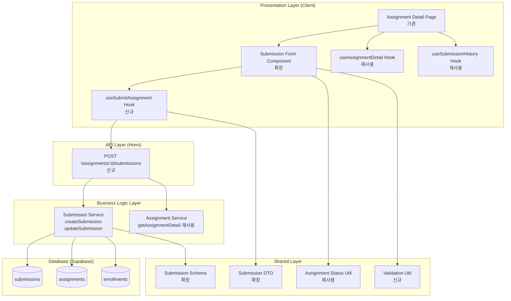

# Implementation Plan: 과제 제출/재제출 (Learner)

## 개요

### Backend Modules

| 모듈 | 위치 | 설명 |
|------|------|------|
| Submission Service (확장) | `src/features/submission/backend/service.ts` | 제출 생성/업데이트 비즈니스 로직 추가 |
| Submission Route | `src/features/submission/backend/route.ts` | POST /assignments/:id/submissions (신규) |
| Submission Schema (확장) | `src/features/submission/backend/schema.ts` | 제출 요청 스키마 추가 |
| Submission Error (확장) | `src/features/submission/backend/error.ts` | 제출 관련 에러 코드 추가 |
| Assignment Service (재사용) | `src/features/assignment/backend/service.ts` | getAssignmentDetail 재사용 |

### Frontend Modules

| 모듈 | 위치 | 설명 |
|------|------|------|
| Submission Form (확장) | `src/features/submission/components/submission-form.tsx` | 제출 양식 + 제출/재제출 로직 |
| useSubmitAssignment Hook | `src/features/submission/hooks/use-submit-assignment.ts` | 제출/재제출 Mutation (신규) |

### Shared/Utility Modules

| 모듈 | 위치 | 설명 |
|------|------|------|
| Submission DTO (확장) | `src/features/submission/dto.ts` | 제출 요청 스키마 재노출 |
| Assignment Status Util (재사용) | `src/lib/utils/assignment-status.ts` | canSubmit, canResubmit 재사용 |
| Validation Util | `src/lib/utils/validation.ts` | URL 검증 (신규) |

---

## Diagram



---

## Implementation Plan

### Phase 1: Backend - Submission Schema & Error

#### 1.1 Submission Schema 확장
**파일**: `src/features/submission/backend/schema.ts`

```typescript
export const CreateSubmissionRequestSchema = z.object({
  text: z.string().min(1, '답변을 입력해주세요'),
  link: z.string().url('올바른 URL 형식을 입력해주세요').nullable().optional(),
});

export type CreateSubmissionRequest = z.infer<typeof CreateSubmissionRequestSchema>;
```

**Unit Tests**:
- ✅ text 필수 검증 (빈 문자열 → 실패)
- ✅ link URL 형식 검증 (잘못된 URL → 실패)
- ✅ link nullable 검증 (null/undefined → 통과)

---

#### 1.2 Submission Error 확장
**파일**: `src/features/submission/backend/error.ts`

```typescript
export const submissionErrorCodes = {
  fetchError: 'FETCH_ERROR',
  validationError: 'VALIDATION_ERROR', // 신규
  assignmentNotFound: 'ASSIGNMENT_NOT_FOUND', // 신규
  assignmentClosed: 'ASSIGNMENT_CLOSED', // 신규
  pastDueNotAllowed: 'PAST_DUE_NOT_ALLOWED', // 신규
  resubmissionNotAllowed: 'RESUBMISSION_NOT_ALLOWED', // 신규
  notEnrolled: 'NOT_ENROLLED', // 신규
  createError: 'CREATE_ERROR', // 신규
} as const;
```

---

### Phase 2: Backend - Submission Service

#### 2.1 Submission Service 확장
**파일**: `src/features/submission/backend/service.ts`

**새 함수**:
```typescript
export const createOrUpdateSubmission = async (
  client: SupabaseClient,
  assignmentId: string,
  learnerId: string,
  data: CreateSubmissionRequest
): Promise<HandlerResult<SubmissionHistoryItem, SubmissionServiceError, unknown>>
```

**로직**:
1. 과제 정보 조회 (status, due_date, allow_late, allow_resubmission)
2. 과제 상태 검증
   - `status !== 'published'` → ASSIGNMENT_CLOSED
3. 수강신청 여부 검증
   - enrollments 테이블 조회 → 없으면 NOT_ENROLLED
4. 마감일 검증
   - 현재 시각 > due_date && allow_late === false → PAST_DUE_NOT_ALLOWED
5. 기존 제출물 조회
   - 있으면: 재제출 검증
     - allow_resubmission === false → RESUBMISSION_NOT_ALLOWED
     - 기존 제출물 업데이트 (text, link, submitted_at, late 플래그)
   - 없으면: 신규 제출물 생성 (text, link, submitted_at, late 플래그)
6. late 플래그 설정
   - 현재 시각 > due_date → late = true
   - 현재 시각 <= due_date → late = false
7. 생성/업데이트된 제출물 반환

**Unit Tests**:
- ✅ 정상 제출 (마감일 전, 처음 제출) → 성공, late=false
- ✅ 지각 제출 (마감일 후, allow_late=true) → 성공, late=true
- ✅ 마감일 후 지각 불허 (allow_late=false) → PAST_DUE_NOT_ALLOWED
- ✅ 재제출 허용 (allow_resubmission=true) → 기존 제출물 업데이트
- ✅ 재제출 불허 (allow_resubmission=false) → RESUBMISSION_NOT_ALLOWED
- ✅ 과제 상태가 closed → ASSIGNMENT_CLOSED
- ✅ 수강신청하지 않은 코스 → NOT_ENROLLED
- ✅ 과제가 존재하지 않음 → ASSIGNMENT_NOT_FOUND

---

### Phase 3: Backend - Submission Route

#### 3.1 Submission Route 신규
**파일**: `src/features/submission/backend/route.ts`

**엔드포인트**:
```typescript
export const registerSubmissionRoutes = (app: Hono<AppEnv>) => {
  app.post('/assignments/:id/submissions', async (c) => {
    // 1. assignmentId 파라미터 검증
    // 2. body 검증 (CreateSubmissionRequestSchema)
    // 3. 로그인 사용자 확인
    // 4. createOrUpdateSubmission 서비스 호출
    // 5. respond 헬퍼로 응답
  });
};
```

**검증**:
- ✅ assignmentId UUID 유효성 검증
- ✅ body schema 검증
- ✅ 로그인 사용자 확인

---

#### 3.2 Hono App 라우트 등록
**파일**: `src/backend/hono/app.ts`

```typescript
import { registerSubmissionRoutes } from '@/features/submission/backend/route';
// ...
registerSubmissionRoutes(app);
```

---

### Phase 4: Shared - Validation Utility

#### 4.1 Validation Util
**파일**: `src/lib/utils/validation.ts`

```typescript
export const isValidUrl = (url: string): boolean => {
  try {
    new URL(url);
    return true;
  } catch {
    return false;
  }
};
```

**Unit Tests**:
- ✅ 유효한 URL → true
- ✅ 잘못된 URL → false
- ✅ 빈 문자열 → false

---

### Phase 5: Frontend - Hooks

#### 5.1 useSubmitAssignment Hook
**파일**: `src/features/submission/hooks/use-submit-assignment.ts`

```typescript
import { useMutation, useQueryClient } from '@tanstack/react-query';
import { apiClient } from '@/lib/remote/api-client';
import type { CreateSubmissionRequest } from '../dto';

export const useSubmitAssignment = (assignmentId: string) => {
  const queryClient = useQueryClient();

  return useMutation({
    mutationFn: async (data: CreateSubmissionRequest) => {
      const response = await apiClient.post(
        `/assignments/${assignmentId}/submissions`,
        data
      );
      return response.data;
    },
    onSuccess: () => {
      queryClient.invalidateQueries({ queryKey: ['submissions', 'history', assignmentId] });
      queryClient.invalidateQueries({ queryKey: ['assignments', assignmentId] });
    },
  });
};
```

**QA Sheet**:
- ✅ 제출 성공 → 제출 이력 갱신, 성공 메시지 표시
- ✅ 텍스트 미입력 → 에러 메시지 표시
- ✅ 잘못된 링크 → 에러 메시지 표시
- ✅ 마감일 후 지각 불허 → 에러 메시지 표시
- ✅ 재제출 불허 상태에서 재제출 시도 → 에러 메시지 표시

---

### Phase 6: Frontend - Component

#### 6.1 Submission Form Component 확장
**파일**: `src/features/submission/components/submission-form.tsx`

**Props**:
```typescript
interface SubmissionFormProps {
  assignmentId: string;
  assignment: AssignmentDetail;
  latestSubmission: SubmissionHistoryItem | null;
}
```

**UI**:
- 텍스트 입력란 (textarea, required)
- 링크 입력란 (input, optional, URL 형식 검증)
- 제출/재제출 버튼
  - canSubmit(assignment) === true → "제출" 버튼 활성화
  - canResubmit(assignment, latestSubmission) === true → "재제출" 버튼 활성화
  - 둘 다 false → 버튼 비활성화 + 사유 메시지 표시
- 제출 중 → 버튼 비활성화 + 스피너
- 성공 메시지 (toast)
- 에러 메시지 (toast)

**로직**:
1. useSubmitAssignment 훅 사용
2. form submit 시:
   - text 빈 문자열 검증
   - link URL 형식 검증 (입력된 경우)
   - mutate 호출
3. 성공 시:
   - 성공 메시지 표시
   - 폼 초기화
4. 실패 시:
   - 에러 메시지 표시

**QA Sheet**:
- ✅ 텍스트 미입력 시 제출 불가 (클라이언트 검증)
- ✅ 잘못된 링크 형식 입력 시 에러 메시지
- ✅ 마감일 전 과제 → "제출" 버튼 활성화
- ✅ 마감일 후 지각 허용 → "제출" 버튼 활성화
- ✅ 마감일 후 지각 불허 → 버튼 비활성화 + "제출 기한이 지났습니다" 메시지
- ✅ 재제출 허용 + 제출 이력 있음 → "재제출" 버튼 활성화
- ✅ 재제출 불허 + 제출 이력 있음 → 버튼 비활성화 + "재제출이 허용되지 않습니다" 메시지
- ✅ 과제 상태가 closed → 버튼 비활성화 + "마감된 과제입니다" 메시지
- ✅ 제출 성공 시 성공 메시지 + 제출 이력 갱신
- ✅ 재제출 성공 시 성공 메시지 + 제출 이력 갱신

---

### Phase 7: DTO & Integration

#### 7.1 Submission DTO 확장
**파일**: `src/features/submission/dto.ts`

```typescript
export * from './backend/schema';
export type {
  CreateSubmissionRequest,
} from './backend/schema';
```

---

## Testing Strategy

### Backend Unit Tests
- Submission Service: createOrUpdateSubmission 모든 시나리오
  - 정상 제출 (마감일 전)
  - 지각 제출 (마감일 후, allow_late=true)
  - 마감일 후 지각 불허 (allow_late=false)
  - 재제출 허용 (allow_resubmission=true)
  - 재제출 불허 (allow_resubmission=false)
  - 과제 상태 closed
  - 수강신청 미완료
  - 과제 미존재

### Frontend QA Checklist
- Submission Form 컴포넌트:
  - 텍스트 필수 검증
  - 링크 URL 형식 검증
  - 제출 가능 여부에 따른 버튼 상태
  - 재제출 가능 여부에 따른 버튼 상태
  - 제출 성공 시 메시지 및 이력 갱신
  - 제출 실패 시 에러 메시지

### Integration Tests
- E2E: 과제 상세 페이지 → 제출 양식 작성 → 제출 → 제출 이력 확인
- API: POST /assignments/:id/submissions 응답 구조 검증
- 권한 검증: 수강신청 여부, 과제 상태, 마감일, 재제출 정책

---

## Deployment Checklist

- ✅ 모든 백엔드 서비스 Unit Test 통과
- ✅ 모든 프론트엔드 컴포넌트 QA Sheet 검증 완료
- ✅ TypeScript 타입 에러 0개
- ✅ ESLint 경고 0개
- ✅ Build 성공
- ✅ Supabase migrations 적용 (submissions 테이블 확인)
- ✅ 마감일 검증 동작 확인
- ✅ 재제출 정책 동작 확인
- ✅ 지각 제출 플래그 정확성 확인

---

## Summary

이 구현 계획은 **과제 제출/재제출 (Learner)** 기능을 최소 스펙으로 모듈화하여 설계했습니다.

### 핵심 원칙
1. **기존 모듈 재사용**: Assignment Service, Submission Service, Submission History 재사용
2. **최소 신규 모듈**: 제출 Route, 제출 Hook만 신규 추가
3. **모듈 분리**: Backend (service/route/schema/error), Frontend (hooks/components), Shared (dto/utils)
4. **비즈니스 로직 집중**: 마감일 검증, 재제출 정책, 지각 플래그 처리
5. **검증 중심**: zod 스키마 기반 요청 검증, Unit Test 포함
6. **사용자 경험**: QA Sheet 기반 사용성 테스트, 실시간 에러 피드백

이 계획을 기반으로 순차적으로 구현하면 유스케이스 요구사항을 충족할 수 있습니다.
