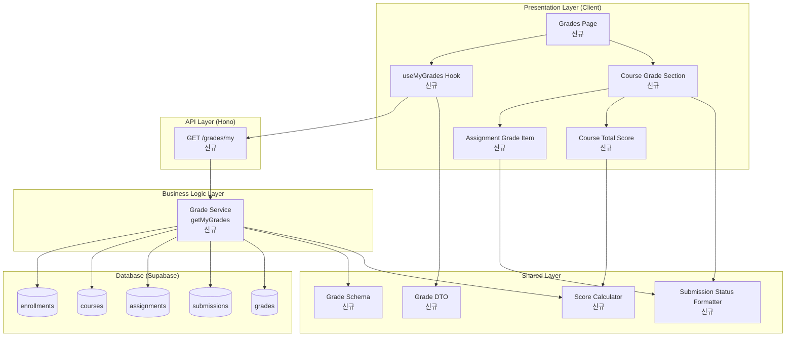

# Implementation Plan: 성적 & 피드백 열람 (Learner)

## 개요

### Backend Modules

| 모듈 | 위치 | 설명 |
|------|------|------|
| Grade Service (신규) | `src/features/grade/backend/service.ts` | 성적 조회 비즈니스 로직 |
| Grade Route (신규) | `src/features/grade/backend/route.ts` | GET /grades/my 엔드포인트 |
| Grade Schema (신규) | `src/features/grade/backend/schema.ts` | 성적 응답 스키마 |
| Grade Error (신규) | `src/features/grade/backend/error.ts` | 성적 조회 에러 코드 |
| Submission Service (재사용) | `src/features/submission/backend/service.ts` | 기존 getSubmissionHistory 재사용 |

### Frontend Modules

| 모듈 | 위치 | 설명 |
|------|------|------|
| Grades Page (신규) | `src/app/(protected)/grades/page.tsx` | 성적 페이지 |
| Course Grade Section (신규) | `src/features/grade/components/course-grade-section.tsx` | 코스별 성적 섹션 |
| Assignment Grade Item (신규) | `src/features/grade/components/assignment-grade-item.tsx` | 과제별 성적 아이템 |
| Course Total Score (신규) | `src/features/grade/components/course-total-score.tsx` | 코스 총점 표시 |
| useMyGrades Hook (신규) | `src/features/grade/hooks/use-my-grades.ts` | 성적 조회 Query |

### Shared/Utility Modules

| 모듈 | 위치 | 설명 |
|------|------|------|
| Grade DTO (신규) | `src/features/grade/dto.ts` | 성적 스키마 재노출 |
| Score Calculator (신규) | `src/lib/utils/score.ts` | 코스 총점 계산 유틸 |
| Submission Status Formatter (신규) | `src/lib/format/submission-status.ts` | 제출 상태 포맷팅 |

---

## Diagram



---

## Implementation Plan

### Phase 1: Backend - Grade Schema & Error

#### 1.1 Grade Schema 생성
**파일**: `src/features/grade/backend/schema.ts`

```typescript
import { z } from 'zod';

export const AssignmentGradeSchema = z.object({
  assignmentId: z.string().uuid(),
  assignmentTitle: z.string(),
  weight: z.number(),
  submissionStatus: z.enum([
    'not_submitted',
    'submitted',
    'graded',
    'resubmission_required',
  ]),
  score: z.number().nullable(),
  feedback: z.string().nullable(),
  late: z.boolean(),
  submittedAt: z.string().nullable(),
  gradedAt: z.string().nullable(),
});

export const CourseGradeSchema = z.object({
  courseId: z.string().uuid(),
  courseName: z.string(),
  totalScore: z.number(),
  maxScore: z.number(),
  assignments: z.array(AssignmentGradeSchema),
});

export const MyGradesResponseSchema = z.object({
  courses: z.array(CourseGradeSchema),
});

export type AssignmentGrade = z.infer<typeof AssignmentGradeSchema>;
export type CourseGrade = z.infer<typeof CourseGradeSchema>;
export type MyGradesResponse = z.infer<typeof MyGradesResponseSchema>;
```

**Unit Tests**:
- ✅ 스키마 검증 (모든 필드 타입 정확성)
- ✅ nullable 필드 검증 (score, feedback, submittedAt, gradedAt)
- ✅ submissionStatus enum 검증

---

#### 1.2 Grade Error 생성
**파일**: `src/features/grade/backend/error.ts`

```typescript
export const gradeErrorCodes = {
  fetchError: 'FETCH_ERROR',
  invalidRole: 'INVALID_ROLE',
  notEnrolled: 'NOT_ENROLLED',
} as const;

export type GradeErrorCode = typeof gradeErrorCodes[keyof typeof gradeErrorCodes];

export interface GradeServiceError {
  code: GradeErrorCode;
  message: string;
}
```

---

### Phase 2: Backend - Grade Service

#### 2.1 Grade Service 생성
**파일**: `src/features/grade/backend/service.ts`

**새 함수**:
```typescript
export const getMyGrades = async (
  client: SupabaseClient,
  learnerId: string
): Promise<HandlerResult<MyGradesResponse, GradeServiceError, unknown>>
```

**로직**:
1. 사용자 역할 검증
   - users 테이블에서 role 조회
   - role !== 'learner' → INVALID_ROLE
2. 수강 중인 코스 조회
   - enrollments 테이블에서 learner_id로 조회
   - courses 테이블 조인하여 코스 정보 가져오기
3. 각 코스별로:
   - 해당 코스의 모든 published 과제 조회
   - 각 과제별로:
     - 제출 이력 조회 (submissions 테이블)
     - 제출 이력 있으면:
       - 제출 상태 확인 (submitted/graded/resubmission_required)
       - graded 상태면 grades 테이블에서 점수/피드백 조회
     - 제출 이력 없으면: submissionStatus = 'not_submitted'
   - 코스 총점 계산:
     - Σ(graded 상태 과제 점수 × 과제 비중) / Σ(graded 상태 과제 비중)
4. 코스 목록 반환

**Unit Tests**:
- ✅ 정상 조회 (수강 중인 코스 있음, 과제 있음, 제출/채점 완료)
- ✅ 수강 중인 코스 없음 → 빈 배열 반환
- ✅ 과제 없는 코스 → 빈 assignments 배열
- ✅ 제출하지 않은 과제 → submissionStatus='not_submitted'
- ✅ 제출했으나 채점 안 된 과제 → submissionStatus='submitted', score=null
- ✅ 재제출 요청된 과제 → submissionStatus='resubmission_required'
- ✅ 총점 계산 정확성 검증
- ✅ Learner가 아닌 역할 → INVALID_ROLE

---

### Phase 3: Backend - Grade Route

#### 3.1 Grade Route 생성
**파일**: `src/features/grade/backend/route.ts`

**엔드포인트**:
```typescript
import type { Hono } from 'hono';
import type { AppEnv } from '@/backend/hono/context';
import { getMyGrades } from './service';
import { respond } from '@/backend/http/response';

export const registerGradeRoutes = (app: Hono<AppEnv>) => {
  app.get('/grades/my', async (c) => {
    const supabase = c.get('supabase');
    const { data: { user } } = await supabase.auth.getUser();

    if (!user) {
      return c.json({ error: 'Unauthorized' }, 401);
    }

    const result = await getMyGrades(supabase, user.id);
    return respond(c, result);
  });
};
```

**검증**:
- ✅ 로그인 사용자 확인
- ✅ 응답 형식 검증 (MyGradesResponse)

---

#### 3.2 Hono App 라우트 등록
**파일**: `src/backend/hono/app.ts`

```typescript
import { registerGradeRoutes } from '@/features/grade/backend/route';
// ...
registerGradeRoutes(app);
```

---

### Phase 4: Shared - Utility Functions

#### 4.1 Score Calculator
**파일**: `src/lib/utils/score.ts`

```typescript
interface WeightedScore {
  score: number;
  weight: number;
}

export const calculateTotalScore = (scores: WeightedScore[]): number => {
  if (scores.length === 0) return 0;

  const totalWeight = scores.reduce((sum, item) => sum + item.weight, 0);
  if (totalWeight === 0) return 0;

  const weightedSum = scores.reduce(
    (sum, item) => sum + item.score * item.weight,
    0
  );

  return weightedSum / totalWeight;
};

export const formatScore = (score: number): string => {
  return score.toFixed(1);
};
```

**Unit Tests**:
- ✅ 정상 계산 (여러 과제, 다양한 비중)
- ✅ 빈 배열 → 0
- ✅ 총 비중 0 → 0
- ✅ 소수점 처리 정확성

---

#### 4.2 Submission Status Formatter
**파일**: `src/lib/format/submission-status.ts`

```typescript
export const formatSubmissionStatus = (
  status: 'not_submitted' | 'submitted' | 'graded' | 'resubmission_required'
): string => {
  const statusMap = {
    not_submitted: '미제출',
    submitted: '채점 대기',
    graded: '채점 완료',
    resubmission_required: '재제출 필요',
  };

  return statusMap[status];
};

export const getSubmissionStatusColor = (
  status: 'not_submitted' | 'submitted' | 'graded' | 'resubmission_required'
): string => {
  const colorMap = {
    not_submitted: 'text-gray-500',
    submitted: 'text-blue-500',
    graded: 'text-green-500',
    resubmission_required: 'text-orange-500',
  };

  return colorMap[status];
};
```

**Unit Tests**:
- ✅ 모든 상태별 한글 텍스트 정확성
- ✅ 모든 상태별 색상 클래스 정확성

---

### Phase 5: Frontend - Hooks

#### 5.1 useMyGrades Hook
**파일**: `src/features/grade/hooks/use-my-grades.ts`

```typescript
import { useQuery } from '@tanstack/react-query';
import { apiClient } from '@/lib/remote/api-client';
import type { MyGradesResponse } from '../dto';

export const useMyGrades = () => {
  return useQuery({
    queryKey: ['grades', 'my'],
    queryFn: async () => {
      const response = await apiClient.get<MyGradesResponse>('/grades/my');
      return response.data;
    },
  });
};
```

**QA Sheet**:
- ✅ 조회 성공 → 성적 데이터 반환
- ✅ 수강 중인 코스 없음 → 빈 배열
- ✅ 로딩 상태 → isLoading=true
- ✅ 에러 발생 → error 객체 반환

---

### Phase 6: Frontend - Components

#### 6.1 Assignment Grade Item Component
**파일**: `src/features/grade/components/assignment-grade-item.tsx`

**Props**:
```typescript
interface AssignmentGradeItemProps {
  assignment: AssignmentGrade;
}
```

**UI**:
- 과제명
- 제출 상태 (formatSubmissionStatus 사용, 색상 적용)
- 점수 (채점 완료된 경우에만 표시)
- 지각 마크 (late=true인 경우)
- 피드백 (채점 완료된 경우에만 표시, 토글 가능)
- 과제 비중 표시

**QA Sheet**:
- ✅ 미제출 과제 → "미제출" 표시, 점수/피드백 비활성화
- ✅ 채점 대기 과제 → "채점 대기" 표시, 점수/피드백 비활성화
- ✅ 채점 완료 과제 → "채점 완료" 표시, 점수/피드백 표시
- ✅ 재제출 필요 과제 → "재제출 필요" 표시, 점수/피드백 표시
- ✅ 지각 제출 → 지각 마크 표시
- ✅ 피드백 토글 → 클릭 시 펼침/접힘

---

#### 6.2 Course Total Score Component
**파일**: `src/features/grade/components/course-total-score.tsx`

**Props**:
```typescript
interface CourseTotalScoreProps {
  totalScore: number;
  maxScore: number;
}
```

**UI**:
- 총점 표시 (formatScore 사용)
- 진행률 바 (totalScore / maxScore)
- 백분율 표시

**QA Sheet**:
- ✅ 총점 정확성
- ✅ 진행률 바 정확성
- ✅ 소수점 한 자리 표시

---

#### 6.3 Course Grade Section Component
**파일**: `src/features/grade/components/course-grade-section.tsx`

**Props**:
```typescript
interface CourseGradeSectionProps {
  course: CourseGrade;
}
```

**UI**:
- 코스명
- 코스 총점 (CourseTotalScore 컴포넌트)
- 과제 목록 (AssignmentGradeItem 컴포넌트 리스트)
- 과제 없는 경우 → "등록된 과제가 없습니다" 메시지

**QA Sheet**:
- ✅ 코스 정보 정확성
- ✅ 과제 목록 표시
- ✅ 과제 없는 경우 메시지 표시

---

#### 6.4 Grades Page
**파일**: `src/app/(protected)/grades/page.tsx`

**UI**:
- 페이지 제목 "성적 & 피드백"
- 로딩 상태 → 스피너
- 에러 상태 → 에러 메시지
- 수강 중인 코스 없음 → "수강 중인 코스가 없습니다" 메시지 + 코스 카탈로그 링크
- 코스별 성적 섹션 (CourseGradeSection 컴포넌트 리스트)

**로직**:
1. useMyGrades 훅 사용
2. 로딩 중 → 스피너 표시
3. 에러 발생 → 에러 메시지 표시
4. 성공 → 코스별 성적 섹션 표시

**QA Sheet**:
- ✅ 로딩 상태 → 스피너 표시
- ✅ 에러 발생 → 에러 메시지
- ✅ 수강 중인 코스 없음 → 안내 메시지 + 링크
- ✅ 코스 목록 표시
- ✅ 코스별 총점 계산 정확성
- ✅ 과제별 점수/피드백 표시 정확성
- ✅ 제출 상태별 UI 정확성

---

### Phase 7: DTO & Integration

#### 7.1 Grade DTO
**파일**: `src/features/grade/dto.ts`

```typescript
export * from './backend/schema';
export type {
  AssignmentGrade,
  CourseGrade,
  MyGradesResponse,
} from './backend/schema';
```

---

## Testing Strategy

### Backend Unit Tests
- Grade Service: getMyGrades 모든 시나리오
  - 정상 조회 (다양한 제출/채점 상태)
  - 수강 중인 코스 없음
  - 과제 없는 코스
  - 제출하지 않은 과제
  - 채점 대기 과제
  - 재제출 요청 과제
  - 총점 계산 정확성
  - Learner가 아닌 역할

### Frontend QA Checklist
- Grades Page:
  - 로딩 상태 표시
  - 에러 상태 표시
  - 수강 중인 코스 없음 메시지
  - 코스 목록 표시
- Course Grade Section:
  - 코스 정보 정확성
  - 총점 표시 정확성
  - 과제 목록 표시
  - 과제 없는 경우 메시지
- Assignment Grade Item:
  - 제출 상태별 UI
  - 점수/피드백 표시
  - 지각 마크 표시
  - 피드백 토글

### Integration Tests
- E2E: 로그인 → 성적 페이지 → 코스별 성적 확인 → 과제별 피드백 확인
- API: GET /grades/my 응답 구조 검증
- 권한 검증: Learner만 접근 가능

---

## Deployment Checklist

- ✅ 모든 백엔드 서비스 Unit Test 통과
- ✅ 모든 프론트엔드 컴포넌트 QA Sheet 검증 완료
- ✅ TypeScript 타입 에러 0개
- ✅ ESLint 경고 0개
- ✅ Build 성공
- ✅ 총점 계산 정확성 검증
- ✅ 제출 상태별 UI 정확성 검증
- ✅ 접근 권한 검증 (Learner만)

---

## Summary

이 구현 계획은 **성적 & 피드백 열람 (Learner)** 기능을 최소 스펙으로 모듈화하여 설계했습니다.

### 핵심 원칙
1. **신규 feature 모듈**: Grade 기능을 독립된 feature로 분리
2. **기존 모듈 재사용**: Submission Service의 제출 이력 조회 재사용
3. **모듈 분리**: Backend (service/route/schema/error), Frontend (page/components/hooks), Shared (dto/utils)
4. **비즈니스 로직 집중**: 총점 계산, 제출 상태별 처리
5. **검증 중심**: zod 스키마 기반 응답 검증, Unit Test 포함
6. **사용자 경험**: QA Sheet 기반 사용성 테스트, 상태별 시각적 피드백

이 계획을 기반으로 순차적으로 구현하면 유스케이스 요구사항을 충족할 수 있습니다.
