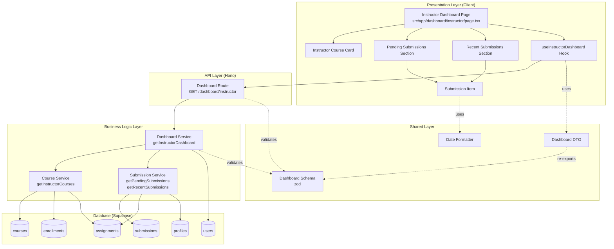

# Implementation Plan: Instructor 대시보드

## 개요

### Backend Modules

| 모듈 | 위치 | 설명 |
|------|------|------|
| Instructor Dashboard Service | `src/features/dashboard/backend/service.ts` | Instructor 대시보드 조회 로직 추가 |
| Instructor Dashboard Schema | `src/features/dashboard/backend/schema.ts` | Instructor 대시보드 응답 스키마 추가 |
| Instructor Dashboard Route | `src/features/dashboard/backend/route.ts` | GET /dashboard/instructor 추가 |
| Course Service (확장) | `src/features/course/backend/service.ts` | Instructor 소유 코스 조회 함수 추가 |
| Submission Service (확장) | `src/features/submission/backend/service.ts` | 채점 대기 제출물 조회 함수 추가 |

### Frontend Modules

| 모듈 | 위치 | 설명 |
|------|------|------|
| Instructor Dashboard Page | `src/app/(protected)/dashboard/instructor/page.tsx` | Instructor 대시보드 페이지 (신규) |
| Instructor Course Card | `src/features/dashboard/components/instructor-course-card.tsx` | Instructor 코스 카드 (신규) |
| Pending Submissions Section | `src/features/dashboard/components/pending-submissions-section.tsx` | 채점 대기 섹션 (신규) |
| Recent Submissions Section | `src/features/dashboard/components/recent-submissions-section.tsx` | 최근 제출물 섹션 (신규) |
| Submission Item | `src/features/dashboard/components/submission-item.tsx` | 제출물 아이템 (신규) |
| useInstructorDashboard Hook | `src/features/dashboard/hooks/use-instructor-dashboard.ts` | Instructor 대시보드 조회 Query (신규) |

### Shared/Utility Modules

| 모듈 | 위치 | 설명 |
|------|------|------|
| Dashboard DTO (확장) | `src/features/dashboard/dto.ts` | Instructor 스키마 재노출 |

---

## Diagram



---

## Implementation Plan

### 1. Backend Layer

#### 1.1 Instructor Dashboard Schema
**파일**: `src/features/dashboard/backend/schema.ts`

**구현 내용**:
```typescript
export const InstructorCourseSchema = z.object({
  courseId: z.string().uuid(),
  title: z.string(),
  description: z.string(),
  status: z.enum(['draft', 'published', 'archived']),
  enrolledCount: z.number(),
  assignmentCount: z.number(),
})

export const RecentSubmissionSchema = z.object({
  submissionId: z.string().uuid(),
  assignmentTitle: z.string(),
  learnerName: z.string(),
  submittedAt: z.string(),
  isLate: z.boolean(),
})

export const InstructorDashboardResponseSchema = z.object({
  courses: z.array(InstructorCourseSchema),
  pendingSubmissionsCount: z.number(),
  recentSubmissions: z.array(RecentSubmissionSchema),
})

export type InstructorCourse = z.infer<typeof InstructorCourseSchema>
export type RecentSubmission = z.infer<typeof RecentSubmissionSchema>
export type InstructorDashboardResponse = z.infer<typeof InstructorDashboardResponseSchema>
```

**Unit Test**:
- ✅ 유효한 InstructorCourse → 통과
- ✅ 잘못된 status → 검증 실패
- ✅ 유효한 RecentSubmission → 통과

---

#### 1.2 Course Service 확장
**파일**: `src/features/course/backend/service.ts`

**구현 내용**:
```typescript
export const getInstructorCourses = async (
  client: SupabaseClient,
  instructorId: string,
): Promise<HandlerResult<InstructorCourse[], CourseServiceError, unknown>>
```

**로직**:
1. courses 테이블에서 instructor_id = instructorId인 코스 조회
2. 각 코스에 대해:
   - enrollments 테이블에서 enrolledCount 계산
   - assignments 테이블에서 assignmentCount 계산
3. InstructorCourse 배열 반환

**Unit Test**:
- ✅ 소유 코스 존재 → 정확한 정보 반환
- ✅ 소유 코스 없음 → 빈 배열
- ✅ enrolledCount 정확성
- ✅ assignmentCount 정확성

---

#### 1.3 Submission Service 확장
**파일**: `src/features/submission/backend/service.ts`

**구현 내용**:
```typescript
export const getPendingSubmissionsCount = async (
  client: SupabaseClient,
  instructorId: string,
): Promise<HandlerResult<number, SubmissionServiceError, unknown>>

export const getRecentSubmissions = async (
  client: SupabaseClient,
  instructorId: string,
  limit: number = 5,
): Promise<HandlerResult<RecentSubmission[], SubmissionServiceError, unknown>>
```

**로직**:

**getPendingSubmissionsCount**:
1. instructorId가 소유한 courses 조회
2. 해당 코스들의 assignments 조회
3. 해당 과제들의 submissions 중 status='submitted' 개수 카운트

**getRecentSubmissions**:
1. instructorId가 소유한 courses 조회
2. 해당 코스들의 assignments 조회
3. submissions 조회:
   - submitted_at DESC 정렬
   - LIMIT 5 (기본값)
4. 각 submission에 대해:
   - assignment 정보 JOIN (title, due_date)
   - learner profile JOIN (name)
   - isLate 계산: submitted_at > due_date
5. RecentSubmission 배열 반환

**Unit Test**:
- ✅ 채점 대기 제출물 카운트 정확성
- ✅ submitted 상태만 카운트
- ✅ 최근 제출물 5개 제한
- ✅ isLate 정확성 (마감일 비교)

---

#### 1.4 Instructor Dashboard Service
**파일**: `src/features/dashboard/backend/service.ts`

**구현 내용**:
```typescript
export const getInstructorDashboard = async (
  client: SupabaseClient,
  instructorId: string,
): Promise<HandlerResult<InstructorDashboardResponse, DashboardServiceError, unknown>>
```

**로직**:
1. **역할 확인**: users 테이블에서 instructorId의 role이 'instructor'인지 확인
   - 아니면 INVALID_ROLE 에러
2. **courses 조회**:
   - `getInstructorCourses` 호출
3. **pendingSubmissionsCount 조회**:
   - `getPendingSubmissionsCount` 호출
4. **recentSubmissions 조회**:
   - `getRecentSubmissions` 호출 (limit: 5)
5. InstructorDashboardResponse 반환

**Unit Test**:
- ✅ Instructor 역할 → 정상 응답
- ✅ Learner 역할 → INVALID_ROLE
- ✅ 소유 코스 없음 → courses 빈 배열
- ✅ 채점 대기 제출물 없음 → count 0
- ✅ 최근 제출물 없음 → recentSubmissions 빈 배열

---

#### 1.5 Instructor Dashboard Route
**파일**: `src/features/dashboard/backend/route.ts`

**구현 내용**:
```typescript
export const registerDashboardRoutes = (app: Hono<AppEnv>) => {
  // ... existing learner route ...

  app.get('/dashboard/instructor', async (c) => {
    const supabase = getSupabase(c)
    const logger = getLogger(c)

    const { data: { user } } = await supabase.auth.getUser()

    if (!user) {
      return respond(c, failure(401, 'UNAUTHORIZED', 'You must be logged in.'))
    }

    const result = await getInstructorDashboard(supabase, user.id)

    if (!result.ok) {
      const errorResult = result as ErrorResult<DashboardServiceError, unknown>

      if (errorResult.error.code === dashboardErrorCodes.invalidRole) {
        logger.warn('Invalid role attempting to access instructor dashboard', user.id)
      } else {
        logger.error('Failed to fetch instructor dashboard', errorResult.error.message)
      }

      return respond(c, result)
    }

    return respond(c, result)
  })
}
```

---

### 2. Frontend Layer

#### 2.1 Dashboard DTO 확장
**파일**: `src/features/dashboard/dto.ts`

**구현 내용**:
```typescript
export {
  InstructorDashboardResponseSchema,
  InstructorCourseSchema,
  RecentSubmissionSchema,
} from './backend/schema'
export type {
  InstructorDashboardResponse,
  InstructorCourse,
  RecentSubmission,
} from './backend/schema'
```

---

#### 2.2 useInstructorDashboard Hook
**파일**: `src/features/dashboard/hooks/use-instructor-dashboard.ts`

**구현 내용**:
```typescript
'use client'

import { useQuery } from '@tanstack/react-query'
import { apiClient } from '@/lib/remote/api-client'
import type { InstructorDashboardResponse } from '../dto'

export const useInstructorDashboard = () => {
  return useQuery<InstructorDashboardResponse, Error>({
    queryKey: ['dashboard', 'instructor'],
    queryFn: async () => {
      const response = await apiClient.get('/dashboard/instructor')
      return response.data
    },
  })
}
```

**QA Sheet**:
- ✅ 로그인 상태 → 데이터 로드
- ✅ 비로그인 → 401 에러
- ✅ Learner 역할 → INVALID_ROLE 에러

---

#### 2.3 Instructor Course Card
**파일**: `src/features/dashboard/components/instructor-course-card.tsx`

**구현 내용**:
```typescript
'use client'

import { Card, CardContent, CardHeader, CardTitle } from '@/components/ui/card'
import { Badge } from '@/components/ui/badge'
import type { InstructorCourse } from '../dto'

interface InstructorCourseCardProps {
  course: InstructorCourse
}

export const InstructorCourseCard = ({ course }: InstructorCourseCardProps) => {
  const statusBadgeVariant = {
    draft: 'secondary',
    published: 'default',
    archived: 'outline',
  } as const

  const statusLabel = {
    draft: '작성 중',
    published: '공개',
    archived: '보관',
  } as const

  return (
    <Card>
      <CardHeader>
        <div className="flex justify-between items-start">
          <CardTitle className="text-lg">{course.title}</CardTitle>
          <Badge variant={statusBadgeVariant[course.status]}>
            {statusLabel[course.status]}
          </Badge>
        </div>
        <p className="text-sm text-muted-foreground line-clamp-2 mt-2">
          {course.description}
        </p>
      </CardHeader>
      <CardContent>
        <div className="flex gap-4 text-sm text-muted-foreground">
          <div>
            <span className="font-semibold text-foreground">{course.enrolledCount}</span>명 수강
          </div>
          <div>
            <span className="font-semibold text-foreground">{course.assignmentCount}</span>개 과제
          </div>
        </div>
      </CardContent>
    </Card>
  )
}
```

**QA Sheet**:
- ✅ 코스 상태 배지 표시 (draft/published/archived)
- ✅ 설명 2줄 제한
- ✅ 수강생 수, 과제 수 표시

---

#### 2.4 Submission Item
**파일**: `src/features/dashboard/components/submission-item.tsx`

**구현 내용**:
```typescript
'use client'

import { Badge } from '@/components/ui/badge'
import { formatRelativeTime } from '@/lib/format/date'
import type { RecentSubmission } from '../dto'

interface SubmissionItemProps {
  submission: RecentSubmission
}

export const SubmissionItem = ({ submission }: SubmissionItemProps) => {
  return (
    <div className="flex justify-between items-center py-3 border-b last:border-0">
      <div className="flex-1 min-w-0">
        <p className="font-medium truncate">{submission.assignmentTitle}</p>
        <p className="text-sm text-muted-foreground">
          {submission.learnerName} · {formatRelativeTime(submission.submittedAt)}
        </p>
      </div>
      {submission.isLate && (
        <Badge variant="destructive" className="ml-2">지각</Badge>
      )}
    </div>
  )
}
```

**QA Sheet**:
- ✅ 과제 제목 truncate
- ✅ 학습자명, 제출 시간 표시
- ✅ 지각 여부 배지

---

#### 2.5 Pending Submissions Section
**파일**: `src/features/dashboard/components/pending-submissions-section.tsx`

**구현 내용**:
```typescript
'use client'

interface PendingSubmissionsSectionProps {
  count: number
}

export const PendingSubmissionsSection = ({ count }: PendingSubmissionsSectionProps) => {
  return (
    <div className="flex items-center justify-between p-6 bg-gradient-to-br from-orange-50 to-orange-100 dark:from-orange-950 dark:to-orange-900 rounded-lg border border-orange-200 dark:border-orange-800">
      <div>
        <h3 className="text-lg font-semibold">채점 대기 중인 제출물</h3>
        <p className="text-sm text-muted-foreground mt-1">
          {count === 0 ? '모두 채점 완료했습니다' : '확인이 필요합니다'}
        </p>
      </div>
      <div className="text-4xl font-bold text-orange-600 dark:text-orange-400">
        {count}
      </div>
    </div>
  )
}
```

**QA Sheet**:
- ✅ 채점 대기 수 표시
- ✅ 0일 때 메시지 변경
- ✅ 강조 스타일 (gradient background)

---

#### 2.6 Recent Submissions Section
**파일**: `src/features/dashboard/components/recent-submissions-section.tsx`

**구현 내용**:
```typescript
'use client'

import { Card, CardContent, CardHeader, CardTitle } from '@/components/ui/card'
import { SubmissionItem } from './submission-item'
import type { RecentSubmission } from '../dto'

interface RecentSubmissionsSectionProps {
  submissions: RecentSubmission[]
}

export const RecentSubmissionsSection = ({ submissions }: RecentSubmissionsSectionProps) => {
  if (submissions.length === 0) {
    return (
      <Card>
        <CardHeader>
          <CardTitle>최근 제출물</CardTitle>
        </CardHeader>
        <CardContent>
          <p className="text-center py-8 text-muted-foreground">
            아직 제출된 과제가 없습니다.
          </p>
        </CardContent>
      </Card>
    )
  }

  return (
    <Card>
      <CardHeader>
        <CardTitle>최근 제출물</CardTitle>
      </CardHeader>
      <CardContent>
        {submissions.map((submission) => (
          <SubmissionItem key={submission.submissionId} submission={submission} />
        ))}
      </CardContent>
    </Card>
  )
}
```

**QA Sheet**:
- ✅ 빈 상태 → 메시지 표시
- ✅ 제출물 존재 → 리스트 표시 (최대 5개)

---

#### 2.7 Instructor Dashboard Page
**파일**: `src/app/(protected)/dashboard/instructor/page.tsx`

**구현 내용**:
```typescript
'use client'

import { useCurrentUser } from '@/features/auth/hooks/useCurrentUser'
import { useInstructorDashboard } from '@/features/dashboard/hooks/use-instructor-dashboard'
import { InstructorCourseCard } from '@/features/dashboard/components/instructor-course-card'
import { PendingSubmissionsSection } from '@/features/dashboard/components/pending-submissions-section'
import { RecentSubmissionsSection } from '@/features/dashboard/components/recent-submissions-section'
import { Button } from '@/components/ui/button'
import Link from 'next/link'
import { useRouter } from 'next/navigation'
import { useEffect } from 'react'

export default function InstructorDashboardPage() {
  const { user } = useCurrentUser()
  const router = useRouter()
  const { data, isLoading, error } = useInstructorDashboard()

  useEffect(() => {
    if (error && error.message.includes('INVALID_ROLE')) {
      router.push('/dashboard')
    }
  }, [error, router])

  if (isLoading) {
    return (
      <div className="min-h-screen bg-gradient-to-br from-slate-950 via-slate-900 to-slate-800 text-white">
        <div className="container mx-auto py-8 px-4">
          <p>로딩 중...</p>
        </div>
      </div>
    )
  }

  if (error) {
    return (
      <div className="min-h-screen bg-gradient-to-br from-slate-950 via-slate-900 to-slate-800 text-white">
        <div className="container mx-auto py-8 px-4">
          <p className="text-red-400">에러 발생: {error.message}</p>
        </div>
      </div>
    )
  }

  if (!data) {
    return null
  }

  return (
    <main className="min-h-screen bg-gradient-to-br from-slate-950 via-slate-900 to-slate-800 text-white">
      <div className="container mx-auto py-8 px-4 space-y-8">
        <header>
          <h1 className="text-3xl font-bold">Instructor 대시보드</h1>
          <p className="text-slate-400 mt-2">
            {user?.email ?? '알 수 없는 사용자'} 님, 환영합니다.
          </p>
        </header>

        <PendingSubmissionsSection count={data.pendingSubmissionsCount} />

        <section>
          <div className="flex justify-between items-center mb-4">
            <h2 className="text-2xl font-semibold">내 코스</h2>
            <Button asChild variant="outline">
              <Link href="/courses/create">새 코스 만들기</Link>
            </Button>
          </div>

          {data.courses.length === 0 ? (
            <div className="text-center py-12 bg-slate-900/50 rounded-lg border border-slate-700">
              <p className="text-slate-400 mb-4">생성한 코스가 없습니다.</p>
              <Button asChild>
                <Link href="/courses/create">첫 코스 만들기</Link>
              </Button>
            </div>
          ) : (
            <div className="grid grid-cols-1 md:grid-cols-2 gap-4">
              {data.courses.map((course) => (
                <InstructorCourseCard key={course.courseId} course={course} />
              ))}
            </div>
          )}
        </section>

        <section>
          <h2 className="text-2xl font-semibold mb-4">최근 제출물</h2>
          <RecentSubmissionsSection submissions={data.recentSubmissions} />
        </section>
      </div>
    </main>
  )
}
```

**QA Sheet**:
- ✅ Instructor → 대시보드 표시
- ✅ Learner → /dashboard 리다이렉트
- ✅ 비로그인 → 로그인 페이지 리다이렉트 (middleware)
- ✅ 로딩 중 → 로딩 메시지
- ✅ 에러 → 에러 메시지
- ✅ 빈 코스 → 빈 상태 + "새 코스 만들기" 버튼
- ✅ 채점 대기 수 강조 표시
- ✅ 최근 제출물 5개 표시

---

### 3. Integration Checklist

- [ ] Course Service 확장 (getInstructorCourses)
- [ ] Submission Service 확장 (getPendingSubmissionsCount, getRecentSubmissions)
- [ ] Dashboard Service 확장 (getInstructorDashboard)
- [ ] Dashboard Schema 확장 (InstructorCourse, RecentSubmission, InstructorDashboardResponse)
- [ ] Backend 라우트 추가 (GET /dashboard/instructor)
- [ ] Dashboard DTO 확장
- [ ] useInstructorDashboard Hook 구현
- [ ] 컴포넌트 구현 (InstructorCourseCard, SubmissionItem, Sections)
- [ ] Instructor Dashboard Page 생성
- [ ] 역할 기반 리다이렉트 구현
- [ ] 타입 체크 및 빌드 확인

---

## Summary

이 구현 계획은 **Instructor 대시보드** 기능을 최소 스펙으로 모듈화하여 설계했습니다.

### 핵심 원칙
1. **기존 Feature 확장**: Dashboard, Course, Submission 모듈에 Instructor 기능 추가
2. **단일 API 엔드포인트**: GET /dashboard/instructor로 모든 데이터 한번에 조회
3. **역할 기반 접근 제어**: Instructor만 접근, Learner는 리다이렉트
4. **채점 대기 강조**: 채점 대기 제출물 수를 눈에 띄게 표시
5. **코스 상태 표시**: draft/published/archived 배지로 상태 구분
6. **빈 상태 처리**: 코스 없을 때 "새 코스 만들기" 유도
7. **성능 최적화**: 단일 쿼리로 대시보드 데이터 조회, React Query 캐싱 활용

이 계획을 기반으로 순차적으로 구현하면 유스케이스 요구사항을 충족할 수 있습니다.
