# Implementation Plan: 코스 관리 (Instructor)

## 개요

### Backend Modules

| 모듈 | 위치 | 설명 |
|------|------|------|
| Course Schema (확장) | `src/features/course/backend/schema.ts` | 코스 생성/수정 요청 스키마 추가 |
| Course Error (확장) | `src/features/course/backend/error.ts` | 코스 관리 관련 에러 코드 추가 |
| Course Service (확장) | `src/features/course/backend/service.ts` | 코스 CRUD 및 상태 전환 비즈니스 로직 |
| Course Route (확장) | `src/features/course/backend/route.ts` | POST/PUT/PATCH 엔드포인트 추가 |

### Frontend Modules

| 모듈 | 위치 | 설명 |
|------|------|------|
| Course Create Page (신규) | `src/app/(protected)/courses/create/page.tsx` | 코스 생성 페이지 |
| Course Edit Page (신규) | `src/app/(protected)/courses/[id]/edit/page.tsx` | 코스 수정 페이지 |
| Course Form (신규) | `src/features/course/components/course-form.tsx` | 코스 생성/수정 폼 컴포넌트 |
| Course Status Selector (신규) | `src/features/course/components/course-status-selector.tsx` | 상태 전환 컴포넌트 |
| useCreateCourse Hook (신규) | `src/features/course/hooks/use-create-course.ts` | 코스 생성 Mutation |
| useUpdateCourse Hook (신규) | `src/features/course/hooks/use-update-course.ts` | 코스 수정 Mutation |
| useUpdateCourseStatus Hook (신규) | `src/features/course/hooks/use-update-course-status.ts` | 상태 전환 Mutation |
| useCourseDetailFull Hook (신규) | `src/features/course/hooks/use-course-detail-full.ts` | 전체 코스 상세 조회 (Instructor용) |

### Shared/Utility Modules

| 모듈 | 위치 | 설명 |
|------|------|------|
| Course DTO (확장) | `src/features/course/dto.ts` | 요청/응답 스키마 재노출 |
| Status Validator (신규) | `src/lib/utils/course-status.ts` | 상태 전환 가능 여부 검증 |
| Course Constants (신규) | `src/constants/course.ts` | 카테고리, 난이도 상수 |

---

## Diagram

```mermaid
graph TB
    subgraph "Presentation Layer (Client)"
        CourseCreatePage[Course Create Page<br/>신규]
        CourseEditPage[Course Edit Page<br/>신규]
        InstructorDashboard[Instructor Dashboard<br/>기존]

        CourseForm[Course Form Component<br/>신규]
        CourseStatusSelector[Course Status Selector<br/>신규]

        useCreateCourse[useCreateCourse Hook<br/>신규]
        useUpdateCourse[useUpdateCourse Hook<br/>신규]
        useUpdateCourseStatus[useUpdateCourseStatus Hook<br/>신규]
        useCourseDetailFull[useCourseDetailFull Hook<br/>신규]
    end

    subgraph "API Layer (Hono)"
        CourseRoutes[Course Routes<br/>확장]
        POST_Courses[POST /courses<br/>신규]
        PUT_Courses[PUT /courses/:id<br/>신규]
        PATCH_Status[PATCH /courses/:id/status<br/>신규]
        GET_CourseFull[GET /courses/:id/full<br/>신규]
    end

    subgraph "Business Logic Layer"
        CourseService[Course Service<br/>확장]
        createCourse[createCourse]
        updateCourse[updateCourse]
        updateCourseStatus[updateCourseStatus]
        getCourseDetailFull[getCourseDetailFull]
        canTransitionStatus[canTransitionStatus]
    end

    subgraph "Database (Supabase)"
        Courses[(courses)]
        Enrollments[(enrollments)]
        Assignments[(assignments)]
        Users[(users)]
    end

    subgraph "Shared Layer"
        CourseDTO[Course DTO<br/>확장]
        CourseSchema[Course Schema<br/>확장]
        StatusValidator[Status Validator<br/>신규]
        CourseConstants[Course Constants<br/>신규]
    end

    CourseCreatePage --> CourseForm
    CourseCreatePage --> useCreateCourse

    CourseEditPage --> CourseForm
    CourseEditPage --> CourseStatusSelector
    CourseEditPage --> useUpdateCourse
    CourseEditPage --> useUpdateCourseStatus
    CourseEditPage --> useCourseDetailFull

    InstructorDashboard --> CourseStatusSelector

    CourseForm --> CourseConstants
    CourseStatusSelector --> StatusValidator

    useCreateCourse --> POST_Courses
    useUpdateCourse --> PUT_Courses
    useUpdateCourseStatus --> PATCH_Status
    useCourseDetailFull --> GET_CourseFull

    POST_Courses --> createCourse
    PUT_Courses --> updateCourse
    PATCH_Status --> updateCourseStatus
    GET_CourseFull --> getCourseDetailFull

    createCourse --> Courses
    createCourse --> Users
    updateCourse --> Courses
    updateCourse --> Users
    updateCourseStatus --> Courses
    updateCourseStatus --> Enrollments
    updateCourseStatus --> canTransitionStatus
    getCourseDetailFull --> Courses

    createCourse --> CourseSchema
    updateCourse --> CourseSchema
    updateCourseStatus --> StatusValidator
```



---

## Implementation Plan

### Phase 1: Backend - Course Schema & Error 확장

#### 1.1 Course Schema 확장
**파일**: `src/features/course/backend/schema.ts`

```typescript
// 코스 생성 요청
export const CreateCourseRequestSchema = z.object({
  title: z.string().min(1, '제목을 입력해주세요').max(200, '제목은 200자 이내로 입력해주세요'),
  description: z.string().min(10, '설명은 최소 10자 이상 입력해주세요').max(5000, '설명은 5000자 이내로 입력해주세요'),
  category: z.string().min(1, '카테고리를 선택해주세요'),
  difficulty: z.enum(['beginner', 'intermediate', 'advanced'], {
    errorMap: () => ({ message: '난이도를 선택해주세요' }),
  }),
  curriculum: z.string().optional(),
});

// 코스 수정 요청
export const UpdateCourseRequestSchema = CreateCourseRequestSchema.partial();

// 상태 전환 요청
export const UpdateCourseStatusRequestSchema = z.object({
  status: z.enum(['draft', 'published', 'archived']),
});

// 전체 코스 상세 (Instructor용)
export const CourseDetailFullSchema = z.object({
  id: z.string().uuid(),
  title: z.string(),
  description: z.string().nullable(),
  category: z.string(),
  difficulty: z.string(),
  curriculum: z.string().nullable(),
  status: z.enum(['draft', 'published', 'archived']),
  instructorId: z.string().uuid(),
  instructorName: z.string(),
  enrolledCount: z.number(),
  assignmentCount: z.number(),
  createdAt: z.string(),
  updatedAt: z.string(),
});

export type CreateCourseRequest = z.infer<typeof CreateCourseRequestSchema>;
export type UpdateCourseRequest = z.infer<typeof UpdateCourseRequestSchema>;
export type UpdateCourseStatusRequest = z.infer<typeof UpdateCourseStatusRequestSchema>;
export type CourseDetailFull = z.infer<typeof CourseDetailFullSchema>;
```

**Unit Tests**:
- ✅ 제목 길이 검증 (1~200자)
- ✅ 설명 길이 검증 (10~5000자)
- ✅ 난이도 enum 검증
- ✅ 선택 필드 검증 (curriculum)

---

#### 1.2 Course Error 확장
**파일**: `src/features/course/backend/error.ts`

```typescript
export const courseErrorCodes = {
  fetchError: 'FETCH_ERROR',
  validationError: 'VALIDATION_ERROR',
  courseNotFound: 'COURSE_NOT_FOUND',
  createError: 'CREATE_ERROR', // 신규
  updateError: 'UPDATE_ERROR', // 신규
  unauthorizedAccess: 'UNAUTHORIZED_ACCESS', // 신규
  invalidStatusTransition: 'INVALID_STATUS_TRANSITION', // 신규
  cannotDeleteWithEnrollments: 'CANNOT_DELETE_WITH_ENROLLMENTS', // 신규
  invalidRole: 'INVALID_ROLE', // 신규
} as const;
```

---

### Phase 2: Backend - Course Service 확장

#### 2.1 Course Service - 코스 생성
**파일**: `src/features/course/backend/service.ts`

**새 함수**:
```typescript
export const createCourse = async (
  client: SupabaseClient,
  instructorId: string,
  data: CreateCourseRequest
): Promise<HandlerResult<CourseDetailFull, string, unknown>>
```

**로직**:
1. 사용자 역할 검증
   - users 테이블에서 role 조회
   - role !== 'instructor' → INVALID_ROLE
2. 코스 생성
   - courses 테이블에 레코드 삽입
   - status = 'draft'
   - instructor_id = instructorId
3. 생성된 코스 조회
4. 강사 프로필 조회
5. CourseDetailFull 반환

**Unit Tests**:
- ✅ 정상 생성 (모든 필드 입력)
- ✅ 선택 필드 없이 생성 (curriculum)
- ✅ Instructor가 아닌 역할 → INVALID_ROLE
- ✅ 제목 길이 초과 → VALIDATION_ERROR
- ✅ 설명 길이 부족 → VALIDATION_ERROR

---

#### 2.2 Course Service - 코스 수정
**파일**: `src/features/course/backend/service.ts`

**새 함수**:
```typescript
export const updateCourse = async (
  client: SupabaseClient,
  courseId: string,
  instructorId: string,
  data: UpdateCourseRequest
): Promise<HandlerResult<CourseDetailFull, string, unknown>>
```

**로직**:
1. 코스 존재 여부 확인
2. 소유권 검증
   - course.instructor_id !== instructorId → UNAUTHORIZED_ACCESS
3. 코스 업데이트
   - 전달된 필드만 업데이트 (partial)
   - updated_at 자동 갱신
4. 업데이트된 코스 조회
5. CourseDetailFull 반환

**Unit Tests**:
- ✅ 정상 수정 (부분 필드)
- ✅ 모든 필드 수정
- ✅ 소유하지 않은 코스 수정 시도 → UNAUTHORIZED_ACCESS
- ✅ 존재하지 않는 코스 → COURSE_NOT_FOUND
- ✅ 검증 실패 (제목 길이 초과) → VALIDATION_ERROR

---

#### 2.3 Course Service - 상태 전환
**파일**: `src/features/course/backend/service.ts`

**새 함수**:
```typescript
export const updateCourseStatus = async (
  client: SupabaseClient,
  courseId: string,
  instructorId: string,
  newStatus: 'draft' | 'published' | 'archived'
): Promise<HandlerResult<CourseDetailFull, string, unknown>>
```

**로직**:
1. 코스 존재 여부 및 소유권 검증
2. 수강생 수 조회
3. 상태 전환 가능 여부 검증 (canTransitionStatus 헬퍼 사용)
   - draft → archived: 불가
   - published → draft (수강생 있음): 불가
   - archived → draft: 불가
4. 상태 업데이트
5. 업데이트된 코스 조회
6. CourseDetailFull 반환

**Helper 함수**:
```typescript
const canTransitionStatus = (
  currentStatus: string,
  newStatus: string,
  enrolledCount: number
): { allowed: boolean; reason?: string } => {
  // draft → archived 불가
  if (currentStatus === 'draft' && newStatus === 'archived') {
    return { allowed: false, reason: 'Draft 코스는 직접 Archived로 전환할 수 없습니다' };
  }

  // published → draft (수강생 있음) 불가
  if (currentStatus === 'published' && newStatus === 'draft' && enrolledCount > 0) {
    return { allowed: false, reason: '수강생이 있는 코스는 Draft로 전환할 수 없습니다' };
  }

  // archived → draft 불가
  if (currentStatus === 'archived' && newStatus === 'draft') {
    return { allowed: false, reason: 'Archived 코스는 Draft로 전환할 수 없습니다' };
  }

  return { allowed: true };
};
```

**Unit Tests**:
- ✅ draft → published 정상 전환
- ✅ published → archived 정상 전환
- ✅ archived → published 정상 전환
- ✅ draft → archived 시도 → INVALID_STATUS_TRANSITION
- ✅ published → draft (수강생 있음) → INVALID_STATUS_TRANSITION
- ✅ archived → draft 시도 → INVALID_STATUS_TRANSITION
- ✅ 소유하지 않은 코스 → UNAUTHORIZED_ACCESS

---

#### 2.4 Course Service - 전체 코스 상세 조회
**파일**: `src/features/course/backend/service.ts`

**새 함수**:
```typescript
export const getCourseDetailFull = async (
  client: SupabaseClient,
  courseId: string,
  instructorId: string
): Promise<HandlerResult<CourseDetailFull, string, unknown>>
```

**로직**:
1. 코스 조회 (모든 상태 포함)
2. 소유권 검증
3. 강사 프로필 조회
4. 수강생 수 조회
5. 과제 수 조회
6. CourseDetailFull 반환

**Unit Tests**:
- ✅ 정상 조회 (draft/published/archived)
- ✅ 소유하지 않은 코스 → UNAUTHORIZED_ACCESS
- ✅ 존재하지 않는 코스 → COURSE_NOT_FOUND

---

### Phase 3: Backend - Course Route 확장

#### 3.1 Course Route - 코스 생성
**파일**: `src/features/course/backend/route.ts`

**엔드포인트**:
```typescript
app.post('/courses', async (c) => {
  const supabase = c.get('supabase');
  const { data: { user } } = await supabase.auth.getUser();

  if (!user) {
    return c.json({ error: 'Unauthorized' }, 401);
  }

  const body = await c.req.json();
  const parsed = CreateCourseRequestSchema.safeParse(body);

  if (!parsed.success) {
    return respond(c, failure(400, 'VALIDATION_ERROR', 'Invalid input', parsed.error.format()));
  }

  const result = await createCourse(supabase, user.id, parsed.data);
  return respond(c, result);
});
```

---

#### 3.2 Course Route - 코스 수정
**파일**: `src/features/course/backend/route.ts`

**엔드포인트**:
```typescript
app.put('/courses/:id', async (c) => {
  const supabase = c.get('supabase');
  const { data: { user } } = await supabase.auth.getUser();

  if (!user) {
    return c.json({ error: 'Unauthorized' }, 401);
  }

  const courseId = c.req.param('id');
  const body = await c.req.json();
  const parsed = UpdateCourseRequestSchema.safeParse(body);

  if (!parsed.success) {
    return respond(c, failure(400, 'VALIDATION_ERROR', 'Invalid input', parsed.error.format()));
  }

  const result = await updateCourse(supabase, courseId, user.id, parsed.data);
  return respond(c, result);
});
```

---

#### 3.3 Course Route - 상태 전환
**파일**: `src/features/course/backend/route.ts`

**엔드포인트**:
```typescript
app.patch('/courses/:id/status', async (c) => {
  const supabase = c.get('supabase');
  const { data: { user } } = await supabase.auth.getUser();

  if (!user) {
    return c.json({ error: 'Unauthorized' }, 401);
  }

  const courseId = c.req.param('id');
  const body = await c.req.json();
  const parsed = UpdateCourseStatusRequestSchema.safeParse(body);

  if (!parsed.success) {
    return respond(c, failure(400, 'VALIDATION_ERROR', 'Invalid input', parsed.error.format()));
  }

  const result = await updateCourseStatus(supabase, courseId, user.id, parsed.data.status);
  return respond(c, result);
});
```

---

#### 3.4 Course Route - 전체 코스 상세 조회
**파일**: `src/features/course/backend/route.ts`

**엔드포인트**:
```typescript
app.get('/courses/:id/full', async (c) => {
  const supabase = c.get('supabase');
  const { data: { user } } = await supabase.auth.getUser();

  if (!user) {
    return c.json({ error: 'Unauthorized' }, 401);
  }

  const courseId = c.req.param('id');
  const result = await getCourseDetailFull(supabase, courseId, user.id);
  return respond(c, result);
});
```

---

### Phase 4: Shared - Constants & Validators

#### 4.1 Course Constants
**파일**: `src/constants/course.ts`

```typescript
export const COURSE_CATEGORIES = [
  'programming',
  'data-science',
  'design',
  'business',
  'marketing',
  'language',
  'other',
] as const;

export const COURSE_DIFFICULTIES = [
  'beginner',
  'intermediate',
  'advanced',
] as const;

export const COURSE_STATUSES = [
  'draft',
  'published',
  'archived',
] as const;

export const CATEGORY_LABELS: Record<typeof COURSE_CATEGORIES[number], string> = {
  programming: '프로그래밍',
  'data-science': '데이터 과학',
  design: '디자인',
  business: '비즈니스',
  marketing: '마케팅',
  language: '언어',
  other: '기타',
};

export const DIFFICULTY_LABELS: Record<typeof COURSE_DIFFICULTIES[number], string> = {
  beginner: '초급',
  intermediate: '중급',
  advanced: '고급',
};

export const STATUS_LABELS: Record<typeof COURSE_STATUSES[number], string> = {
  draft: '작성 중',
  published: '공개',
  archived: '보관',
};
```

---

#### 4.2 Status Validator
**파일**: `src/lib/utils/course-status.ts`

```typescript
export const canTransitionToStatus = (
  currentStatus: 'draft' | 'published' | 'archived',
  newStatus: 'draft' | 'published' | 'archived',
  enrolledCount: number
): { allowed: boolean; reason?: string } => {
  if (currentStatus === newStatus) {
    return { allowed: true };
  }

  // draft → archived 불가
  if (currentStatus === 'draft' && newStatus === 'archived') {
    return {
      allowed: false,
      reason: 'Draft 상태의 코스는 Published를 거쳐야 Archived로 전환할 수 있습니다'
    };
  }

  // published → draft (수강생 있음) 불가
  if (currentStatus === 'published' && newStatus === 'draft' && enrolledCount > 0) {
    return {
      allowed: false,
      reason: '수강생이 있는 코스는 Draft로 전환할 수 없습니다'
    };
  }

  // archived → draft 불가
  if (currentStatus === 'archived' && newStatus === 'draft') {
    return {
      allowed: false,
      reason: 'Archived 상태의 코스는 Draft로 전환할 수 없습니다'
    };
  }

  return { allowed: true };
};

export const getAvailableStatusTransitions = (
  currentStatus: 'draft' | 'published' | 'archived',
  enrolledCount: number
): ('draft' | 'published' | 'archived')[] => {
  const transitions: ('draft' | 'published' | 'archived')[] = [];

  if (currentStatus === 'draft') {
    transitions.push('published');
  } else if (currentStatus === 'published') {
    if (enrolledCount === 0) {
      transitions.push('draft');
    }
    transitions.push('archived');
  } else if (currentStatus === 'archived') {
    transitions.push('published');
  }

  return transitions;
};
```

**Unit Tests**:
- ✅ 모든 상태 전환 조합 검증
- ✅ 수강생 수에 따른 제약 검증
- ✅ getAvailableStatusTransitions 정확성

---

### Phase 5: Frontend - Hooks

#### 5.1 useCreateCourse Hook
**파일**: `src/features/course/hooks/use-create-course.ts`

```typescript
import { useMutation, useQueryClient } from '@tanstack/react-query';
import { apiClient } from '@/lib/remote/api-client';
import type { CreateCourseRequest, CourseDetailFull } from '../dto';

export const useCreateCourse = () => {
  const queryClient = useQueryClient();

  return useMutation({
    mutationFn: async (data: CreateCourseRequest) => {
      const response = await apiClient.post<CourseDetailFull>('/courses', data);
      return response.data;
    },
    onSuccess: () => {
      queryClient.invalidateQueries({ queryKey: ['instructor', 'dashboard'] });
    },
  });
};
```

**QA Sheet**:
- ✅ 생성 성공 → 대시보드 쿼리 무효화
- ✅ 검증 실패 → 에러 메시지 표시
- ✅ 네트워크 에러 처리

---

#### 5.2 useUpdateCourse Hook
**파일**: `src/features/course/hooks/use-update-course.ts`

```typescript
import { useMutation, useQueryClient } from '@tanstack/react-query';
import { apiClient } from '@/lib/remote/api-client';
import type { UpdateCourseRequest, CourseDetailFull } from '../dto';

export const useUpdateCourse = (courseId: string) => {
  const queryClient = useQueryClient();

  return useMutation({
    mutationFn: async (data: UpdateCourseRequest) => {
      const response = await apiClient.put<CourseDetailFull>(`/courses/${courseId}`, data);
      return response.data;
    },
    onSuccess: () => {
      queryClient.invalidateQueries({ queryKey: ['courses', courseId, 'full'] });
      queryClient.invalidateQueries({ queryKey: ['instructor', 'dashboard'] });
    },
  });
};
```

**QA Sheet**:
- ✅ 수정 성공 → 쿼리 무효화
- ✅ 소유권 에러 처리
- ✅ 검증 실패 에러 표시

---

#### 5.3 useUpdateCourseStatus Hook
**파일**: `src/features/course/hooks/use-update-course-status.ts`

```typescript
import { useMutation, useQueryClient } from '@tanstack/react-query';
import { apiClient } from '@/lib/remote/api-client';
import type { CourseDetailFull } from '../dto';

export const useUpdateCourseStatus = (courseId: string) => {
  const queryClient = useQueryClient();

  return useMutation({
    mutationFn: async (status: 'draft' | 'published' | 'archived') => {
      const response = await apiClient.patch<CourseDetailFull>(
        `/courses/${courseId}/status`,
        { status }
      );
      return response.data;
    },
    onSuccess: () => {
      queryClient.invalidateQueries({ queryKey: ['courses', courseId, 'full'] });
      queryClient.invalidateQueries({ queryKey: ['instructor', 'dashboard'] });
    },
  });
};
```

**QA Sheet**:
- ✅ 상태 전환 성공 → 쿼리 무효화
- ✅ 불가능한 전환 시도 → 에러 메시지
- ✅ 수강생 경고 표시

---

#### 5.4 useCourseDetailFull Hook
**파일**: `src/features/course/hooks/use-course-detail-full.ts`

```typescript
import { useQuery } from '@tanstack/react-query';
import { apiClient } from '@/lib/remote/api-client';
import type { CourseDetailFull } from '../dto';

export const useCourseDetailFull = (courseId: string) => {
  return useQuery({
    queryKey: ['courses', courseId, 'full'],
    queryFn: async () => {
      const response = await apiClient.get<CourseDetailFull>(`/courses/${courseId}/full`);
      return response.data;
    },
  });
};
```

**QA Sheet**:
- ✅ 조회 성공 → 데이터 반환
- ✅ 소유하지 않은 코스 → 에러 처리
- ✅ 존재하지 않는 코스 → 404 에러

---

### Phase 6: Frontend - Components

#### 6.1 Course Form Component
**파일**: `src/features/course/components/course-form.tsx`

**Props**:
```typescript
interface CourseFormProps {
  mode: 'create' | 'edit';
  defaultValues?: Partial<CreateCourseRequest>;
  onSubmit: (data: CreateCourseRequest | UpdateCourseRequest) => void;
  isLoading?: boolean;
}
```

**UI**:
- 제목 입력 (Input, required)
- 설명 텍스트에리어 (Textarea, required)
- 카테고리 선택 (Select, required)
- 난이도 선택 (RadioGroup, required)
- 커리큘럼 텍스트에리어 (Textarea, optional)
- 제출 버튼 (생성/수정)
- 취소 버튼

**로직**:
- react-hook-form 사용
- zod 스키마 검증
- 실시간 에러 표시
- 로딩 중 버튼 비활성화

**QA Sheet**:
- ✅ 필수 입력 누락 시 에러 메시지
- ✅ 제목 길이 초과 시 에러
- ✅ 설명 길이 부족 시 에러
- ✅ 생성 모드와 수정 모드 UI 구분
- ✅ 로딩 중 버튼 비활성화
- ✅ 취소 버튼 동작

---

#### 6.2 Course Status Selector Component
**파일**: `src/features/course/components/course-status-selector.tsx`

**Props**:
```typescript
interface CourseStatusSelectorProps {
  courseId: string;
  currentStatus: 'draft' | 'published' | 'archived';
  enrolledCount: number;
  onStatusChange?: () => void;
}
```

**UI**:
- 현재 상태 표시 (Badge)
- 가능한 상태 전환 버튼들
- 전환 확인 AlertDialog
- 수강생 있을 때 경고 메시지

**로직**:
- getAvailableStatusTransitions 헬퍼 사용
- 상태 전환 시 확인 다이얼로그
- useUpdateCourseStatus 훅 사용
- 성공 시 콜백 호출

**QA Sheet**:
- ✅ 현재 상태 정확히 표시
- ✅ 가능한 전환만 버튼 표시
- ✅ 불가능한 전환 시도 시 에러 메시지
- ✅ 수강생 있을 때 경고 표시
- ✅ 전환 성공 후 상태 갱신
- ✅ 전환 확인 다이얼로그 동작

---

### Phase 7: Frontend - Pages

#### 7.1 Course Create Page
**파일**: `src/app/(protected)/courses/create/page.tsx`

**UI**:
- 페이지 제목 "새 코스 만들기"
- CourseForm 컴포넌트 (mode='create')
- 뒤로 가기 버튼

**로직**:
- useCreateCourse 훅 사용
- 생성 성공 시 Instructor 대시보드로 리다이렉트
- 토스트 메시지 표시
- 에러 처리

**QA Sheet**:
- ✅ 폼 제출 성공 시 리다이렉트
- ✅ 에러 발생 시 메시지 표시
- ✅ 뒤로 가기 버튼 동작
- ✅ Instructor가 아닌 역할 접근 시 에러

---

#### 7.2 Course Edit Page
**파일**: `src/app/(protected)/courses/[id]/edit/page.tsx`

**UI**:
- 페이지 제목 "코스 수정"
- 로딩 스피너
- CourseForm 컴포넌트 (mode='edit', defaultValues)
- CourseStatusSelector 컴포넌트
- 뒤로 가기 버튼

**로직**:
- useCourseDetailFull 훅으로 기존 데이터 로드
- useUpdateCourse 훅 사용
- 소유권 검증 (클라이언트)
- 수정 성공 시 토스트 메시지
- 에러 처리

**QA Sheet**:
- ✅ 기존 데이터 로드 및 폼 채우기
- ✅ 소유하지 않은 코스 접근 시 에러
- ✅ 폼 제출 성공 시 메시지
- ✅ 상태 전환 동작
- ✅ 뒤로 가기 버튼 동작
- ✅ 로딩 상태 표시

---

### Phase 8: DTO & Integration

#### 8.1 Course DTO 확장
**파일**: `src/features/course/dto.ts`

```typescript
export * from './backend/schema';
export type {
  CreateCourseRequest,
  UpdateCourseRequest,
  UpdateCourseStatusRequest,
  CourseDetailFull,
} from './backend/schema';
```

---

## Testing Strategy

### Backend Unit Tests
- Course Service: 모든 CRUD 및 상태 전환 시나리오
  - 코스 생성 (정상/에러)
  - 코스 수정 (정상/소유권 에러)
  - 상태 전환 (모든 조합)
  - 전체 코스 상세 조회
- Status Validator: 모든 전환 규칙 검증
- Schema Validation: 입력 검증

### Frontend QA Checklist
- Course Form:
  - 필수 입력 검증
  - 길이 제한 검증
  - 생성/수정 모드 구분
  - 카테고리/난이도 선택
- Course Status Selector:
  - 가능한 상태만 표시
  - 전환 확인 다이얼로그
  - 수강생 경고 메시지
- Pages:
  - 생성 플로우 (폼 입력 → 제출 → 리다이렉트)
  - 수정 플로우 (로드 → 수정 → 저장)
  - 상태 전환 플로우

### Integration Tests
- E2E: 코스 생성 → 수정 → 상태 전환 → 수강신청 → 상태 전환 제약 확인
- API: POST/PUT/PATCH 엔드포인트 응답 검증
- 권한 검증: 소유권, 역할 기반 접근 제어

---

## Deployment Checklist

- ✅ 모든 백엔드 서비스 Unit Test 통과
- ✅ 모든 프론트엔드 컴포넌트 QA Sheet 검증 완료
- ✅ TypeScript 타입 에러 0개
- ✅ ESLint 경고 0개
- ✅ Build 성공
- ✅ 상태 전환 규칙 동작 확인
- ✅ 소유권 검증 동작 확인
- ✅ 역할 기반 접근 제어 확인

---

## Summary

이 구현 계획은 **코스 관리 (Instructor)** 기능을 최소 스펙으로 모듈화하여 설계했습니다.

### 핵심 원칙
1. **기존 모듈 확장**: Course Service/Route/Schema 기반으로 확장
2. **역할 기반 접근 제어**: Instructor만 코스 관리 가능
3. **소유권 검증**: 본인이 생성한 코스만 수정/삭제/상태 전환 가능
4. **상태 전환 규칙**: Business Rules에 따른 엄격한 검증
5. **재사용 가능한 컴포넌트**: 폼, 상태 선택기 등 범용 컴포넌트
6. **사용자 경험**: 실시간 검증, 명확한 에러 메시지, 확인 다이얼로그

이 계획을 기반으로 순차적으로 구현하면 유스케이스 요구사항을 충족할 수 있습니다.
