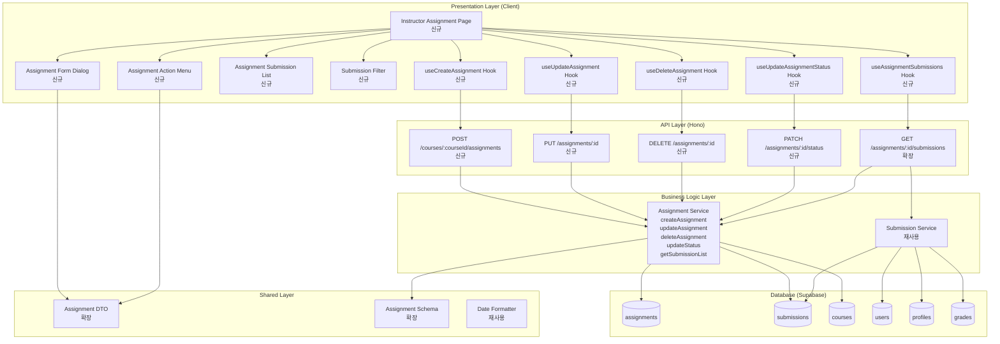

# Implementation Plan: 과제 관리 (Instructor)

## 개요

### Backend Modules

| 모듈 | 위치 | 설명 |
|------|------|------|
| Assignment Service (확장) | `src/features/assignment/backend/service.ts` | 과제 생성, 수정, 삭제, 상태 변경, 제출물 목록 조회 추가 |
| Assignment Route (확장) | `src/features/assignment/backend/route.ts` | POST/PUT/DELETE/PATCH 엔드포인트 추가 |
| Assignment Schema (확장) | `src/features/assignment/backend/schema.ts` | 생성/수정/제출물 목록 스키마 추가 |
| Assignment Error (확장) | `src/features/assignment/backend/error.ts` | 권한, 상태 전환 관련 에러 코드 추가 |
| Submission Service (재사용) | `src/features/submission/backend/service.ts` | 제출물 목록 조회 재사용 |

### Frontend Modules

| 모듈 | 위치 | 설명 |
|------|------|------|
| Instructor Assignment Page | `src/app/(protected)/dashboard/instructor/courses/[id]/assignments/page.tsx` | 과제 관리 페이지 (신규) |
| Assignment Form Dialog | `src/features/assignment/components/assignment-form-dialog.tsx` | 과제 생성/수정 폼 (신규) |
| Assignment Action Menu | `src/features/assignment/components/assignment-action-menu.tsx` | 과제 액션 메뉴 (게시/마감/삭제) (신규) |
| Assignment Submission List | `src/features/assignment/components/assignment-submission-list.tsx` | 제출물 목록 (신규) |
| Submission Filter | `src/features/assignment/components/submission-filter.tsx` | 제출물 필터 (신규) |
| useCreateAssignment Hook | `src/features/assignment/hooks/use-create-assignment.ts` | 과제 생성 Mutation (신규) |
| useUpdateAssignment Hook | `src/features/assignment/hooks/use-update-assignment.ts` | 과제 수정 Mutation (신규) |
| useDeleteAssignment Hook | `src/features/assignment/hooks/use-delete-assignment.ts` | 과제 삭제 Mutation (신규) |
| useUpdateAssignmentStatus Hook | `src/features/assignment/hooks/use-update-assignment-status.ts` | 과제 상태 변경 Mutation (신규) |
| useAssignmentSubmissions Hook | `src/features/assignment/hooks/use-assignment-submissions.ts` | 제출물 목록 조회 Query (신규) |

### Shared/Utility Modules

| 모듈 | 위치 | 설명 |
|------|------|------|
| Assignment DTO (확장) | `src/features/assignment/dto.ts` | 생성/수정 요청 스키마 재노출 |
| Date Formatter (재사용) | `src/lib/format/date.ts` | 마감일 포맷팅 재사용 |

---

## Diagram



---

## Implementation Plan

### Phase 1: Backend - Assignment Schema 확장

#### 1.1 Assignment Schema 확장
**파일**: `src/features/assignment/backend/schema.ts`

```typescript
export const CreateAssignmentRequestSchema = z.object({
  title: z.string().min(1, '제목을 입력해주세요'),
  description: z.string().min(1, '설명을 입력해주세요'),
  dueDate: z.string().refine((date) => !isNaN(Date.parse(date)), {
    message: '올바른 날짜 형식이 아닙니다',
  }),
  weight: z.number().min(0).max(100, '점수 비중은 0~100 사이여야 합니다'),
  allowLate: z.boolean().default(false),
  allowResubmission: z.boolean().default(false),
});

export const UpdateAssignmentRequestSchema = CreateAssignmentRequestSchema.partial();

export const UpdateAssignmentStatusRequestSchema = z.object({
  status: z.enum(['draft', 'published', 'closed']),
});

export const SubmissionListItemSchema = z.object({
  submissionId: z.string().uuid().nullable(),
  learnerId: z.string().uuid(),
  learnerName: z.string(),
  submissionStatus: z.enum(['not_submitted', 'submitted', 'graded', 'resubmission_required']),
  submittedAt: z.string().nullable(),
  late: z.boolean().nullable(),
  score: z.number().nullable(),
});

export const AssignmentSubmissionsResponseSchema = z.array(SubmissionListItemSchema);

export type CreateAssignmentRequest = z.infer<typeof CreateAssignmentRequestSchema>;
export type UpdateAssignmentRequest = z.infer<typeof UpdateAssignmentRequestSchema>;
export type UpdateAssignmentStatusRequest = z.infer<typeof UpdateAssignmentStatusRequestSchema>;
export type SubmissionListItem = z.infer<typeof SubmissionListItemSchema>;
```

**Unit Tests**:
- ✅ CreateAssignmentRequestSchema 유효성 검증
- ✅ weight 범위 검증 (0~100)
- ✅ 필수 필드 누락 검증
- ✅ dueDate 형식 검증

---

#### 1.2 Assignment Error 확장
**파일**: `src/features/assignment/backend/error.ts`

```typescript
export const assignmentErrorCodes = {
  fetchError: 'ASSIGNMENT_FETCH_ERROR',
  validationError: 'ASSIGNMENT_VALIDATION_ERROR',
  assignmentNotFound: 'ASSIGNMENT_NOT_FOUND',
  notEnrolled: 'NOT_ENROLLED',
  notPublished: 'NOT_PUBLISHED',
  notOwner: 'ASSIGNMENT_NOT_OWNER', // 신규
  invalidStatus: 'ASSIGNMENT_INVALID_STATUS', // 신규
  hasSubmissions: 'ASSIGNMENT_HAS_SUBMISSIONS', // 신규
  createError: 'ASSIGNMENT_CREATE_ERROR', // 신규
  updateError: 'ASSIGNMENT_UPDATE_ERROR', // 신규
  deleteError: 'ASSIGNMENT_DELETE_ERROR', // 신규
} as const;
```

---

### Phase 2: Backend - Assignment Service 확장

#### 2.1 Assignment Service 확장
**파일**: `src/features/assignment/backend/service.ts`

**새 함수**:

```typescript
export const createAssignment = async (
  client: SupabaseClient,
  courseId: string,
  instructorId: string,
  data: CreateAssignmentRequest
): Promise<HandlerResult<Assignment, AssignmentServiceError, unknown>>

export const updateAssignment = async (
  client: SupabaseClient,
  assignmentId: string,
  instructorId: string,
  data: UpdateAssignmentRequest
): Promise<HandlerResult<Assignment, AssignmentServiceError, unknown>>

export const deleteAssignment = async (
  client: SupabaseClient,
  assignmentId: string,
  instructorId: string
): Promise<HandlerResult<void, AssignmentServiceError, unknown>>

export const updateAssignmentStatus = async (
  client: SupabaseClient,
  assignmentId: string,
  instructorId: string,
  status: 'draft' | 'published' | 'closed'
): Promise<HandlerResult<Assignment, AssignmentServiceError, unknown>>

export const getAssignmentSubmissions = async (
  client: SupabaseClient,
  assignmentId: string,
  instructorId: string
): Promise<HandlerResult<SubmissionListItem[], AssignmentServiceError, unknown>>
```

**로직**:

**createAssignment**:
1. 코스 소유권 검증 (instructor_id = instructorId)
2. 입력값 검증
3. status='draft'로 과제 생성
4. 생성된 과제 반환

**updateAssignment**:
1. 과제 조회 및 소유권 검증
2. 입력값 검증
3. 과제 정보 업데이트
4. 업데이트된 과제 반환

**deleteAssignment**:
1. 과제 조회 및 소유권 검증
2. 상태 검증 (draft만 삭제 가능)
3. 제출물 존재 여부 검증
4. 과제 삭제

**updateAssignmentStatus**:
1. 과제 조회 및 소유권 검증
2. 상태 전환 유효성 검증
   - draft → published (O)
   - published → closed (O)
   - 기타 (X)
3. 상태 업데이트

**getAssignmentSubmissions**:
1. 과제 조회 및 소유권 검증
2. 수강생 목록 조회 (enrollments)
3. 제출물 조회 (submissions + grades)
4. 수강생별 최신 제출물 매핑
5. 제출물 목록 반환

**Unit Tests**:
- ✅ createAssignment - 정상 생성
- ✅ createAssignment - 타인의 코스 접근 → NOT_OWNER
- ✅ updateAssignment - 정상 수정
- ✅ updateAssignment - 타인의 과제 수정 → NOT_OWNER
- ✅ deleteAssignment - draft 상태 삭제 성공
- ✅ deleteAssignment - published 상태 삭제 실패 → INVALID_STATUS
- ✅ deleteAssignment - 제출물 있는 과제 삭제 실패 → HAS_SUBMISSIONS
- ✅ updateAssignmentStatus - draft → published 성공
- ✅ updateAssignmentStatus - published → closed 성공
- ✅ updateAssignmentStatus - published → draft 실패 → INVALID_STATUS
- ✅ getAssignmentSubmissions - 정상 조회
- ✅ getAssignmentSubmissions - 타인의 과제 조회 → NOT_OWNER

---

### Phase 3: Backend - Assignment Routes 확장

#### 3.1 Assignment Routes 확장
**파일**: `src/features/assignment/backend/route.ts`

**엔드포인트**:
- `POST /courses/:courseId/assignments` - 과제 생성
- `PUT /assignments/:id` - 과제 수정
- `DELETE /assignments/:id` - 과제 삭제
- `PATCH /assignments/:id/status` - 과제 상태 변경
- `GET /assignments/:id/submissions` - 제출물 목록 조회

**검증**:
- ✅ UUID 유효성 검증
- ✅ Instructor 역할 확인
- ✅ Request body schema 검증

---

### Phase 4: Frontend - Hooks

#### 4.1 useCreateAssignment Hook
**파일**: `src/features/assignment/hooks/use-create-assignment.ts`

```typescript
export const useCreateAssignment = (courseId: string) => {
  const queryClient = useQueryClient();

  return useMutation({
    mutationFn: async (data: CreateAssignmentRequest) => {
      const response = await apiClient.post(
        `/courses/${courseId}/assignments`,
        data
      );
      return response.data;
    },
    onSuccess: () => {
      queryClient.invalidateQueries({ queryKey: ['assignments', 'course', courseId] });
    },
  });
};
```

**QA Sheet**:
- ✅ 생성 성공 → 목록 갱신, 성공 메시지
- ✅ 필수 필드 누락 → 에러 메시지
- ✅ weight 범위 오류 → 에러 메시지
- ✅ 타인의 코스 → 에러 메시지

---

#### 4.2 useUpdateAssignment Hook
**파일**: `src/features/assignment/hooks/use-update-assignment.ts`

```typescript
export const useUpdateAssignment = (assignmentId: string) => {
  const queryClient = useQueryClient();

  return useMutation({
    mutationFn: async (data: UpdateAssignmentRequest) => {
      const response = await apiClient.put(
        `/assignments/${assignmentId}`,
        data
      );
      return response.data;
    },
    onSuccess: () => {
      queryClient.invalidateQueries({ queryKey: ['assignments'] });
      queryClient.invalidateQueries({ queryKey: ['assignment', assignmentId] });
    },
  });
};
```

**QA Sheet**:
- ✅ 수정 성공 → 목록 갱신, 성공 메시지
- ✅ 타인의 과제 수정 → 에러 메시지

---

#### 4.3 useDeleteAssignment Hook
**파일**: `src/features/assignment/hooks/use-delete-assignment.ts`

```typescript
export const useDeleteAssignment = () => {
  const queryClient = useQueryClient();

  return useMutation({
    mutationFn: async (assignmentId: string) => {
      await apiClient.delete(`/assignments/${assignmentId}`);
    },
    onSuccess: () => {
      queryClient.invalidateQueries({ queryKey: ['assignments'] });
    },
  });
};
```

**QA Sheet**:
- ✅ draft 상태 삭제 성공
- ✅ published 상태 삭제 → 에러 메시지
- ✅ 제출물 있는 과제 삭제 → 에러 메시지

---

#### 4.4 useUpdateAssignmentStatus Hook
**파일**: `src/features/assignment/hooks/use-update-assignment-status.ts`

```typescript
export const useUpdateAssignmentStatus = (assignmentId: string) => {
  const queryClient = useQueryClient();

  return useMutation({
    mutationFn: async (status: 'draft' | 'published' | 'closed') => {
      const response = await apiClient.patch(
        `/assignments/${assignmentId}/status`,
        { status }
      );
      return response.data;
    },
    onSuccess: () => {
      queryClient.invalidateQueries({ queryKey: ['assignments'] });
      queryClient.invalidateQueries({ queryKey: ['assignment', assignmentId] });
    },
  });
};
```

**QA Sheet**:
- ✅ draft → published 성공
- ✅ published → closed 성공
- ✅ 잘못된 상태 전환 → 에러 메시지

---

#### 4.5 useAssignmentSubmissions Hook
**파일**: `src/features/assignment/hooks/use-assignment-submissions.ts`

```typescript
export const useAssignmentSubmissions = (assignmentId: string) => {
  return useQuery({
    queryKey: ['assignment', assignmentId, 'submissions'],
    queryFn: async () => {
      const response = await apiClient.get(`/assignments/${assignmentId}/submissions`);
      return response.data;
    },
    enabled: !!assignmentId,
  });
};
```

---

### Phase 5: Frontend - Components

#### 5.1 Assignment Form Dialog Component
**파일**: `src/features/assignment/components/assignment-form-dialog.tsx`

**Props**:
```typescript
interface AssignmentFormDialogProps {
  courseId: string;
  assignment?: Assignment;
  open: boolean;
  onOpenChange: (open: boolean) => void;
}
```

**UI**:
- shadcn Dialog 사용
- 제목, 설명, 마감일, 점수 비중, 지각 허용, 재제출 허용 입력
- react-hook-form + zod 검증
- 생성/수정 모드 분리

**QA Sheet**:
- ✅ 생성 모드: 빈 폼 표시
- ✅ 수정 모드: 기존 데이터 로드
- ✅ 필수 필드 검증
- ✅ 제출 성공 시 다이얼로그 닫힘
- ✅ 제출 실패 시 에러 메시지 표시

---

#### 5.2 Assignment Action Menu Component
**파일**: `src/features/assignment/components/assignment-action-menu.tsx`

**Props**:
```typescript
interface AssignmentActionMenuProps {
  assignment: Assignment;
}
```

**UI**:
- shadcn DropdownMenu 사용
- 수정, 게시, 마감, 삭제 액션
- 상태에 따라 액션 비활성화
  - draft: 수정, 게시, 삭제 가능
  - published: 수정, 마감 가능
  - closed: 수정만 가능

**QA Sheet**:
- ✅ draft 상태: 수정, 게시, 삭제 버튼 활성화
- ✅ published 상태: 수정, 마감 버튼 활성화
- ✅ closed 상태: 수정 버튼만 활성화
- ✅ 게시/마감 확인 모달 표시
- ✅ 삭제 확인 모달 표시

---

#### 5.3 Assignment Submission List Component
**파일**: `src/features/assignment/components/assignment-submission-list.tsx`

**Props**:
```typescript
interface AssignmentSubmissionListProps {
  assignmentId: string;
}
```

**UI**:
- 제출물 목록 테이블
- 학습자 이름, 제출 상태, 제출일시, 지각 여부, 점수 표시
- 필터 및 정렬 기능
- 클릭 시 제출물 상세 (채점 페이지)로 이동

**QA Sheet**:
- ✅ 제출물 목록 올바르게 표시
- ✅ 필터 적용 시 목록 갱신
- ✅ 정렬 적용 시 목록 갱신
- ✅ 클릭 시 채점 페이지로 이동

---

#### 5.4 Submission Filter Component
**파일**: `src/features/assignment/components/submission-filter.tsx`

**Props**:
```typescript
interface SubmissionFilterProps {
  onFilterChange: (filter: SubmissionFilter) => void;
}

type SubmissionFilter = {
  status?: 'submitted' | 'graded' | 'resubmission_required';
  late?: boolean;
};
```

**UI**:
- 체크박스 그룹
- 미채점, 지각 제출, 재제출 요청 필터

**QA Sheet**:
- ✅ 필터 선택 시 즉시 적용
- ✅ 다중 필터 적용 가능

---

### Phase 6: Frontend - Pages

#### 6.1 Instructor Assignment Page
**파일**: `src/app/(protected)/dashboard/instructor/courses/[id]/assignments/page.tsx`

**로직**:
1. URL params에서 courseId 추출
2. useAssignments(courseId) 호출
3. 과제 목록 표시
4. "과제 추가" 버튼 클릭 시 AssignmentFormDialog 열기
5. 각 과제에 AssignmentActionMenu 표시

**QA Sheet**:
- ✅ 과제 목록 올바르게 표시
- ✅ 과제 추가 버튼 클릭 시 다이얼로그 열림
- ✅ 과제 생성 성공 시 목록 갱신
- ✅ 권한 없는 사용자 접근 차단

---

### Phase 7: DTO & Integration

#### 7.1 Assignment DTO 확장
**파일**: `src/features/assignment/dto.ts`

```typescript
export * from './backend/schema';
export type {
  Assignment,
  CreateAssignmentRequest,
  UpdateAssignmentRequest,
  UpdateAssignmentStatusRequest,
  SubmissionListItem,
} from './backend/schema';
```

---

## Testing Strategy

### Backend Unit Tests
- Assignment Service: 모든 함수의 성공/실패 케이스
- 권한 검증: 타인의 코스/과제 접근 차단
- 상태 전환: 유효한/유효하지 않은 전환 검증
- 삭제 정책: draft만 삭제, 제출물 있으면 차단

### Frontend QA Checklist
- 각 컴포넌트의 UI 렌더링 검증
- 폼 검증 동작 확인
- 권한 검증 동작 확인
- 에러 상태 표시 확인
- 로딩 상태 표시 확인

### Integration Tests
- E2E: 과제 생성 → 수정 → 게시 → 마감 플로우
- API: 각 엔드포인트의 응답 구조 검증
- 권한 검증: Instructor만 접근 가능, 소유자만 관리 가능

---

## Deployment Checklist

- ✅ 모든 백엔드 서비스 Unit Test 통과
- ✅ 모든 프론트엔드 컴포넌트 QA Sheet 검증 완료
- ✅ TypeScript 타입 에러 0개
- ✅ ESLint 경고 0개
- ✅ Build 성공
- ✅ Instructor 역할 검증 확인
- ✅ 소유권 검증 확인
- ✅ 상태 전환 정책 확인
- ✅ 삭제 정책 확인

---

## Summary

이 구현 계획은 **과제 관리 (Instructor)** 기능을 최소 스펙으로 모듈화하여 설계했습니다.

### 핵심 원칙
1. **기존 Assignment 모듈 확장**: CRUD 및 상태 관리 기능 추가
2. **권한 검증 중심**: Instructor 역할 및 소유권 검증
3. **상태 전환 정책**: draft → published → closed 단방향 전환
4. **삭제 정책**: draft만 삭제, 제출물 있으면 차단
5. **모듈 분리**: Backend (service/route/schema/error), Frontend (components/hooks), Shared (dto)
6. **검증 중심**: zod 스키마 기반 요청/응답 검증, Unit Test 포함
7. **사용자 경험**: QA Sheet 기반 사용성 테스트, 실시간 상태 업데이트

이 계획을 기반으로 순차적으로 구현하면 유스케이스 요구사항을 충족할 수 있습니다.
