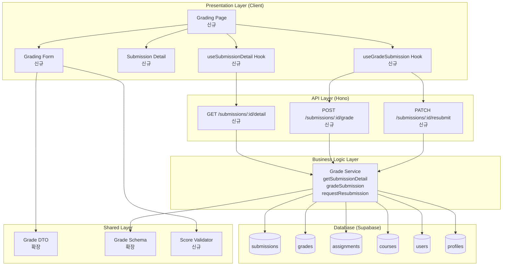

# Implementation Plan: 제출물 채점 & 피드백 (Instructor)

## 개요

### Backend Modules

| 모듈 | 위치 | 설명 |
|------|------|------|
| Grade Service (확장) | `src/features/grade/backend/service.ts` | 제출물 채점, 피드백 작성, 재제출 요청 기능 추가 |
| Grade Route (확장) | `src/features/grade/backend/route.ts` | POST/PATCH 엔드포인트 추가 |
| Grade Schema (확장) | `src/features/grade/backend/schema.ts` | 채점 요청/응답 스키마 추가 |
| Grade Error (확장) | `src/features/grade/backend/error.ts` | 권한, 검증 관련 에러 코드 추가 |

### Frontend Modules

| 모듈 | 위치 | 설명 |
|------|------|------|
| Grading Page | `src/app/(protected)/grades/[submissionId]/page.tsx` | 제출물 채점 페이지 (신규) |
| Grading Form | `src/features/grade/components/grading-form.tsx` | 채점 폼 컴포넌트 (신규) |
| Submission Detail | `src/features/grade/components/submission-detail.tsx` | 제출물 상세 정보 (신규) |
| useGradeSubmission Hook | `src/features/grade/hooks/use-grade-submission.ts` | 채점 Mutation (신규) |
| useSubmissionDetail Hook | `src/features/grade/hooks/use-submission-detail.ts` | 제출물 상세 조회 Query (신규) |

### Shared/Utility Modules

| 모듈 | 위치 | 설명 |
|------|------|------|
| Grade DTO (확장) | `src/features/grade/dto.ts` | 채점 요청 스키마 재노출 |
| Score Validator (신규) | `src/lib/utils/validators.ts` | 점수 범위 검증 유틸 |

---

## Diagram



---

## Implementation Plan

### Phase 1: Backend - Grade Schema 확장

#### 1.1 Grade Schema 확장
**파일**: `src/features/grade/backend/schema.ts`

```typescript
export const SubmissionDetailSchema = z.object({
  submissionId: z.string().uuid(),
  assignmentTitle: z.string(),
  courseId: z.string().uuid(),
  courseName: z.string(),
  learnerId: z.string().uuid(),
  learnerName: z.string(),
  submissionText: z.string(),
  submissionLink: z.string().nullable(),
  submittedAt: z.string(),
  isLate: z.boolean(),
  status: z.enum(['submitted', 'graded', 'resubmission_required']),
  currentScore: z.number().nullable(),
  currentFeedback: z.string().nullable(),
  gradedAt: z.string().nullable(),
});

export const GradeSubmissionRequestSchema = z.object({
  score: z.number().min(0).max(100, '점수는 0~100 사이여야 합니다'),
  feedback: z.string().min(1, '피드백은 필수입니다'),
});

export const GradeSubmissionResponseSchema = z.object({
  submissionId: z.string().uuid(),
  status: z.enum(['graded']),
  score: z.number(),
  feedback: z.string(),
  gradedAt: z.string(),
});

export const RequestResubmissionRequestSchema = z.object({
  feedback: z.string().min(1, '재제출 사유는 필수입니다'),
});

export type SubmissionDetail = z.infer<typeof SubmissionDetailSchema>;
export type GradeSubmissionRequest = z.infer<typeof GradeSubmissionRequestSchema>;
export type GradeSubmissionResponse = z.infer<typeof GradeSubmissionResponseSchema>;
export type RequestResubmissionRequest = z.infer<typeof RequestResubmissionRequestSchema>;
```

**Unit Tests**:
- ✅ GradeSubmissionRequestSchema 유효성 검증
- ✅ score 범위 검증 (0~100)
- ✅ feedback 필수 검증
- ✅ RequestResubmissionRequestSchema 유효성 검증

---

#### 1.2 Grade Error 확장
**파일**: `src/features/grade/backend/error.ts`

```typescript
export const gradeErrorCodes = {
  fetchError: 'GRADE_FETCH_ERROR',
  invalidRole: 'INVALID_ROLE',
  submissionNotFound: 'SUBMISSION_NOT_FOUND', // 신규
  notCourseOwner: 'NOT_COURSE_OWNER', // 신규
  alreadyGraded: 'ALREADY_GRADED', // 신규
  invalidScore: 'INVALID_SCORE', // 신규
  gradeError: 'GRADE_ERROR', // 신규
  resubmitError: 'RESUBMIT_ERROR', // 신규
} as const;

export type GradeServiceError = (typeof gradeErrorCodes)[keyof typeof gradeErrorCodes];
```

---

### Phase 2: Backend - Grade Service 확장

#### 2.1 Grade Service 확장
**파일**: `src/features/grade/backend/service.ts`

**새 함수**:

```typescript
export const getSubmissionDetail = async (
  client: SupabaseClient,
  submissionId: string,
  instructorId: string
): Promise<HandlerResult<SubmissionDetail, GradeServiceError, unknown>>

export const gradeSubmission = async (
  client: SupabaseClient,
  submissionId: string,
  instructorId: string,
  data: GradeSubmissionRequest
): Promise<HandlerResult<GradeSubmissionResponse, GradeServiceError, unknown>>

export const requestResubmission = async (
  client: SupabaseClient,
  submissionId: string,
  instructorId: string,
  feedback: string
): Promise<HandlerResult<GradeSubmissionResponse, GradeServiceError, unknown>>
```

**로직**:

**getSubmissionDetail**:
1. 제출물 조회 (submission + assignment + course + learner profile)
2. 코스 소유권 검증 (course.instructor_id = instructorId)
3. 제출물 상세 정보 반환 (학습자 정보, 제출 내용, 제출 시간, 지각 여부, 현재 점수/피드백)

**gradeSubmission**:
1. 제출물 조회 및 코스 소유권 검증
2. 입력값 검증 (score: 0~100, feedback: 필수)
3. grades 테이블에 INSERT 또는 UPDATE
4. submissions.status를 'graded'로 업데이트
5. 채점 결과 반환

**requestResubmission**:
1. 제출물 조회 및 코스 소유권 검증
2. submissions.status를 'resubmission_required'로 업데이트
3. grades 테이블에 피드백만 저장 (score는 NULL 또는 기존 값 유지)
4. 결과 반환

**Unit Tests**:
- ✅ getSubmissionDetail - 정상 조회
- ✅ getSubmissionDetail - 타인의 코스 제출물 조회 → NOT_COURSE_OWNER
- ✅ getSubmissionDetail - 존재하지 않는 제출물 → SUBMISSION_NOT_FOUND
- ✅ gradeSubmission - 정상 채점
- ✅ gradeSubmission - 점수 범위 초과 → INVALID_SCORE
- ✅ gradeSubmission - 피드백 누락 → validation error
- ✅ gradeSubmission - 타인의 코스 제출물 채점 → NOT_COURSE_OWNER
- ✅ requestResubmission - 정상 재제출 요청
- ✅ requestResubmission - 타인의 코스 제출물 → NOT_COURSE_OWNER

---

### Phase 3: Backend - Grade Routes 확장

#### 3.1 Grade Routes 확장
**파일**: `src/features/grade/backend/route.ts`

**엔드포인트**:
- `GET /submissions/:id/detail` - 제출물 상세 조회
- `POST /submissions/:id/grade` - 제출물 채점
- `PATCH /submissions/:id/resubmit` - 재제출 요청

**검증**:
- ✅ UUID 유효성 검증
- ✅ Instructor 역할 확인
- ✅ Request body schema 검증

---

### Phase 4: Frontend - Hooks

#### 4.1 useSubmissionDetail Hook
**파일**: `src/features/grade/hooks/use-submission-detail.ts`

```typescript
export const useSubmissionDetail = (submissionId: string) => {
  return useQuery({
    queryKey: ['submission', submissionId, 'detail'],
    queryFn: async () => {
      const response = await apiClient.get(`/submissions/${submissionId}/detail`);
      return response.data;
    },
    enabled: !!submissionId,
  });
};
```

**QA Sheet**:
- ✅ 정상 조회 시 제출물 상세 정보 표시
- ✅ 권한 없을 경우 에러 메시지 표시
- ✅ 존재하지 않는 제출물 → 에러 메시지

---

#### 4.2 useGradeSubmission Hook
**파일**: `src/features/grade/hooks/use-grade-submission.ts`

```typescript
export const useGradeSubmission = (submissionId: string) => {
  const queryClient = useQueryClient();

  return useMutation({
    mutationFn: async (data: GradeSubmissionRequest | { resubmit: true; feedback: string }) => {
      if ('resubmit' in data) {
        const response = await apiClient.patch(
          `/submissions/${submissionId}/resubmit`,
          { feedback: data.feedback }
        );
        return response.data;
      }

      const response = await apiClient.post(
        `/submissions/${submissionId}/grade`,
        data
      );
      return response.data;
    },
    onSuccess: () => {
      queryClient.invalidateQueries({ queryKey: ['submission', submissionId] });
      queryClient.invalidateQueries({ queryKey: ['assignments'] });
      queryClient.invalidateQueries({ queryKey: ['grades'] });
    },
  });
};
```

**QA Sheet**:
- ✅ 채점 성공 → 성공 메시지, 제출물 상태 갱신
- ✅ 점수 범위 오류 → 에러 메시지
- ✅ 피드백 누락 → 에러 메시지
- ✅ 재제출 요청 성공 → 성공 메시지, 상태 갱신

---

### Phase 5: Frontend - Components

#### 5.1 Submission Detail Component
**파일**: `src/features/grade/components/submission-detail.tsx`

**Props**:
```typescript
interface SubmissionDetailProps {
  submission: SubmissionDetail;
}
```

**UI**:
- 학습자 이름
- 과제 제목
- 제출 시간
- 지각 여부 표시
- 제출 내용 (텍스트)
- 제출 링크 (있을 경우)
- 현재 점수/피드백 (이미 채점된 경우)

**QA Sheet**:
- ✅ 제출물 정보 올바르게 표시
- ✅ 지각 제출 시 경고 표시
- ✅ 링크 있을 경우 클릭 가능한 링크로 표시

---

#### 5.2 Grading Form Component
**파일**: `src/features/grade/components/grading-form.tsx`

**Props**:
```typescript
interface GradingFormProps {
  submissionId: string;
  currentScore?: number | null;
  currentFeedback?: string | null;
  onSuccess: () => void;
}
```

**UI**:
- 점수 입력 (0~100)
- 피드백 입력 (Textarea, 필수)
- 저장 버튼
- 재제출 요청 버튼
- react-hook-form + zod 검증

**QA Sheet**:
- ✅ 점수 범위 검증 (0~100)
- ✅ 피드백 필수 검증
- ✅ 저장 성공 시 성공 메시지
- ✅ 재제출 요청 성공 시 성공 메시지
- ✅ 제출 실패 시 에러 메시지 표시

---

### Phase 6: Frontend - Pages

#### 6.1 Grading Page
**파일**: `src/app/(protected)/grades/[submissionId]/page.tsx`

**로직**:
1. URL params에서 submissionId 추출
2. useSubmissionDetail(submissionId) 호출
3. SubmissionDetail 컴포넌트에 제출물 정보 표시
4. GradingForm 컴포넌트에 채점 폼 표시
5. 채점 완료 시 성공 메시지 표시 및 목록 갱신

**QA Sheet**:
- ✅ 제출물 정보 올바르게 표시
- ✅ 채점 폼 올바르게 표시
- ✅ 채점 성공 시 성공 메시지 표시
- ✅ 권한 없는 사용자 접근 차단
- ✅ 존재하지 않는 제출물 접근 시 404 표시

---

### Phase 7: DTO & Integration

#### 7.1 Grade DTO 확장
**파일**: `src/features/grade/dto.ts`

```typescript
export * from './backend/schema';
export type {
  AssignmentGrade,
  CourseGrade,
  MyGradesResponse,
  SubmissionDetail, // 신규
  GradeSubmissionRequest, // 신규
  GradeSubmissionResponse, // 신규
  RequestResubmissionRequest, // 신규
} from './backend/schema';
```

---

#### 7.2 Score Validator Utility
**파일**: `src/lib/utils/validators.ts`

```typescript
export const validateScore = (score: number): boolean => {
  return score >= 0 && score <= 100 && Number.isInteger(score);
};

export const validateFeedback = (feedback: string): boolean => {
  return feedback.trim().length > 0;
};
```

---

## Testing Strategy

### Backend Unit Tests
- Grade Service: 모든 함수의 성공/실패 케이스
- 권한 검증: 타인의 코스 제출물 접근 차단
- 점수 검증: 0~100 범위 검증
- 피드백 검증: 필수 입력 검증
- 상태 전환: submitted → graded, submitted → resubmission_required

### Frontend QA Checklist
- 각 컴포넌트의 UI 렌더링 검증
- 폼 검증 동작 확인
- 권한 검증 동작 확인
- 에러 상태 표시 확인
- 로딩 상태 표시 확인
- 채점 성공 시 상태 갱신 확인

### Integration Tests
- E2E: 제출물 목록 조회 → 제출물 선택 → 채점 → 성공 플로우
- API: 각 엔드포인트의 응답 구조 검증
- 권한 검증: Instructor만 접근 가능, 본인 코스만 채점 가능

---

## Deployment Checklist

- ✅ 모든 백엔드 서비스 Unit Test 통과
- ✅ 모든 프론트엔드 컴포넌트 QA Sheet 검증 완료
- ✅ TypeScript 타입 에러 0개
- ✅ ESLint 경고 0개
- ✅ Build 성공
- ✅ Instructor 역할 검증 확인
- ✅ 코스 소유권 검증 확인
- ✅ 점수 범위 검증 확인
- ✅ 피드백 필수 검증 확인

---

## Summary

이 구현 계획은 **제출물 채점 & 피드백 (Instructor)** 기능을 최소 스펙으로 모듈화하여 설계했습니다.

### 핵심 원칙
1. **기존 Grade 모듈 확장**: 제출물 상세 조회 및 채점 기능 추가
2. **권한 검증 중심**: Instructor 역할 및 코스 소유권 검증
3. **입력 검증**: 점수 범위(0~100), 피드백 필수
4. **상태 관리**: submitted → graded 또는 resubmission_required
5. **모듈 분리**: Backend (service/route/schema/error), Frontend (components/hooks), Shared (dto/validators)
6. **검증 중심**: zod 스키마 기반 요청/응답 검증, Unit Test 포함
7. **사용자 경험**: QA Sheet 기반 사용성 테스트, 실시간 상태 업데이트

이 계획을 기반으로 순차적으로 구현하면 유스케이스 요구사항을 충족할 수 있습니다.
