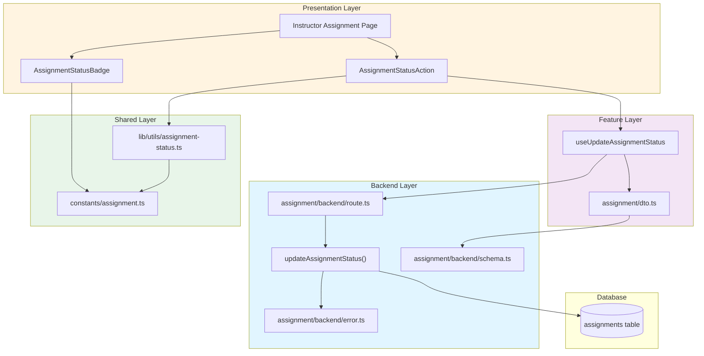

# Assignment 게시/마감 기능 구현 계획

## 개요

본 기능은 이미 구현된 `updateAssignmentStatus` 서비스를 활용하여 UI 레이어를 추가하는 작업입니다.

### 모듈 목록

| 모듈 | 경로 | 설명 |
|------|------|------|
| **Constants** | `src/constants/assignment.ts` | Assignment 상태 관련 상수 및 타입 정의 |
| **Validation Utility** | `src/lib/utils/assignment-status.ts` | Assignment 상태 전환 검증 로직 (기존 파일 확장) |
| **React Hook** | `src/features/assignment/hooks/use-update-assignment-status.ts` | 상태 변경 mutation hook (기존 파일 유지) |
| **UI Component** | `src/features/assignment/components/assignment-status-action.tsx` | 상태 변경 버튼/다이얼로그 컴포넌트 |
| **Badge Component** | `src/features/assignment/components/assignment-status-badge.tsx` | 과제 상태 배지 컴포넌트 |

## Diagram



## Implementation Plan

### 1. Constants Layer

**파일**: `src/constants/assignment.ts` (신규 생성)

**목적**: Assignment 상태 관련 상수 정의

**구현 내용**:
```typescript
export const ASSIGNMENT_STATUS = {
  DRAFT: 'draft',
  PUBLISHED: 'published',
  CLOSED: 'closed',
} as const;

export type AssignmentStatus = (typeof ASSIGNMENT_STATUS)[keyof typeof ASSIGNMENT_STATUS];

export const ASSIGNMENT_STATUS_LABELS_KO: Record<AssignmentStatus, string> = {
  [ASSIGNMENT_STATUS.DRAFT]: '작성 중',
  [ASSIGNMENT_STATUS.PUBLISHED]: '게시됨',
  [ASSIGNMENT_STATUS.CLOSED]: '마감됨',
};
```

**검증**: 타입 안정성 확인 (컴파일 에러 없음)

---

### 2. Validation Utility

**파일**: `src/lib/utils/assignment-status.ts` (기존 파일 확장)

**목적**: Assignment 상태 전환 검증 로직

**구현 내용**:
```typescript
// 기존 함수 유지: canSubmit, canResubmit, getSubmissionStatus

// 추가 함수
export const canPublishAssignment = (assignment: {
  title?: string;
  description?: string;
  dueDate?: string;
  weight?: number;
}): { allowed: boolean; reason?: string } => {
  if (!assignment.title || assignment.title.trim() === '') {
    return { allowed: false, reason: '제목을 입력해주세요' };
  }
  if (!assignment.description || assignment.description.trim() === '') {
    return { allowed: false, reason: '설명을 입력해주세요' };
  }
  if (!assignment.dueDate) {
    return { allowed: false, reason: '마감일을 입력해주세요' };
  }
  if (assignment.weight === undefined || assignment.weight < 0 || assignment.weight > 100) {
    return { allowed: false, reason: '점수 비중을 0~100 사이로 입력해주세요' };
  }
  return { allowed: true };
};

export const getNextAllowedAssignmentStatuses = (
  currentStatus: AssignmentStatus,
): AssignmentStatus[] => {
  const validTransitions: Record<AssignmentStatus, AssignmentStatus[]> = {
    draft: ['published'],
    published: ['closed'],
    closed: [],
  };
  return validTransitions[currentStatus] || [];
};
```

**Unit Test**:
```typescript
describe('assignment-status utils', () => {
  describe('canPublishAssignment', () => {
    it('필수 정보가 모두 있으면 게시 가능', () => {
      const result = canPublishAssignment({
        title: 'Test',
        description: 'Desc',
        dueDate: '2025-12-31',
        weight: 50,
      });
      expect(result.allowed).toBe(true);
    });

    it('제목 없으면 게시 불가', () => {
      const result = canPublishAssignment({
        description: 'Desc',
        dueDate: '2025-12-31',
        weight: 50,
      });
      expect(result.allowed).toBe(false);
      expect(result.reason).toContain('제목');
    });
  });

  describe('getNextAllowedAssignmentStatuses', () => {
    it('draft는 published로만 전환 가능', () => {
      const result = getNextAllowedAssignmentStatuses('draft');
      expect(result).toEqual(['published']);
    });

    it('closed는 전환 불가', () => {
      const result = getNextAllowedAssignmentStatuses('closed');
      expect(result).toEqual([]);
    });
  });
});
```

---

### 3. UI Component - Status Badge

**파일**: `src/features/assignment/components/assignment-status-badge.tsx` (신규)

**목적**: Assignment 상태를 시각적으로 표시

**구현 내용**:
```typescript
'use client';

import { Badge } from '@/components/ui/badge';
import { ASSIGNMENT_STATUS_LABELS_KO, type AssignmentStatus } from '@/constants/assignment';

interface AssignmentStatusBadgeProps {
  status: AssignmentStatus;
}

export function AssignmentStatusBadge({ status }: AssignmentStatusBadgeProps) {
  const variantMap: Record<AssignmentStatus, 'default' | 'secondary' | 'destructive'> = {
    draft: 'secondary',
    published: 'default',
    closed: 'destructive',
  };

  return (
    <Badge variant={variantMap[status]}>
      {ASSIGNMENT_STATUS_LABELS_KO[status]}
    </Badge>
  );
}
```

**QA Sheet**:
| 테스트 케이스 | 입력 | 예상 결과 |
|--------------|------|-----------|
| Draft 상태 | status='draft' | '작성 중' 배지 (secondary 스타일) |
| Published 상태 | status='published' | '게시됨' 배지 (default 스타일) |
| Closed 상태 | status='closed' | '마감됨' 배지 (destructive 스타일) |

---

### 4. UI Component - Status Action

**파일**: `src/features/assignment/components/assignment-status-action.tsx` (신규)

**목적**: Assignment 상태 변경 UI

**구현 내용**:
```typescript
'use client';

import { useState } from 'react';
import { Button } from '@/components/ui/button';
import {
  AlertDialog,
  AlertDialogAction,
  AlertDialogCancel,
  AlertDialogContent,
  AlertDialogDescription,
  AlertDialogFooter,
  AlertDialogHeader,
  AlertDialogTitle,
} from '@/components/ui/alert-dialog';
import {
  Select,
  SelectContent,
  SelectItem,
  SelectTrigger,
  SelectValue,
} from '@/components/ui/select';
import { useToast } from '@/hooks/use-toast';
import { useUpdateAssignmentStatus } from '../hooks/use-update-assignment-status';
import { getNextAllowedAssignmentStatuses, canPublishAssignment } from '@/lib/utils/assignment-status';
import { ASSIGNMENT_STATUS_LABELS_KO, type AssignmentStatus } from '@/constants/assignment';

interface AssignmentStatusActionProps {
  assignmentId: string;
  courseId: string;
  currentStatus: AssignmentStatus;
  assignmentData: {
    title?: string;
    description?: string;
    dueDate?: string;
    weight?: number;
  };
}

export function AssignmentStatusAction({
  assignmentId,
  courseId,
  currentStatus,
  assignmentData,
}: AssignmentStatusActionProps) {
  const { toast } = useToast();
  const [selectedStatus, setSelectedStatus] = useState<AssignmentStatus | ''>('');
  const [showConfirmDialog, setShowConfirmDialog] = useState(false);
  const updateStatusMutation = useUpdateAssignmentStatus(assignmentId, courseId);

  const allowedStatuses = getNextAllowedAssignmentStatuses(currentStatus);

  const handleStatusChange = (newStatus: string) => {
    // 게시 전 검증
    if (newStatus === 'published' && currentStatus === 'draft') {
      const validation = canPublishAssignment(assignmentData);
      if (!validation.allowed) {
        toast({
          title: '게시할 수 없습니다',
          description: validation.reason,
          variant: 'destructive',
        });
        return;
      }
    }

    setSelectedStatus(newStatus as AssignmentStatus);
    setShowConfirmDialog(true);
  };

  const handleConfirm = async () => {
    if (!selectedStatus) return;

    try {
      await updateStatusMutation.mutateAsync({ status: selectedStatus });
      toast({
        title: '과제 상태가 변경되었습니다',
        description: `${ASSIGNMENT_STATUS_LABELS_KO[selectedStatus]}(으)로 변경되었습니다`,
      });
      setShowConfirmDialog(false);
      setSelectedStatus('');
    } catch (error) {
      toast({
        title: '상태 변경에 실패했습니다',
        description: error instanceof Error ? error.message : '다시 시도해주세요',
        variant: 'destructive',
      });
    }
  };

  if (allowedStatuses.length === 0) {
    return null;
  }

  return (
    <>
      <div className="flex items-center gap-2">
        <Select value={selectedStatus} onValueChange={handleStatusChange}>
          <SelectTrigger className="w-[180px]">
            <SelectValue placeholder="상태 변경" />
          </SelectTrigger>
          <SelectContent>
            {allowedStatuses.map((status) => (
              <SelectItem key={status} value={status}>
                {ASSIGNMENT_STATUS_LABELS_KO[status]}(으)로 변경
              </SelectItem>
            ))}
          </SelectContent>
        </Select>
      </div>

      <AlertDialog open={showConfirmDialog} onOpenChange={setShowConfirmDialog}>
        <AlertDialogContent>
          <AlertDialogHeader>
            <AlertDialogTitle>과제 상태를 변경하시겠습니까?</AlertDialogTitle>
            <AlertDialogDescription>
              {selectedStatus && (
                <>
                  현재 상태: <strong>{ASSIGNMENT_STATUS_LABELS_KO[currentStatus]}</strong>
                  <br />
                  변경할 상태: <strong>{ASSIGNMENT_STATUS_LABELS_KO[selectedStatus]}</strong>
                  <br />
                  <br />
                  {selectedStatus === 'published' && currentStatus === 'draft' && (
                    <span className="text-yellow-600">
                      과제가 게시되면 모든 수강생에게 노출됩니다.
                    </span>
                  )}
                  {selectedStatus === 'closed' && (
                    <span className="text-yellow-600">
                      과제가 마감되면 학습자는 더 이상 제출할 수 없습니다. 채점은 계속 가능합니다.
                    </span>
                  )}
                </>
              )}
            </AlertDialogDescription>
          </AlertDialogHeader>
          <AlertDialogFooter>
            <AlertDialogCancel>취소</AlertDialogCancel>
            <AlertDialogAction
              onClick={handleConfirm}
              disabled={updateStatusMutation.isPending}
            >
              {updateStatusMutation.isPending ? '처리중...' : '확인'}
            </AlertDialogAction>
          </AlertDialogFooter>
        </AlertDialogContent>
      </AlertDialog>
    </>
  );
}
```

**QA Sheet**:
| 테스트 케이스 | 전제 조건 | 사용자 동작 | 예상 결과 |
|--------------|-----------|-------------|-----------|
| Draft → Published 성공 | 필수 정보 모두 입력 | 게시 버튼 클릭 → 확인 | 상태 변경 성공, 토스트 메시지 표시 |
| Draft → Published 실패 (검증) | 제목 미입력 | 게시 버튼 클릭 | 검증 에러 토스트 표시, 다이얼로그 미표시 |
| Published → Closed | Published 상태 | 마감 버튼 클릭 → 확인 | 상태 변경 성공, 마감 안내 메시지 |
| Closed 상태 | Closed 상태 | - | 상태 변경 버튼 미표시 |
| 네트워크 오류 | - | 상태 변경 시도 | 실패 토스트 표시, 이전 상태 유지 |

---

### 5. Backend Validation (기존 로직 확인)

**파일**: `src/features/assignment/backend/service.ts` (수정 불필요)

**확인 사항**:
- `updateAssignmentStatus` 함수 (607-678줄)에서 이미 검증 로직 구현됨:
  - 권한 확인 (instructor_id 일치)
  - 상태 전환 규칙 검증 (validTransitions)
  - 에러 코드 반환 (`assignmentErrorCodes.invalidStatus`)

**추가 개선 (선택사항)**:
- 게시 시 필수 정보 검증을 백엔드에서도 수행하려면:
```typescript
// updateAssignmentStatus 함수 내부에 추가
if (status === 'published' && currentStatus === 'draft') {
  // 필수 정보 체크
  const { data: fullAssignment } = await client
    .from('assignments')
    .select('title, description, due_date, weight')
    .eq('id', assignmentId)
    .single();

  if (!fullAssignment?.title || !fullAssignment?.description ||
      !fullAssignment?.due_date || fullAssignment?.weight === undefined) {
    return failure(
      400,
      assignmentErrorCodes.validationError,
      'Cannot publish assignment with incomplete information',
    );
  }
}
```

**Unit Test** (Backend):
```typescript
describe('updateAssignmentStatus', () => {
  it('draft → published 전환 성공', async () => {
    // given: draft 상태의 assignment, instructor 권한
    // when: status='published'로 업데이트
    // then: 성공 응답, DB 업데이트 확인
  });

  it('published → draft 전환 불가', async () => {
    // given: published 상태의 assignment
    // when: status='draft'로 업데이트 시도
    // then: invalidStatus 에러 반환
  });

  it('권한 없는 사용자는 상태 변경 불가', async () => {
    // given: 다른 instructor의 assignment
    // when: 상태 변경 시도
    // then: notOwner 에러 반환
  });
});
```

---

## 구현 순서

1. ✅ **Constants 생성** → `src/constants/assignment.ts`
2. ✅ **Validation Utility 확장** → `src/lib/utils/assignment-status.ts`
3. ✅ **Status Badge 컴포넌트** → `assignment-status-badge.tsx`
4. ✅ **Status Action 컴포넌트** → `assignment-status-action.tsx`
5. ✅ **Backend 검증 로직 추가** (선택사항)
6. 🔲 **Unit Test 작성** (Backend 및 Utils)
7. 🔲 **QA 시트 기반 테스트**

---

## 의존성

### 외부 라이브러리
- `@tanstack/react-query`: 이미 설치됨
- `zod`: 이미 설치됨
- `shadcn-ui`: 추가 컴포넌트 필요 시 설치
  ```bash
  npx shadcn@latest add select
  npx shadcn@latest add alert-dialog
  npx shadcn@latest add badge
  ```

### 내부 모듈
- `@/backend/http/response`: 이미 구현됨
- `@/features/assignment/backend/service`: 이미 구현됨
- `@/lib/remote/api-client`: 이미 구현됨

---

## 주의사항

### 코드 품질
- 모든 컴포넌트는 `'use client'` 지시어 사용
- TypeScript strict mode 준수
- ESLint 규칙 준수
- 함수형 프로그래밍 및 immutable 패턴 사용

### 보안
- 백엔드에서 권한 검증 필수 (이미 구현됨)
- 프론트엔드 검증은 UX 개선용, 보안 의존 금지

### UX
- 상태 변경 전 명확한 확인 다이얼로그
- 성공/실패 피드백 제공
- 로딩 상태 표시

### 성능
- React Query invalidation을 통한 캐시 업데이트
- 불필요한 리렌더링 방지
