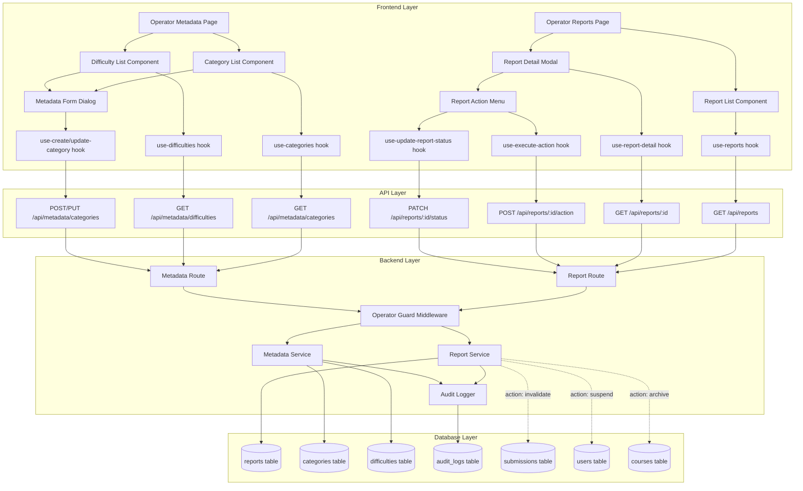

# Implementation Plan: 운영 관리 (Operator)

## 개요

### 1. Report Feature (신고 관리)
| 모듈 | 위치 | 설명 |
|------|------|------|
| **Backend** |
| Report Schema | `src/features/report/backend/schema.ts` | 신고 관련 DTO, 요청/응답 스키마 정의 |
| Report Service | `src/features/report/backend/service.ts` | 신고 접수, 조회, 상태 변경, 액션 처리 비즈니스 로직 |
| Report Route | `src/features/report/backend/route.ts` | 신고 관련 API 엔드포인트 (POST, GET, PATCH) |
| Report Error | `src/features/report/backend/error.ts` | 신고 관련 에러 코드 정의 |
| **Frontend** |
| Report Hooks | `src/features/report/hooks/use-reports.ts` | 신고 목록 조회 hook |
|  | `src/features/report/hooks/use-report-detail.ts` | 신고 상세 조회 hook |
|  | `src/features/report/hooks/use-update-report-status.ts` | 신고 상태 변경 mutation hook |
|  | `src/features/report/hooks/use-execute-action.ts` | 신고 처리 액션 실행 hook |
| Report Components | `src/features/report/components/report-list.tsx` | 신고 목록 테이블 |
|  | `src/features/report/components/report-detail-modal.tsx` | 신고 상세 모달 |
|  | `src/features/report/components/report-action-menu.tsx` | 신고 처리 액션 메뉴 |
|  | `src/features/report/components/report-status-badge.tsx` | 신고 상태 배지 |
| Report DTO | `src/features/report/dto.ts` | Frontend에서 사용하는 타입 export |
| **Pages** |
| Operator Page | `src/app/(protected)/operator/reports/page.tsx` | 신고 관리 페이지 |

### 2. Metadata Feature (메타데이터 관리)
| 모듈 | 위치 | 설명 |
|------|------|------|
| **Backend** |
| Metadata Schema | `src/features/metadata/backend/schema.ts` | 카테고리, 난이도 DTO 정의 |
| Metadata Service | `src/features/metadata/backend/service.ts` | 메타데이터 CRUD, 활성화/비활성화 로직 |
| Metadata Route | `src/features/metadata/backend/route.ts` | 메타데이터 API 엔드포인트 |
| Metadata Error | `src/features/metadata/backend/error.ts` | 메타데이터 관련 에러 코드 |
| **Frontend** |
| Metadata Hooks | `src/features/metadata/hooks/use-categories.ts` | 카테고리 목록 조회 |
|  | `src/features/metadata/hooks/use-difficulties.ts` | 난이도 목록 조회 |
|  | `src/features/metadata/hooks/use-create-category.ts` | 카테고리 생성 |
|  | `src/features/metadata/hooks/use-update-category.ts` | 카테고리 수정 |
|  | `src/features/metadata/hooks/use-toggle-category.ts` | 카테고리 활성화/비활성화 |
| Metadata Components | `src/features/metadata/components/category-list.tsx` | 카테고리 관리 테이블 |
|  | `src/features/metadata/components/difficulty-list.tsx` | 난이도 관리 테이블 |
|  | `src/features/metadata/components/metadata-form-dialog.tsx` | 메타데이터 생성/수정 폼 |
| Metadata DTO | `src/features/metadata/dto.ts` | Frontend 타입 export |
| **Pages** |
| Metadata Page | `src/app/(protected)/operator/metadata/page.tsx` | 메타데이터 관리 페이지 |

### 3. Shared Modules (공통 모듈)
| 모듈 | 위치 | 설명 |
|------|------|------|
| Operator Guard | `src/backend/middleware/operator-guard.ts` | 운영자 권한 검증 미들웨어 |
| Audit Logger | `src/backend/utils/audit-log.ts` | 운영 작업 감사 로그 기록 유틸 |

---

## Diagram



---

## Implementation Plan

### Phase 1: Backend - Report Feature

#### 1.1 Database Migration
**파일**: `supabase/migrations/0004_create_reports_and_metadata.sql`

```sql
-- reports table
CREATE TABLE reports (
  id UUID PRIMARY KEY DEFAULT gen_random_uuid(),
  target_type TEXT NOT NULL CHECK (target_type IN ('course', 'assignment', 'submission', 'user')),
  target_id UUID NOT NULL,
  reporter_id UUID NOT NULL REFERENCES users(id),
  reason TEXT NOT NULL CHECK (reason IN ('inappropriate', 'plagiarism', 'spam', 'other')),
  content TEXT,
  status TEXT NOT NULL DEFAULT 'received' CHECK (status IN ('received', 'investigating', 'resolved')),
  action_taken TEXT,
  action_reason TEXT,
  created_at TIMESTAMPTZ DEFAULT NOW(),
  resolved_at TIMESTAMPTZ
);

-- categories table
CREATE TABLE categories (
  id UUID PRIMARY KEY DEFAULT gen_random_uuid(),
  name TEXT NOT NULL UNIQUE,
  active BOOLEAN NOT NULL DEFAULT true,
  created_at TIMESTAMPTZ DEFAULT NOW()
);

-- difficulties table
CREATE TABLE difficulties (
  id UUID PRIMARY KEY DEFAULT gen_random_uuid(),
  name TEXT NOT NULL UNIQUE,
  active BOOLEAN NOT NULL DEFAULT true,
  created_at TIMESTAMPTZ DEFAULT NOW()
);

-- audit_logs table
CREATE TABLE audit_logs (
  id UUID PRIMARY KEY DEFAULT gen_random_uuid(),
  operator_id UUID NOT NULL REFERENCES users(id),
  action TEXT NOT NULL,
  target_type TEXT NOT NULL,
  target_id UUID NOT NULL,
  reason TEXT,
  created_at TIMESTAMPTZ DEFAULT NOW()
);

CREATE INDEX idx_reports_status ON reports(status);
CREATE INDEX idx_reports_target ON reports(target_type, target_id);
CREATE INDEX idx_audit_logs_operator ON audit_logs(operator_id);
```

#### 1.2 Report Backend Module

**파일**: `src/features/report/backend/schema.ts`
```typescript
export const ReportSchema = z.object({
  id: z.string().uuid(),
  targetType: z.enum(['course', 'assignment', 'submission', 'user']),
  targetId: z.string().uuid(),
  reporterId: z.string().uuid(),
  reason: z.enum(['inappropriate', 'plagiarism', 'spam', 'other']),
  content: z.string().nullable(),
  status: z.enum(['received', 'investigating', 'resolved']),
  actionTaken: z.string().nullable(),
  actionReason: z.string().nullable(),
  createdAt: z.string(),
  resolvedAt: z.string().nullable(),
});

export const ReportQueryParamsSchema = z.object({
  status: z.enum(['received', 'investigating', 'resolved']).optional(),
  targetType: z.enum(['course', 'assignment', 'submission', 'user']).optional(),
});

export const UpdateReportStatusSchema = z.object({
  status: z.enum(['investigating', 'resolved']),
});

export const ExecuteActionSchema = z.object({
  action: z.enum(['warn', 'invalidate_submission', 'suspend_user', 'archive_course']),
  reason: z.string().min(10, '사유는 최소 10자 이상 입력해주세요'),
});
```

**파일**: `src/features/report/backend/error.ts`
```typescript
export const reportErrorCodes = {
  fetchError: 'FETCH_ERROR',
  reportNotFound: 'REPORT_NOT_FOUND',
  invalidStatusTransition: 'INVALID_STATUS_TRANSITION',
  actionError: 'ACTION_ERROR',
  alreadyResolved: 'ALREADY_RESOLVED',
  targetNotFound: 'TARGET_NOT_FOUND',
} as const;
```

**파일**: `src/features/report/backend/service.ts`

**Unit Tests**:
```typescript
describe('Report Service', () => {
  describe('getReports', () => {
    it('운영자가 신고 목록을 조회할 수 있다');
    it('status 필터로 신고를 조회할 수 있다');
    it('targetType 필터로 신고를 조회할 수 있다');
  });

  describe('getReportDetail', () => {
    it('신고 상세 정보를 조회할 수 있다');
    it('존재하지 않는 신고 조회 시 404 반환');
  });

  describe('updateReportStatus', () => {
    it('received → investigating 상태 변경 성공');
    it('investigating → resolved 상태 변경 성공');
    it('resolved 상태의 신고는 변경 불가');
    it('잘못된 상태 전환 시도 시 오류 반환');
  });

  describe('executeAction', () => {
    it('warn 액션: 대상 사용자에게 경고 알림 발송');
    it('invalidate_submission: submissions.invalidated=true 업데이트');
    it('suspend_user: users.status=suspended 업데이트');
    it('archive_course: courses.status=archived 업데이트');
    it('이미 처리된 신고에 액션 실행 시 오류');
    it('존재하지 않는 대상에 액션 실행 시 오류');
    it('모든 액션은 audit_logs에 기록됨');
  });
});
```

#### 1.3 Report Routes
**파일**: `src/features/report/backend/route.ts`

```typescript
// GET /api/reports - 신고 목록 조회 (Operator only)
// GET /api/reports/:id - 신고 상세 조회 (Operator only)
// PATCH /api/reports/:id/status - 신고 상태 변경 (Operator only)
// POST /api/reports/:id/action - 신고 처리 액션 실행 (Operator only)
```

---

### Phase 2: Backend - Metadata Feature

#### 2.1 Metadata Backend Module

**파일**: `src/features/metadata/backend/schema.ts`
```typescript
export const CategorySchema = z.object({
  id: z.string().uuid(),
  name: z.string(),
  active: z.boolean(),
  createdAt: z.string(),
});

export const CreateCategorySchema = z.object({
  name: z.string().min(1).max(50),
});

export const UpdateCategorySchema = z.object({
  name: z.string().min(1).max(50).optional(),
  active: z.boolean().optional(),
});
```

**파일**: `src/features/metadata/backend/service.ts`

**Unit Tests**:
```typescript
describe('Metadata Service', () => {
  describe('getCategories', () => {
    it('전체 카테고리 목록을 조회할 수 있다');
    it('active=true인 카테고리만 조회할 수 있다');
  });

  describe('createCategory', () => {
    it('새로운 카테고리를 생성할 수 있다');
    it('중복된 이름으로 생성 시 오류 반환');
  });

  describe('updateCategory', () => {
    it('카테고리 이름을 수정할 수 있다');
    it('카테고리를 비활성화할 수 있다');
  });

  describe('deleteCategory', () => {
    it('사용 중인 카테고리는 삭제 불가');
    it('사용 중이지 않은 카테고리만 비활성화 가능');
  });

  describe('checkCategoryUsage', () => {
    it('courses 테이블에서 카테고리 사용 여부 확인');
  });
});
```

#### 2.2 Metadata Routes
**파일**: `src/features/metadata/backend/route.ts`

```typescript
// GET /api/metadata/categories - 카테고리 목록 조회
// POST /api/metadata/categories - 카테고리 생성 (Operator only)
// PUT /api/metadata/categories/:id - 카테고리 수정 (Operator only)
// PATCH /api/metadata/categories/:id/toggle - 활성화/비활성화 (Operator only)
```

---

### Phase 3: Shared Modules

#### 3.1 Operator Guard Middleware
**파일**: `src/backend/middleware/operator-guard.ts`

```typescript
export const operatorGuard = () => {
  return async (c: AppContext, next: () => Promise<void>) => {
    const supabase = getSupabase(c);
    const { data: { user } } = await supabase.auth.getUser();

    if (!user) {
      return c.json({ error: { message: 'Unauthorized' } }, 401);
    }

    const { data: userData } = await supabase
      .from('users')
      .select('role')
      .eq('id', user.id)
      .single();

    if (userData?.role !== 'operator') {
      return c.json({ error: { message: 'Operator role required' } }, 403);
    }

    await next();
  };
};
```

#### 3.2 Audit Logger
**파일**: `src/backend/utils/audit-log.ts`

```typescript
export const createAuditLog = async (
  client: SupabaseClient,
  operatorId: string,
  action: string,
  targetType: string,
  targetId: string,
  reason?: string
) => {
  await client.from('audit_logs').insert({
    operator_id: operatorId,
    action,
    target_type: targetType,
    target_id: targetId,
    reason,
  });
};
```

---

### Phase 4: Frontend - Report Feature

#### 4.1 Report Hooks
**파일**: `src/features/report/hooks/use-reports.ts`
```typescript
export const useReports = (queryParams?: ReportQueryParams) => {
  return useQuery({
    queryKey: ['reports', queryParams],
    queryFn: () => fetchReports(queryParams),
  });
};
```

#### 4.2 Report Components

**파일**: `src/features/report/components/report-list.tsx`

**QA Sheet**:
- [ ] 신고 목록이 테이블 형태로 표시되는가?
- [ ] 신고 상태별 필터링이 작동하는가?
- [ ] 신고 대상 타입별 필터링이 작동하는가?
- [ ] 신고 항목 클릭 시 상세 모달이 열리는가?
- [ ] 로딩 상태가 표시되는가?
- [ ] 에러 메시지가 표시되는가?

**파일**: `src/features/report/components/report-detail-modal.tsx`

**QA Sheet**:
- [ ] 신고 상세 정보가 모두 표시되는가?
- [ ] 신고 대상 정보가 표시되는가?
- [ ] 현재 상태가 배지로 표시되는가?
- [ ] 상태 변경 버튼이 비즈니스 룰에 따라 활성화/비활성화 되는가?
- [ ] resolved 상태일 때 수정 불가능한가?

**파일**: `src/features/report/components/report-action-menu.tsx`

**QA Sheet**:
- [ ] 액션 목록이 드롭다운으로 표시되는가?
- [ ] 액션 실행 전 확인 다이얼로그가 표시되는가?
- [ ] 사유 입력 필드가 필수로 표시되는가?
- [ ] 액션 실행 후 성공 메시지가 표시되는가?
- [ ] 액션 실행 실패 시 에러 메시지가 표시되는가?

---

### Phase 5: Frontend - Metadata Feature

#### 5.1 Metadata Components

**파일**: `src/features/metadata/components/category-list.tsx`

**QA Sheet**:
- [ ] 카테고리 목록이 테이블로 표시되는가?
- [ ] 활성/비활성 상태가 배지로 표시되는가?
- [ ] 생성 버튼 클릭 시 폼 다이얼로그가 열리는가?
- [ ] 수정 버튼 클릭 시 폼 다이얼로그가 열리는가?
- [ ] 활성화/비활성화 토글 버튼이 작동하는가?
- [ ] 사용 중인 카테고리는 삭제 버튼이 비활성화되는가?

**파일**: `src/features/metadata/components/metadata-form-dialog.tsx`

**QA Sheet**:
- [ ] 생성/수정 모드에 따라 다른 제목이 표시되는가?
- [ ] 이름 입력 필드가 유효성 검증을 수행하는가?
- [ ] 중복 이름 입력 시 에러 메시지가 표시되는가?
- [ ] 저장 버튼 클릭 시 성공 메시지가 표시되는가?
- [ ] 저장 후 다이얼로그가 닫히는가?

---

### Phase 6: Pages

#### 6.1 Operator Pages

**파일**: `src/app/(protected)/operator/reports/page.tsx`

**QA Sheet**:
- [ ] operator 권한이 없는 사용자는 접근 불가한가?
- [ ] 신고 목록이 정상 표시되는가?
- [ ] 필터링이 정상 작동하는가?
- [ ] 신고 상세 모달이 정상 표시되는가?
- [ ] 신고 처리 액션이 정상 작동하는가?

**파일**: `src/app/(protected)/operator/metadata/page.tsx`

**QA Sheet**:
- [ ] operator 권한이 없는 사용자는 접근 불가한가?
- [ ] 카테고리 목록이 정상 표시되는가?
- [ ] 난이도 목록이 정상 표시되는가?
- [ ] CRUD 기능이 정상 작동하는가?

---

## Implementation Order

1. **Database Migration** (0004_create_reports_and_metadata.sql)
2. **Shared Modules** (operator-guard, audit-log)
3. **Backend - Report** (schema → error → service → route)
4. **Backend - Metadata** (schema → error → service → route)
5. **Frontend - Report** (hooks → components → pages)
6. **Frontend - Metadata** (hooks → components → pages)
7. **Integration Testing** (E2E test for operator workflows)

---

## Dependencies

- **Database**: PostgreSQL (Supabase)
- **Backend**: Hono, Zod, Supabase Client
- **Frontend**: React, TanStack Query, React Hook Form, Shadcn UI
- **Existing Features**: auth (role check), course, assignment, submission (for action execution)

---

## Notes

- **Operator Role**: 현재 스키마에서 `users.role`은 `learner | instructor`만 있으므로, `operator` 역할 추가 필요 (migration 업데이트)
- **Notification**: 신고 처리 액션 실행 시 알림 발송은 별도 notification 모듈이 구현되면 연동 예정
- **Audit Log**: 모든 운영자 작업은 audit_logs에 기록되며, 추후 감사 로그 조회 기능 추가 가능
